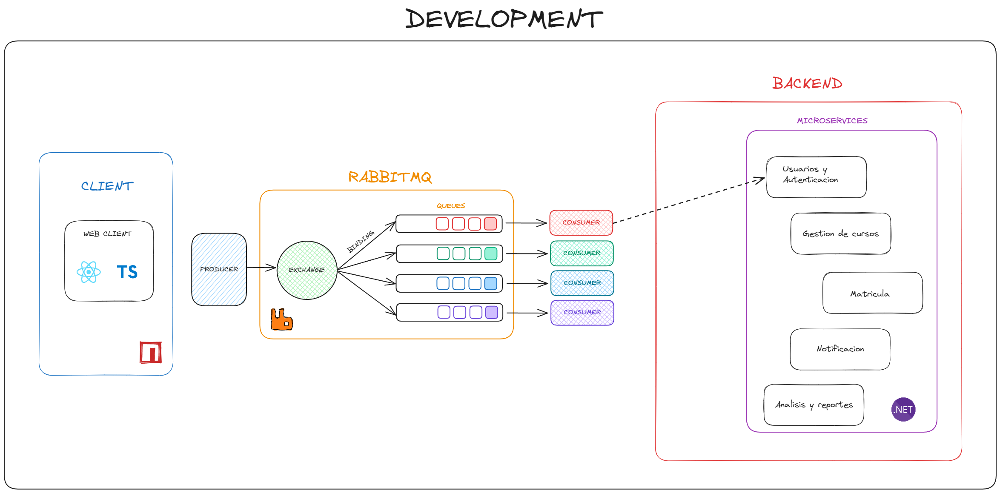

<div style="text-align: center;">

# Enrollment Management System UNSA (By Dexo Corp)

</div>

<div style="text-align: center;">


</div>
<div style="text-align: center;">


</div>

***Dexo Corp Members:***

- Mogollon Caceres Sergio Daniel
- Davis Coropuna Leon Felipe
- Apaza Apaza Nelzon Jorge
- Lupo Condori Avelino
- Maldonado Casilla Braulio Nayap
- Parizaca Mozo Paul Antony
- Huaman Coaquira Luciana Julissa

## 1. **Descripcion**
El Sistema de Gestión de Matrículas (SGM) es una aplicación web desarrollada por ***Dexo Corp*** para la ***Universidad Nacional de San Agustín (UNSA)*** con el objetivo de agilizar y optimizar los procesos de inscripción y gestión de matrículas de los estudiantes. El sistema está diseñado para ser escalable, seguro y fácil de usar, y se basa en una arquitectura moderna de microservicios y tecnologías de vanguardia.

El sistema se sustenta en una arquitectura guiada por eventos, orquestada por una cola de mensajes RabbitMQ. Esta arquitectura modular permite una alta escalabilidad y flexibilidad, facilitando la incorporación de nuevas funcionalidades y el mantenimiento del sistema a lo largo del tiempo.

**Tecnologias Usadas**
- **Backend:**
  - `.NET`: Framework de desarrollo para la implementación de los microservicios backend.
  - `C#`: Lenguaje de programación para el desarrollo de los microservicios backend.
  - `Entity Framework Core`: ORM para el mapeo de objetos a relaciones.
  - `NUnit`: Framework de pruebas unitarias para las pruebas del código backend.
- **Frontend:**
  - `React`: Biblioteca de JavaScript para la creación de interfaces de usuario declarativas.
  - `Redux`: Librería para la gestión del estado de la aplicación.
  - `TypeScript`: Lenguaje de programación superconjunto de JavaScript con tipado estático.
  - `SASS`: Preprocesador de CSS para la creación de estilos CSS más organizados y mantenibles.
- **Mensajería:**
  - `RabbitMQ`: Sistema de mensajería asíncrona para la comunicación entre microservicios.
- **Base de Datos:**
  - `Mysql`: Sistema de gestión de bases de datos relacionales
  - `Mongodb`: Base de datos NoSQL de código abierto

## 2. **Requisitos**

### 2.1 **Requisitos Funcionales**
---


### 2.2 **Requisitos No Funcionales**
---


## 3. **Diseño del sistema**

<p align="center">
  
</p>

## 4. **Gestion de Proyecto**


## 5. **Configuraciones** ***(ASP Project With NUnit Test)***

### Project Setup

#### **1. Create Solution**

```bash
mkdir users-microservice && cd users-microservice
dotnet new sln
```

#### **2. Create Source Project**

```bash
mkdir src && cd src && dotnet new web
```

#### **3. Create Test Project**

```bash
mkdir test && cd test && dotnet new nunit
```

- Install Moq Dependency `(Mocks)`:
  ```bash
  dotnet add package Moq
  ```
- Link Test Project with Source Project
  ```bash
  dotnet add reference ../src/src.csproj
  ```

#### **4. Link Subprojects to Base Project**

- Go to the root of the `base project`
- Link Source Project with Base Project
  ```bash
  dotnet sln add src/src.csproj
  ```
- Link Test Project with Base Project
  ```bash
  cd ..
  dotnet sln add test/test.csproj
  ```

#### **5. Install Dependencies in /src**

```bash
cd src/
```

- For EntityFramework Core CLI:

  ```bash
  dotnet tool install --global dotnet-ef
  ```

- For EntityFrameworkCore.Design for migrations:

  ```bash
  dotnet add package Microsoft.EntityFrameworkCore.Design --version 9.0.0-preview.1.24081.2
  ```

- For Pomelo.EntityFrameworkCore.MySql dependency:
  ```bash
  dotnet add package Pomelo.EntityFrameworkCore.MySql --version 9.0.0-preview.1
  ```
- For Microsoft.AspNetCore.Authentication.JwtBearer dependency:
  ```bash
  dotnet add package Microsoft.AspNetCore.Authentication.JwtBearer --version 8.0.5
  ```

#### **6. Add Migrations**

```bash
cd src/
```

```bash
dotnet ef migrations add NameMigrate
```

```bash
dotnet ef database update
```

#### **6. Run App**

```bash
dotnet run --project src/src.csproj
```

#### **7. Run Test**

```bash
dotnet test
```

#### **8. Build App**

```bash
dotnet build src/src.csproj --configuration Release
```

#### **9. Coverage**

```bash
dotnet test /p:CollectCoverage=true /p:CoverletOutputFormat=opencover /p:CoverletOutput=../../coverage # no func
dotnet test /p:CollectCoverage=true /p:CoverletOutputFormat=opencover --output coverage # si func pero warning
```
