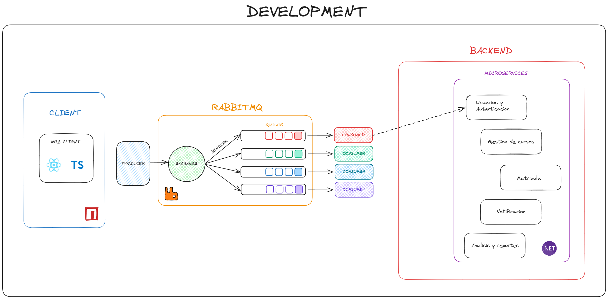

<div style="text-align: center;">

# Enrollment Management System UNSA (By Dexo Corp)

</div>

<div style="text-align: center;">


</div>
<div style="text-align: center;">


</div>

***Dexo Corp Members:***

- Mogollon Caceres Sergio Daniel
- Davis Coropuna Leon Felipe
- Apaza Apaza Nelzon Jorge
- Lupo Condori Avelino
- Maldonado Casilla Braulio Nayap
- Parizaca Mozo Paul Antony
- Huaman Coaquira Luciana Julissa

## **Descripcion**
El Sistema de Gestión de Matrículas (SGM) es una aplicación web desarrollada por ***Dexo Corp*** para la ***Universidad Nacional de San Agustín (UNSA)*** con el objetivo de agilizar y optimizar los procesos de inscripción y gestión de matrículas de los estudiantes. El sistema está diseñado para ser escalable, seguro y fácil de usar, y se basa en una arquitectura moderna de microservicios y tecnologías de vanguardia.

El sistema se sustenta en una arquitectura guiada por eventos, orquestada por una cola de mensajes RabbitMQ. Esta arquitectura modular permite una alta escalabilidad y flexibilidad, facilitando la incorporación de nuevas funcionalidades y el mantenimiento del sistema a lo largo del tiempo.

**Tecnologias Usadas**
- **Backend:**
  - `.NET`: Framework de desarrollo para la implementación de los microservicios backend.
  - `C#`: Lenguaje de programación para el desarrollo de los microservicios backend.
  - `Entity Framework Core`: ORM para el mapeo de objetos a relaciones.
  - `NUnit`: Framework de pruebas unitarias para las pruebas del código backend.
- **Frontend:**
  - `React`: Biblioteca de JavaScript para la creación de interfaces de usuario declarativas.
  - `Redux`: Librería para la gestión del estado de la aplicación.
  - `TypeScript`: Lenguaje de programación superconjunto de JavaScript con tipado estático.
  - `SASS`: Preprocesador de CSS para la creación de estilos CSS más organizados y mantenibles.
- **Mensajería:**
  - `RabbitMQ`: Sistema de mensajería asíncrona para la comunicación entre microservicios.
- **Base de Datos:**
  - `Mysql`: Sistema de gestión de bases de datos relacionales
  - `Mongodb`: Base de datos NoSQL de código abierto

## **Requisitos**

### **Requisitos Funcionales**
---


### **Requisitos No Funcionales**
---


## **Diseño del sistema**

### DDD
- **Entidades:** son capaces de ser buscadas, almacenadas y recuperadas.
- **Objetos de valor:** no tienen identidad propia y se identifican por sus atributos.
- **Agregados:** Agrupaciones de entidades y valor objetos que se tratan como una unidad única para mantener la consistencia del dominio.
- **Fabricas:** Tendrá la responsabilidad de fabricar objetos complejos.
- **Servicios de Dominio:** Operaciones que no pertenecen naturalmente a una entidad o valor objeto, pero son parte del dominio y encapsulan lógica del negocio.
- **Repositorios:** Interfaces para acceder a objetos agregados de un repositorio de datos persistente, proporcionando una abstracción sobre la infraestructura de almacenamiento de datos.

<p align="center">
  
</p>

## **Gestion de Proyecto**


## **Features**


## **Principios Solid**

- **Single Responsibility Principle (SRP):**
Cada clase o módulo debe tener una única responsabilidad o razón para cambiar. En otras palabras, una clase debe estar enfocada en una sola tarea o funcionalidad, lo que facilita su comprensión, mantenimiento y prueba. Si una clase tiene más de una responsabilidad, es probable que los cambios en una responsabilidad afecten a las otras, lo que puede llevar a errores y un código más difícil de gestionar.
<!-- 
  - ***Controlador (Responsable de manejar las solicitudes HTTP)***
    ```csharp
    using Microsoft.AspNetCore.Mvc;
    using System.Threading.Tasks;

    namespace MyApp.Controllers
    {
        [ApiController]
        [Route("api/[controller]")]
        public class UsersController : ControllerBase
        {
            private readonly IUserService _userService;

            public UsersController(IUserService userService)
            {
                _userService = userService;
            }

            [HttpPost]
            public async Task<IActionResult> CreateUser([FromBody] UserDto userDto)
            {
                var result = await _userService.CreateUserAsync(userDto);
                if (result.Success)
                {
                    return Ok(result);
                }
                return BadRequest(result);
            }
        }
    }
    ```
  - ***Servicio (Responsable de la lógica de negocio)***
    ```csharp
    using System.Threading.Tasks;

    namespace MyApp.Services
    {
        public class UserService : IUserService
        {
            private readonly IUserRepository _userRepository;

            public UserService(IUserRepository userRepository)
            {
                _userRepository = userRepository;
            }

            public async Task<Result> CreateUserAsync(UserDto userDto)
            {
                if (string.IsNullOrWhiteSpace(userDto.Name))
                {
                    return new Result { Success = false, Message = "User name is required." };
                }

                var user = new User
                {
                    Name = userDto.Name,
                    Email = userDto.Email
                };

                await _userRepository.AddUserAsync(user);

                return new Result { Success = true, Message = "User created successfully." };
            }
        }
    }
    ```
  - ***Repositorio (Responsable del acceso a datos)***
    ```csharp
    using System.Threading.Tasks;

    namespace MyApp.Repositories
    {
        public class UserRepository : IUserRepository
        {
            private readonly AppDbContext _context;

            public UserRepository(AppDbContext context)
            {
                _context = context;
            }

            public async Task AddUserAsync(User user)
            {
                _context.Users.Add(user);
                await _context.SaveChangesAsync();
            }
        }
    }
    ``` -->

- **Open/Closed Principle (OCP):**
Las entidades de software (clases, módulos, funciones, etc.) deben estar abiertas para la extensión, pero cerradas para la modificación. Esto significa que el comportamiento de una clase debe poder extenderse sin modificar su código fuente original. Este principio promueve el uso de la herencia, la composición y otros patrones de diseño para agregar nuevas funcionalidades, lo que reduce el riesgo de introducir errores en el código existente.

- **Liskov Substitution Principle (LSP):**
Las subclases deben ser sustituibles por sus superclases sin alterar el comportamiento correcto del programa. Esto implica que las clases derivadas deben ser completamente intercambiables con sus clases base, cumpliendo con el contrato establecido por la clase base. Las subclases no deben cambiar la funcionalidad esperada ni violar las expectativas del usuario de la clase base.

- **Interface Segregation Principle (ISP):**
Los clientes no deben estar obligados a depender de interfaces que no utilizan. En lugar de tener una única interfaz grande y general, es preferible tener múltiples interfaces específicas y pequeñas. Esto permite que los clientes dependan solo de los métodos que realmente necesitan, reduciendo las dependencias innecesarias y haciendo que el código sea más fácil de modificar y mantener.

- **Dependency Inversion Principle (DIP):**
Los módulos de alto nivel no deben depender de módulos de bajo nivel, sino que ambos deben depender de abstracciones. Además, las abstracciones no deben depender de los detalles, sino que los detalles deben depender de las abstracciones. Este principio promueve el uso de interfaces o clases abstractas para reducir el acoplamiento entre componentes, facilitando la modificación y prueba del código.


## 6. **Configuraciones** ***(ASP Project With NUnit Test)***

### Project Setup

#### **1. Create Solution**

```bash
mkdir users-microservice && cd users-microservice
dotnet new sln
```

#### **2. Create Source Project**

```bash
mkdir src && cd src && dotnet new web
```

#### **3. Create Test Project**

```bash
mkdir test && cd test && dotnet new nunit
```

- Install Moq Dependency `(Mocks)`:
  ```bash
  dotnet add package Moq
  ```
- Link Test Project with Source Project
  ```bash
  dotnet add reference ../src/src.csproj
  ```

#### **4. Link Subprojects to Base Project**

- Go to the root of the `base project`
- Link Source Project with Base Project
  ```bash
  dotnet sln add src/src.csproj
  ```
- Link Test Project with Base Project
  ```bash
  cd ..
  dotnet sln add test/test.csproj
  ```

#### **5. Install Dependencies in /src**

```bash
cd src/
```

- For EntityFramework Core CLI:

  ```bash
  dotnet tool install --global dotnet-ef
  ```

- For EntityFrameworkCore.Design for migrations:

  ```bash
  dotnet add package Microsoft.EntityFrameworkCore.Design --version 9.0.0-preview.1.24081.2
  ```

- For Pomelo.EntityFrameworkCore.MySql dependency:
  ```bash
  dotnet add package Pomelo.EntityFrameworkCore.MySql --version 9.0.0-preview.1
  ```
- For Microsoft.AspNetCore.Authentication.JwtBearer dependency:
  ```bash
  dotnet add package Microsoft.AspNetCore.Authentication.JwtBearer --version 8.0.5
  ```

#### **6. Add Migrations**

```bash
cd src/
```

```bash
dotnet ef migrations add NameMigrate
```

```bash
dotnet ef database update
```

#### **6. Run App**

```bash
dotnet run --project src/src.csproj
```

#### **7. Run Test**

```bash
dotnet test
```

#### **8. Build App**

```bash
dotnet build src/src.csproj --configuration Release
```

#### **9. Coverage**

```bash
dotnet test /p:CollectCoverage=true /p:CoverletOutputFormat=opencover /p:CoverletOutput=../../coverage # no func
dotnet test /p:CollectCoverage=true /p:CoverletOutputFormat=opencover --output coverage # si func pero warning
```
