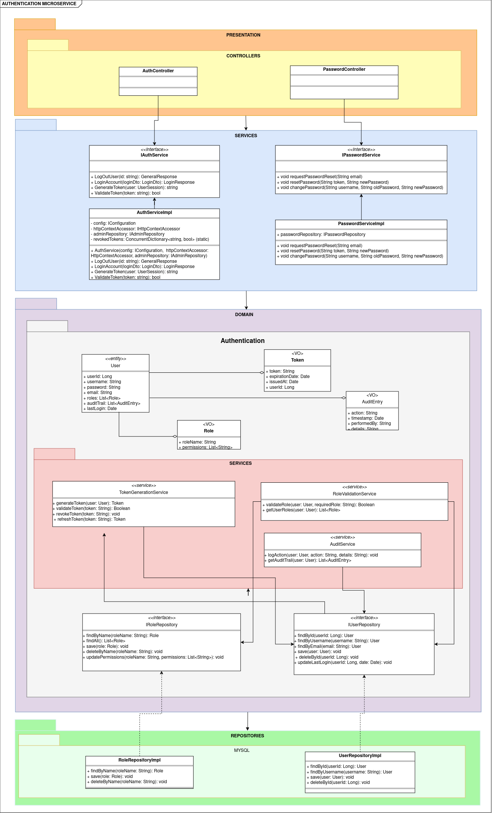
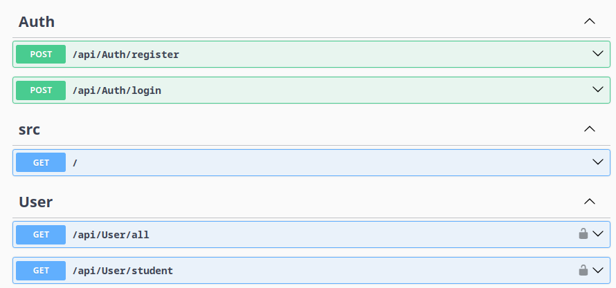
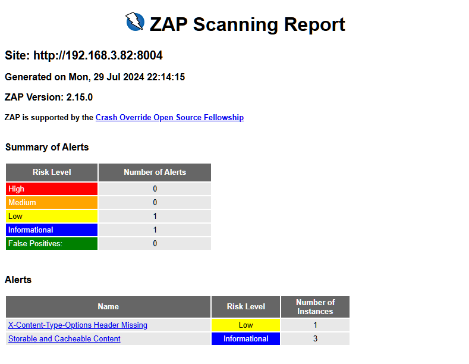

# Arquitectura DDD y Pruebas del Microservicio de Autenticación

## 1. Descripción

El microservicio de pagos gestiona transacciones financieras relacionadas con pagos de estudiantes. Esto incluye la creación, actualización, obtención de pagos y generación de códigos de pago. El contexto delimitado es la gestión de pagos, lo que indica que todas las funcionalidades están enfocadas en este dominio.

- **Contexto Delimitado:** Gestión de Autenticación

## 2. Arquitectura DDD

### 2.1. Capas de la Arquitectura
<details open>
  <summary><b><i>2.1.1. Capa de Presentación</b></i></summary>
  <ul>
    <li>Controladores</li>
    <ul>
      <li><b>AuthController</b>: Gestiona las solicitudes HTTP relacionadas con la autenticación. Incluye métodos para registrar y autenticar usuarios, delegando la lógica a los servicios de aplicación.</li>
      <li><b>UserController</b>: Gestiona las solicitudes HTTP relacionadas con los usuarios. Incluye métodos para obtener información de los usuarios, accesibles según los roles asignados.</li>
    </ul>
  </ul>
</details>
<details open>
  <summary><b><i>2.1.2. Capa de Aplicación</b></i></summary>
  <ul>
    <li>Servicios de aplicación</li>
    <ul>
      <li><b>AuthService</b>: Contiene la lógica de negocio específica para la autenticación. Coordina las operaciones entre el controlador y el dominio, incluyendo la validación y transformación de datos.</li>
      <li><b>UserService</b>: Gestiona la lógica de negocio relacionada con la gestión de usuarios, incluyendo la validación y la comunicación con los repositorios.</li>
    </ul>
    <li>DTOs</li>
    <ul>
      <li><b>UserDto</b>: Objeto de transferencia de datos utilizado para encapsular los datos de un usuario en una estructura simple que puede ser utilizada en la capa de presentación.</li>
      <li><b>LoginDto</b>: DTO utilizado para encapsular los datos necesarios para el inicio de sesión.</li>
      <li><b>UserSession</b>: DTO que encapsula los datos de una sesión de usuario.</li>
    </ul>
    <li>Mapping</li>
    <ul>
      <li><b>UserMapper</b>: Clase responsable de mapear entre entidades de dominio y DTOs, asegurando que los datos se transfieran correctamente entre capas.</li>
    </ul>
  </ul>
</details>
<details open>
  <summary><b><i>2.1.3. Capa de Dominio</b></i></summary>
  <ul>
    <li>Entidades</li>
    <ul>
      <li><b>User</b>: Representa la entidad principal del sistema de autenticación, incluyendo propiedades como <code>UserId</code>, <code>Name</code>, <code>Email</code>, <code>Password</code>, entre otras.</li>
      <li><b>Session</b>: Representa la entidad de sesión de usuario, incluyendo propiedades como <code>SessionId</code>, <code>UserId</code>, <code>CreatedAt</code>, etc.</li>
    </ul>
    <li>Value Objects</li>
    <ul>
      <li><b>UserCredentials</b>: Representa un objeto de valor para manejar las credenciales de usuario, con propiedades como <code>Email</code> y <code>Password</code>.</li>
      <li><b>UserRole</b>: Representa el rol de un usuario, como <code>Admin</code> o <code>User</code>.</li>
    </ul>
    <li>Agregados</li>
    <ul>
      <li><b>UserAggregate</b>: Agrupa entidades y objetos de valor relacionados al usuario, asegurando la consistencia interna del agregado.</li>
    </ul>
    <li>Servicios de dominio</li>
    <ul>
      <li><b>AuthDomainService</b>: Contiene lógica de negocio compleja que involucra múltiples entidades o agregados, como la gestión de tokens y sesiones.</li>
      <li><b>UserDomainService</b>: Contiene lógica de negocio compleja para la gestión de usuarios, como la validación de roles y permisos.</li>
    </ul>
    <li>Interfaces de repositorio</li>
    <ul>
      <li><b>IAuthRepository</b>: Define los métodos que deben ser implementados para la gestión de la autenticación en el repositorio. Incluye métodos como <code>CreateAccount</code>, <code>LoginAccount</code>, y <code>GetSessionById</code>.</li>
      <li><b>IUserRepository</b>: Define los métodos necesarios para gestionar los usuarios, incluyendo operaciones CRUD y consultas.</li>
    </ul>
  </ul>
</details>
<details open>
  <summary><b><i>2.1.4. Capa de Infraestructura</b></i></summary>
  <ul>
    <li>Implementaciones de repositorios</li>
    <ul>
      <li><b>AuthRepository</b>: Implementación concreta de <code>IAuthRepository</code>. Utiliza el contexto de la base de datos para realizar operaciones CRUD sobre la autenticación.</li>
      <li><b>UserRepository</b>: Implementación concreta de <code>IUserRepository</code>. Utiliza el contexto de la base de datos para realizar operaciones CRUD sobre los usuarios.</li>
    </ul>
    <li>Contexto de la base de datos</li>
    <ul>
      <li><b>AuthDbContext</b>: Clase que maneja la conexión a la base de datos y proporciona acceso a las entidades a través de DbSets. Configura mapeos y relaciones entre entidades.</li>
    </ul>
    <li>Integraciones externas</li>
    <ul>
      <li><b>NotificationService</b>: Servicio que se encarga de enviar notificaciones a los usuarios sobre sus cuentas.</li>
    </ul>
  </ul>
</details>
### 2.2. Diagrama de la Arquitectura

<p align="center">
  
</p>


## 3. Pruebas

### 3.1. Pruebas de API

#### 3.1.1. Herramientas y Tecnologías

Para llevar a cabo las pruebas de nuestra API, hemos utilizado una serie de herramientas y tecnologías clave que facilitan la evaluación exhaustiva y efectiva de las funcionalidades expuestas por la API. A continuación se describen las herramientas principales empleadas:

- **Postman:** Esta herramienta es ampliamente utilizada para el diseño, prueba y documentación de APIs. Permite realizar solicitudes HTTP a los endpoints de la API, definir y gestionar colecciones de pruebas, y verificar respuestas con gran detalle. Postman también proporciona funcionalidades avanzadas como la ejecución de scripts pre y post solicitud, así como la integración con sistemas de CI/CD para automatizar las pruebas.

- **Swagger:** Swagger, ahora conocido como OpenAPI, es una herramienta poderosa para documentar y probar APIs. Permite generar documentación interactiva que facilita la comprensión y el uso de los endpoints de la API. Con Swagger, es posible visualizar y probar los endpoints directamente desde la documentación, lo que ayuda a identificar problemas y validar el comportamiento de la API de manera eficiente.

#### 3.1.2. Escenarios de Prueba de API

En esta sección se detallan los escenarios de prueba para el microservicio de autenticación, los cuales han sido diseñados para validar el correcto funcionamiento de las diferentes operaciones del API. Los detalles de los escenarios de prueba están disponibles en el archivo `auth-microservice.postman_collection.json`, el cual contiene las solicitudes y configuraciones para ejecutar los tests en Postman.

Además, los resultados de la ejecución de estos tests se encuentran en el archivo `auth-microservice.postman_test_run.json`. Este archivo proporciona un resumen de las pruebas realizadas y los resultados obtenidos, facilitando la verificación del comportamiento esperado del API según los casos de prueba definidos.

<details open>
  <summary><b><i>Escenario 1:</i></b> Registrar un usuario (caso de éxito).</summary>
  
```gherkin
  Scenario: Registrar un usuario
    Given que se proporciona un UserDto válido
    When se envía una solicitud POST al endpoint con los datos del usuario
    Then la respuesta debe ser 200 OK
    And la respuesta debe contener los detalles del usuario registrado

```

</details>

```gherkin
 Background: 
  Dado que el endpoint "api/auth/login" está disponible
```
<details open>
  <summary><b><i>Escenario 3:</i></b> Iniciar sesión (caso de éxito).</summary>

```gherkin
  Scenario: Iniciar sesión
  Given que se proporciona un LoginDto válido
  When se envía una solicitud POST al endpoint con los datos de inicio de sesión
  Then la respuesta debe ser 200 OK
  And la respuesta debe contener los detalles de la sesión iniciada

```

  </details>
<details open>
  <summary><b><i>Escenario 4:</i></b> Iniciar sesión (caso de fallo).</summary>

```gherkin

   Scenario: Iniciar sesión
  Given que se proporciona un LoginDto inválido
  When se envía una solicitud POST al endpoint con los datos de inicio de sesión
  Then la respuesta debe ser 400 Bad Request
  And la respuesta debe contener un mensaje de error adecuado

 ```

</details>

```gherkin
Background: 
  Dado que el endpoint "api/auth/user" está disponible
```
<details open>
  <summary><b><i>Escenario 5:</i></b> Obtener detalles del usuario (caso de éxito).</summary>

```gherkin
Scenario: Obtener detalles del usuario
  Given que se proporciona un UserId válido
  When se envía una solicitud GET al endpoint con el UserId
  Then la respuesta debe ser 200 OK
  And la respuesta debe contener los detalles del usuario
```
#### 3.1.3. Pruebas de API con Swagger

Swagger facilita la comprensión de los endpoints disponibles y cómo interactuar con ellos. Además, se incluye información sobre el archivo `requests/enroll.http`, que contiene los comandos cURL necesarios para ejecutar las pruebas de la API de manera eficiente. Este archivo permite realizar las solicitudes directamente desde la línea de comandos, complementando el uso de Swagger para una experiencia de prueba completa.



### 3.2. Pruebas de Rendimiento

#### 3.2.1. Herramientas y Tecnologías

**Apache JMeter** es una herramienta de código abierto ampliamente utilizada para realizar pruebas de rendimiento y carga en aplicaciones. Diseñada para evaluar el rendimiento de servicios web y aplicaciones en una variedad de protocolos, JMeter permite simular múltiples usuarios concurrentes para medir el comportamiento del sistema bajo diferentes cargas. Con su interfaz gráfica intuitiva, JMeter facilita la creación de planes de prueba personalizados, la definición de escenarios de carga y la configuración de métricas detalladas. Esta herramienta también ofrece capacidades para generar reportes detallados y gráficos, proporcionando una visión integral del rendimiento del sistema y ayudando a identificar cuellos de botella y áreas de mejora. Su flexibilidad y extensibilidad la convierten en una opción ideal para evaluar la capacidad de respuesta y la estabilidad de aplicaciones en entornos de producción.
#### 3.2.2. Escenarios de Prueba de Rendimiento
<details open>
  <summary><b><i>Escenario 1:</i></b> Obtener detalles del usuario con 10 peticiones simultáneas.</summary>

```gherkin
Scenario: Obtener detalles del usuario con 10 peticiones simultáneas
  Given que el endpoint "api/auth/user/{userId}" está disponible
  When se envían 10 peticiones GET simultáneas al endpoint con un UserId válido
  Then todas las respuestas deben ser 200 OK
  And el tiempo de respuesta promedio debe ser menor a 1 segundo
```
</details>
<details open>
  <summary><b><i>Escenario 2:</i></b> Obtener detalles del usuario con 25 peticiones simultáneas.</summary>

```gherkin
Scenario: Obtener detalles del usuario con 25 peticiones simultáneas
  Given que el endpoint "api/auth/user/{userId}" está disponible
  When se envían 25 peticiones GET simultáneas al endpoint con un UserId válido
  Then todas las respuestas deben ser 200 OK
  And el tiempo de respuesta promedio debe ser menor a 1.5 segundos
```
</details>
<details open>
  <summary><b><i>Escenario 3:</i></b> Obtener detalles del usuario con 50 peticiones simultáneas.</summary>

```gherkin
Scenario: Obtener detalles del usuario con 50 peticiones simultáneas
  Given que el endpoint "api/auth/user/{userId}" está disponible
  When se envían 50 peticiones GET simultáneas al endpoint con un UserId válido
  Then todas las respuestas deben ser 200 OK
  And el tiempo de respuesta promedio debe ser menor a 2 segundos

```
</details>

### 3.3. Pruebas de Seguridad

#### 3.3.1. Herramientas y Tecnologías

**OWASP ZAP (Zed Attack Proxy)** es una herramienta de código abierto diseñada para realizar pruebas de seguridad en aplicaciones web. Desarrollada por el Open Web Application Security Project (OWASP), ZAP proporciona una amplia gama de funciones para identificar vulnerabilidades y evaluar la seguridad de aplicaciones durante el ciclo de desarrollo. Su interfaz intuitiva permite a los usuarios realizar escaneos automatizados, así como llevar a cabo pruebas manuales de seguridad, como la exploración de aplicaciones y la identificación de puntos débiles. ZAP es particularmente útil para detectar problemas de seguridad comunes, como inyecciones SQL, ataques de cross-site scripting (XSS) y configuraciones incorrectas. Además, ZAP ofrece soporte para integraciones con otras herramientas de desarrollo y pruebas, lo que facilita la inclusión de prácticas de seguridad en el proceso de desarrollo ágil. Su capacidad para generar reportes detallados ayuda a los equipos de desarrollo a abordar las vulnerabilidades de manera efectiva y mejorar la seguridad general de sus aplicaciones.

#### 3.3.2. Escenarios de Prueba de Seguridad

```gherkin
Background:
    Given que el endpoint "http://localhost:8004" está accesible
```

<details open>
  <summary><b><i>Escenario 1:</i></b> Verificación de encabezados de seguridad HTTP.</summary>

```gherkin
Scenario: Verificación de encabezados de seguridad HTTP
  Given el sitio web "http://localhost:8004" debe incluir varios encabezados de seguridad HTTP
  When se realiza un análisis de encabezados HTTP
  Then los encabezados esperados deben estar presentes, incluyendo "Strict-Transport-Security", "Content-Security-Policy", y "X-Content-Type-Options"
```

</details>

<details open>
  <summary><b><i>Escenario 2:</i></b> Verificación de vulnerabilidades en bibliotecas JavaScript.</summary>

```gherkin
Scenario: Verificación de vulnerabilidades en bibliotecas JavaScript
  Given el sitio web "http://localhost:8004" utiliza bibliotecas JavaScript de terceros
  When se realiza un análisis de bibliotecas JavaScript
  Then no se deben encontrar bibliotecas vulnerables, como aquellas indicadas por Retire.js
```

</details>

<details open>
  <summary><b><i>Escenario 3:</i></b> Verificación de la configuración de cookies.</summary>

```gherkin
Scenario: Verificación de la configuración de cookies
  Given el sitio web "http://localhost:8004" utiliza cookies para el manejo de sesiones
  When se realiza un análisis de cookies
  Then todas las cookies deben estar configuradas con las banderas adecuadas, incluyendo "HttpOnly" y "Secure"
```

</details>

<details open>
  <summary><b><i>Escenario 4:</i></b> Verificación de la protección contra ataques XSS.</summary>

```gherkin
Scenario: Verificación de la protección contra ataques XSS
  Given el sitio web "http://localhost:8004" permite la entrada de usuarios
  When se realiza un análisis de entrada para detectar vulnerabilidades XSS
  Then no se deben encontrar puntos de entrada vulnerables a ataques de cross-site scripting (XSS)
```

</details>

<details open>
  <summary><b><i>Escenario 5:</i></b> Verificación de la política de seguridad de contenido (CSP).</summary>

```gherkin
Scenario: Verificación de la política de seguridad de contenido (CSP)
  Given el sitio web "http://localhost:8004" debe tener una política de seguridad de contenido configurada
  When se realiza un análisis de la política de seguridad de contenido
  Then la política debe estar correctamente configurada y debe incluir directivas como "default-src" y "script-src"
```

</details>

<details open>
  <summary><b><i>Escenario 6:</i></b> Verificación de la protección contra el clickjacking.</summary>

```gherkin
Scenario: Verificación de la protección contra el clickjacking
  Given el sitio web "http://localhost:8004" debe protegerse contra ataques de clickjacking
  When se realiza un análisis de encabezados HTTP
  Then debe estar presente el encabezado "X-Frame-Options" con una configuración segura
```

</details>

<details open>
  <summary><b><i>Escenario 7:</i></b> Verificación de redirecciones abiertas.</summary>

```gherkin
Scenario: Verificación de redirecciones abiertas
  Given el sitio web "http://localhost:8004" debe manejar las redirecciones de forma segura
  When se realiza un análisis para detectar redirecciones abiertas
  Then no deben encontrarse vulnerabilidades de redirección abierta
```

</details>

<details open>
  <summary><b><i>Escenario 8:</i></b> Verificación de exposición de información sensible.</summary>

```gherkin
Scenario: Verificación de exposición de información sensible
  Given el sitio web "http://localhost:8004" debe proteger la información sensible
  When se realiza un análisis para detectar la exposición de información sensible
  Then no se debe encontrar información sensible expuesta en encabezados HTTP o mensajes de error
```

</details>

<details open>
  <summary><b><i>Escenario 9:</i></b> Verificación de configuraciones de seguridad en la administración de sesiones.</summary>

```gherkin
Scenario: Verificación de configuraciones de seguridad en la administración de sesiones
  Given el sitio web "http://localhost:8004" gestiona sesiones de usuario
  When se realiza un análisis de la gestión de sesiones
  Then la sesión debe estar protegida contra ataques como el secuestro de sesión y el manejo inseguro de IDs de sesión
```

</details>

<details open>
  <summary><b><i>Escenario 10:</i></b> Verificación de la protección contra ataques de CSRF.</summary>

```gherkin
Scenario: Verificación de la protección contra ataques de CSRF
  Given el sitio web "http://localhost:8004" debe protegerse contra ataques de falsificación de solicitudes entre sitios (CSRF)
  When se realiza un análisis para detectar la protección contra CSRF
  Then deben encontrarse y validarse tokens anti-CSRF en formularios y solicitudes
```

</details>

<details open>
  <summary><b><i>Escenario 11:</i></b> Verificación de vulnerabilidades de exposición de información.</summary>

```gherkin
Scenario: Verificación de vulnerabilidades de exposición de información
  Given el sitio web "http://localhost:8004" debe manejar la exposición de información con cuidado
  When se realiza un análisis para detectar la divulgación de información sensible
  Then no deben encontrarse vulnerabilidades de divulgación de información, como mensajes de error o encabezados de respuesta que revelen detalles internos
```

</details>

<p align="center">
  
</p>

## 4. Referencias

[1] W. by Iamprovidence, **“Backend side architecture evolution (N-layered, DDD, Hexagon, Onion, Clean Architecture)”**, Medium, 27-jun-2023. [En línea]. Disponible en: [https://medium.com/@iamprovidence/backend-side-architecture-evolution-n-layered-ddd-hexagon-onion-clean-architecture-643d72444ce4](https://medium.com/@iamprovidence/backend-side-architecture-evolution-n-layered-ddd-hexagon-onion-clean-architecture-643d72444ce4).

[2] C. Ramalingam, **“Building domain driven microservices - Walmart global tech blog - medium”**, Walmart Global Tech Blog, 01-jul-2020. [En línea]. Disponible en: [https://medium.com/walmartglobaltech/building-domain-driven-microservices-af688aa1b1b8](https://medium.com/walmartglobaltech/building-domain-driven-microservices-af688aa1b1b8).

[3] J. Loscalzo, **“Domain Driven Design: principios, beneficios y elementos — Segunda Parte”**, Medium, 18-jun-2018. [En línea]. Disponible en: [https://medium.com/@jonathanloscalzo/domain-driven-design-principios-beneficios-y-elementos-segunda-parte-337d77dc8566](https://medium.com/@jonathanloscalzo/domain-driven-design-principios-beneficios-y-elementos-segunda-parte-337d77dc8566).

[4] P. Martinez, **“Domain-Driven Design: Everything you always wanted to know”**, SSENSE-TECH, 15-may-2020. [En línea]. Disponible en: [https://medium.com/ssense-tech/domain-driven-design-everything-you-always-wanted-to-know-about-it-but-were-afraid-to-ask-a85e7b74497a](https://medium.com/ssense-tech/domain-driven-design-everything-you-always-wanted-to-know-about-it-but-were-afraid-to-ask-a85e7b74497a).
