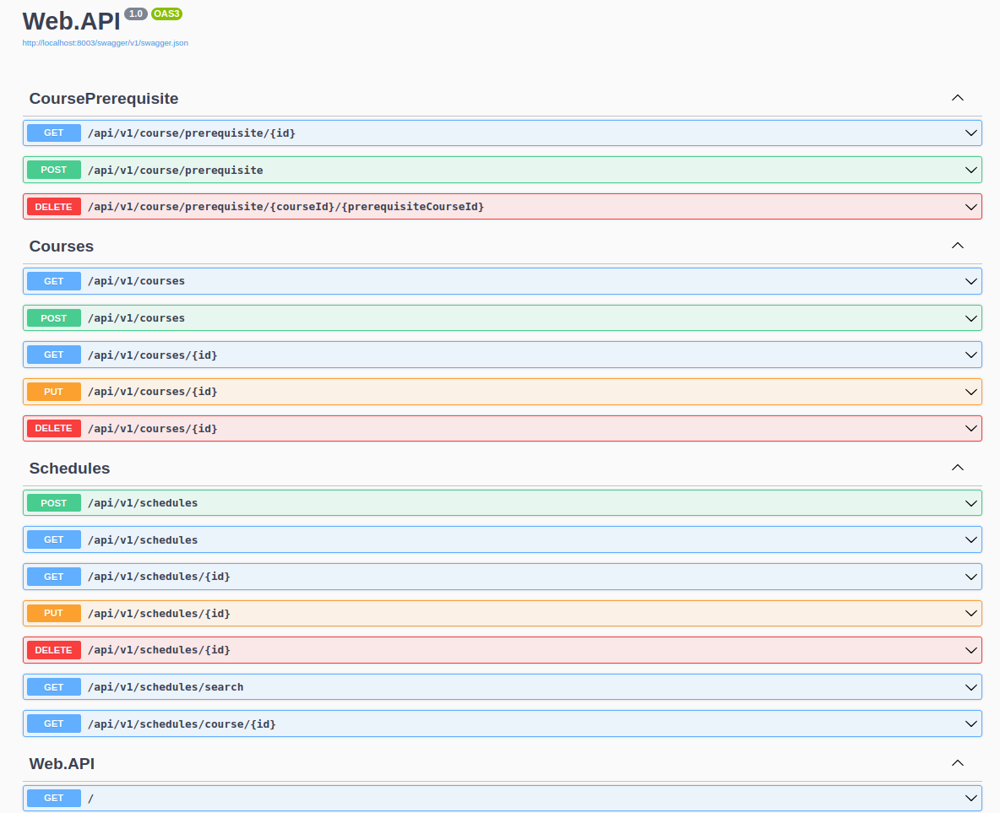
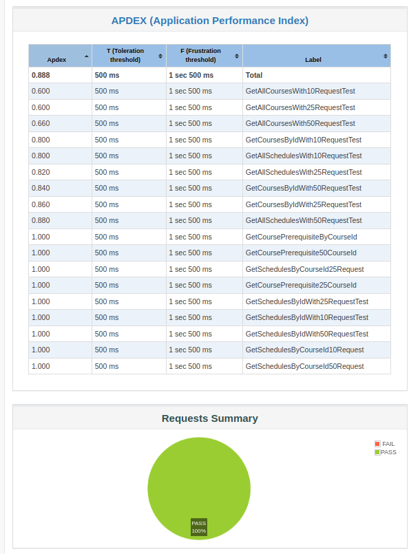
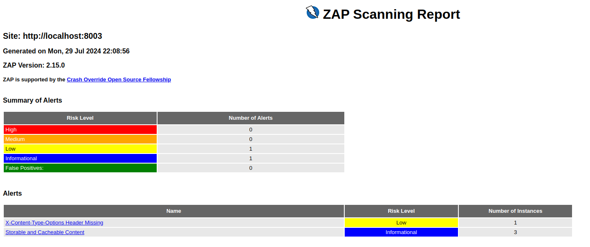

# Arquitectura DDD y Pruebas del Microservicio de Cursos

## 1. Descripcion
El microservicio de cursos es responsable de la gestión integral de los cursos ofrecidos por todas las escuelas, incluyendo la creación y administración de horarios. Facilita operaciones CRUD (Crear, Leer, Actualizar, Eliminar) para cursos, requisitos de cursos, y horarios.
- **Contexto Delimitado:** Gestión de Cursos y Horarios

## 2. Arquitectura DDD

### 2.1 Capas de la Arquitectura

<details>
<summary>2.1.1. `Application`</summary>

Esta capa contiene la lógica de la aplicación y maneja los casos de uso del sistema. Se organiza en carpetas específicas por entidad, como `Courses`, `CoursePrerequisites`, `Customers`, y `Schedules`, cada una conteniendo comandos, manejadores de comandos y consultas.

- **`CoursePrerequisites`:** 
  - `Common`: Respuestas comunes.
  - `Create`, `Delete`, `GetAll`: Comandos y manejadores de comandos para operaciones CRUD.
  
- **`Courses`:**
  - `Common`: Respuestas comunes.
  - `Create`, `Delete`, `GetAll`, `GetById`, `Update`: Comandos y manejadores de comandos para operaciones CRUD.

- **`Customers`:**
  - `Create`, `Delete`, `GetAll`, `GetById`, `Update`: Comandos y manejadores de comandos para operaciones CRUD.

- **`Schedules`:**
  - `Common`: Respuestas comunes.
  - `Create`, `GetAll`, `GetById`, `Update`, `GetScheduleByYearSemesterSchool`, `GetSchedulesByCourseId`, `UpdateAvailableSeats`: Comandos y manejadores de comandos para operaciones CRUD.

</details>

<details>
<summary>2.1.2. `Domain`</summary>

Esta capa contiene las entidades del dominio, objetos de valor, repositorios, servicios y eventos del dominio.

- **`Entities`:** Define las entidades principales como `Course`, `CoursePrerequisite`, `Customer`, y `Schedule`.
- **`ValueObjects`:** Define los objetos de valor como `Address`, `PhoneNumber`, `ScheduleDetails`, `ScheduleEntry`, y `Semester`.
- **`Repositories`:** Interfaces para repositorios.
- **`Services`:** Define servicios de dominio e interfaces.
- **`Primitives`:** Define elementos básicos como `AggregateRoot`, `DomainEvent`, e `IUnitOfWork`.
- **`DomainErrors`:** Define errores específicos del dominio.

</details>

<details>
<summary>2.1.3. `Infrastructure`</summary>

Esta capa implementa las interfaces definidas en la capa de dominio y maneja la comunicación con la base de datos y otros servicios externos.

- **`Persistence`:** Configuraciones y contexto de base de datos.
  - `ApplicationDbContext.cs`: Contexto de base de datos.
  - `Configuration`: Configuraciones para entidades.
  - `Migrations`: Migraciones de base de datos.
  - `Repositories`: Implementaciones de los repositorios.

</details>

<details>
<summary>2.1.4. `Web.API`</summary>

Esta capa expone la funcionalidad de la aplicación a través de controladores y configura la inyección de dependencias.

- **`Controllers`:** Define controladores API como `CourseController`, `CoursePrerequisiteController`, `CustomerController`, y `ScheduleController`.
- **`Common`:** Manejo de errores y configuración HTTP.
- **`Program.cs`:** Configuración principal de la aplicación.
- **`Properties`:** Configuraciones de entorno.

</details>

### 2.2 Diagrama de la Arquitectura


## 3. Pruebas

### 3.1 Pruebas de API

#### 3.1.1. Herramientas y Tecnologías
Descripción de las herramientas utilizadas para las pruebas de API (por ejemplo, Postman, Swagger, etc.).

#### 3.1.2. Escenarios de Prueba de API


<details open>
  <summary><b><i>Crear de curso.</i></b> </summary>


<details open>
  <summary><b><i>Escenario 1: </i></b> Creación de curso con horas inválidas.</summary>

 ```gherkin
Scenario: El endpoint "api/v1/courses" está disponible
Given el endpoint "api/payments/" requiere autenticación
When se envía una solicitud POST al endpoint con el siguiente cuerpo:
    {
        "name": "Anime II",
        "credits": 3,
        "hours": 0, // Valor inválido
        "active": true,
        "semester": "B",
        "schoolId": "321"
    }
Then la respuesta debe tener un código de estado 400
And el cuerpo de la respuesta debe contener un error para las horas inválidas
And el campo "title" debe tener el valor "One or more validation errors occurred."
  ```
</details>

<details open>
  <summary><b><i>Escenario 2: </i></b> Creación de curso con créditos inválidos.</summary>

 ```gherkin
Scenario: el endpoint "api/v1/courses" está disponible
Given el endpoint "api/v1/courses" está disponible
When se envía una solicitud POST al endpoint con el siguiente cuerpo:
    {
        "name": "Anime II",
        "credits": 0, // Valor inválido
        "hours": 3, 
        "active": true,
        "semester": "B",
        "schoolId": "321"
    }
Then la respuesta debe tener un código de estado 400
And la respuesta debe estar en formato JSON
And el cuerpo de la respuesta debe contener un error para los créditos inválidos
And el campo "title" debe tener el valor "One or more validation errors occurred."
  
  ```
  
</details>

<details open>
  <summary><b><i>Escenario 3: </i></b> Creación de curso con datos válidos.</summary>

 ```gherkin
Scenario: el endpoint "api/v1/courses" está disponible
Given el endpoint "api/v1/courses" está disponible
When se envía una solicitud POST al endpoint con el siguiente cuerpo:
    {
      "name": "Anime II",
      "credits": 4,
      "hours": 3,
      "active": true,
      "semester": "A",
      "schoolId": "123"
    }
Then la respuesta debe tener un código de estado 201
  And la respuesta debe estar en formato JSON
  And el cuerpo de la respuesta debe contener el campo "courseId"
  And el campo "name" debe tener el valor "Anime II"
  And el campo "credits" debe tener el valor 4
  And el campo "hours" debe tener el valor 3
  And el campo "active" debe tener el valor true
  And el campo "semester" debe tener el valor "A"
  And el campo "schoolId" debe tener el valor "123"
  
  ```
</details>


<details open>
  <summary><b><i>Escenario 4: </i></b> Creación de curso con datos válidos.</summary>

 ```gherkin
Scenario: el endpoint "api/v1/courses" está disponible
Given el endpoint "api/v1/courses" está disponible
When se envía una solicitud POST al endpoint con el siguiente cuerpo:
    {
      "name": "Anime II",
      "credits": 4,
      "hours": 3,
      "active": true,
      "semester": "A",
      "schoolId": "123"
    }
Then la respuesta debe tener un código de estado 201
  And la respuesta debe estar en formato JSON
  And el cuerpo de la respuesta debe contener el campo "courseId"
  And el campo "name" debe tener el valor "Anime II"
  And el campo "credits" debe tener el valor 4
  And el campo "hours" debe tener el valor 3
  And el campo "active" debe tener el valor true
  And el campo "semester" debe tener el valor "A"
  And el campo "schoolId" debe tener el valor "123"
  
  ```
</details>
</details>

<details open>
  <summary><b><i>Obtener curso por ID.</i></b></summary>

<details open>
  <summary><b><i>Escenario 5: </i></b> Obtener curso por ID válido.</summary>

 ```gherkin
Given un curso válido ha sido creado y el ID del curso está almacenado en la variable de entorno "courseId"
When se envía una solicitud GET al endpoint "api/v1/courses/{{courseId}}"
 Then la respuesta debe tener un código de estado 200
  And la respuesta debe estar en formato JSON
  And el cuerpo de la respuesta debe contener el campo "courseId"
  ```
</details>


<details open>
  <summary><b><i>Escenario 6: </i></b> Obtener curso con ID no encontrado.</summary>

 ```gherkin
Given un ID de curso que no existe
  When se envía una solicitud GET al endpoint "api/v1/courses/..."
  Then la respuesta debe tener un código de estado 404
  And la respuesta debe estar en formato JSON
  And el cuerpo de la respuesta debe contener el campo "status" con el valor 404
  ```
</details>

<details open>
  <summary><b><i>Escenario 7: </i></b> Obtener curso con ID inválido.</summary>

 ```gherkin
Given un ID de curso inválido
  When se envía una solicitud GET al endpoint "api/v1/courses/374650ac-962a-4f73-982d-a"
  Then la respuesta debe tener un código de estado 400
  And la respuesta debe estar en formato JSON
  And el cuerpo de la respuesta debe contener el campo "status" con el valor 400
  ```
</details>

</details>

<details open>
  <summary><b><i> Obtener todos los cursos</i></b></summary>

<details open>
  <summary><b><i>Escenario 8: </i></b> Obtener todos los cursos.</summary>

 ```gherkin
Given hay cursos disponibles en la base de datos
  When se envía una solicitud GET al endpoint "api/v1/courses"
  Then la respuesta debe tener un código de estado 200
  And la respuesta debe estar en formato JSON
  And la respuesta debe contener una lista de cursos
  And la lista de cursos no debe estar vacía
  And el primer curso en la lista debe contener los campos "courseId", "name", "credits", "hours", "active", "semester" y "schoolId"
  ```
</details>

</details>

<details open>
  <summary><b><i>Eliminar un curso.</i></b></summary>

<details open>
  <summary><b><i>Escenario 9: </i></b> Eliminación de curso válido.</summary>

 ```gherkin
Given un curso válido ha sido creado y el ID del curso está almacenado en la variable de entorno "courseId"
  When se envía una solicitud DELETE al endpoint "api/v1/courses/{{courseId}}"
  Then la respuesta debe tener un código de estado 204
  And el curso con el ID "courseId" ya no debe existir
  And se debe recibir una respuesta con un código de estado 404 cuando se intente obtener el curso eliminado
  ```
</details>

<details open>
  <summary><b><i>Escenario 10: </i></b> Eliminación de curso con ID no encontrado.</summary>

 ```gherkin
Given un ID de curso que no existe
  When se envía una solicitud DELETE al endpoint "api/v1/courses/{{courseId}}"
  Then la respuesta debe tener un código de estado 404
  And la respuesta debe estar en formato JSON
  And el cuerpo de la respuesta debe contener el campo "status" con el valor 404
  ```
</details>

</details>


<details open>
  <summary><b><i> Actualización de curso válido</i></b></summary>

<details open>
  <summary><b><i>Escenario 11: </i></b>  Actualización de curso válido.</summary>

 ```gherkin
Given un curso válido ha sido creado y el ID del curso está almacenado en la variable de entorno "courseId"
  When se envía una solicitud PUT al endpoint "api/v1/courses/{{courseId}}" con el cuerpo actualizado:
    {
      "id": "{{courseId}}",
      "name": "asd",
      "credits": 2,
      "hours": 3,
      "active": true,
      "semester": "A",
      "schoolId": "21"
    }
  Then la respuesta debe tener un código de estado 204
  ```
</details>

<details open>
  <summary><b><i>Escenario 12: </i></b>  Actualización de curso con ID no encontrado.</summary>

 ```gherkin
Given un ID de curso que no existe
  When se envía una solicitud PUT al endpoint "api/v1/courses/37302ffc-5432-4431-6eb2-d23d52b9a5bd" con el cuerpo:
    {
      "id": "37302ffc-5432-4431-6eb2-d23d52b9a5bd",
      "name": "asd",
      "credits": 2,
      "hours": 3,
      "active": true,
      "semester": "A",
      "schoolId": "1"
    }
  Then la respuesta debe tener un código de estado 404
  And la respuesta debe contener detalles del error
  And el cuerpo de la respuesta debe contener el campo "status" con el valor 404
  ```
</details>
</details>

<details open>
  <summary><b><i>Crear un prerequisito.</i></b></summary>

<details open>
  <summary><b><i>Escenario 13: </i></b> Creación de un prerequisito de curso válido..</summary>

 ```gherkin
Given un cuerpo de solicitud válido para la creación de un prerequisito de curso
  When se envía una solicitud POST al endpoint "api/v1/course/prerequisite" con el cuerpo:
    """
    {
      "courseId": "08dcaf56-d0bd-4992-8f10-75243793bbef",
      "coursePrerequisiteId": "20603fe9-7949-4a4b-844d-d479692491ca"
    }
    """
  Then la respuesta debe tener un código de estado 201
  And la respuesta debe estar en formato JSON
  And la respuesta debe contener los campos "courseId" y "coursePrerequisiteId"
  ```
</details>
</details>

<details open>
  <summary><b><i>Obtener todos los prerequisitos de un curso.</i></b> </summary>

<details open>
  <summary><b><i>Escenario 14: </i></b> Obtener todos los prerequisitos de curso válidos.</summary>

 ```gherkin
Given un ID de curso válido "08dcaf56-d0bd-4992-8f10-75243793bbef"
  When se envía una solicitud GET al endpoint "api/v1/course/prerequisite/08dcaf56-d0bd-4992-8f10-75243793bbef"
  Then la respuesta debe tener un código de estado 200
  And la respuesta debe estar en formato JSON
  And la respuesta debe contener una lista de prerequisitos de curso esperados
  ```
</details>
</details>

<details open>
  <summary><b><i> Crear un horario de curso</i></b></summary>

<details open>
  <summary><b><i>Escenario 15: </i></b>  Crear un horario de curso.</summary>

 ```gherkin
 Given un curso con ID "{{courseId}}"
  When se envía una solicitud POST al endpoint "api/v1/schedules" con los siguientes datos:
    {
      "courseId": "{{courseId}}",
      "year": 2024,
      "schoolId": "123",
      "details": {
        "group": "A",
        "professorId": "prof-123"
      },
      "entries": [
        {
          "dayOfWeek": 1,
          "startTime": "10:00:00",
          "endTime": "11:00:00"
        },
        {
          "dayOfWeek": 4,
          "startTime": "17:00:00",
          "endTime": "21:00:00"
        }
      ]
    }
  Then la respuesta debe tener un código de estado 201
  And la respuesta debe estar en formato JSON
  And la respuesta debe contener un ID de horario
  And la respuesta debe contener el ID del curso "{{$courseId}}"
  And el año en la respuesta debe ser 2024
  And el ID de la escuela en la respuesta debe ser "123"
  And el grupo en los detalles debe ser "A"
  And el ID del profesor en los detalles debe ser "prof-123"
  And la respuesta debe contener 2 entradas de horario
  ```
</details>

<details open>
  <summary><b><i>Escenario 16: </i></b> Crear un horario con horas no válidas.</summary>

 ```gherkin
  Given un curso con ID "{{$courseId}}"
  When se envía una solicitud POST al endpoint "api/v1/schedules" con los siguientes datos:
    """
    {
      "courseId": "{{courseId}}",
      "year": 2024,
      "schoolId": "123",
      "details": {
        "group": "A",
        "professorId": "prof-123"
      },
      "entries": [
        {
          "dayOfWeek": 1,
          "startTime": "10:00:00",
          "endTime": "11:00:00"  // 1 hour
        },
        {
          "dayOfWeek": 4,
          "startTime": "17:00:00",
          "endTime": "18:00:00"  // 1 hour (Total: 2 hours, should be 5)
        }
      ]
    }
    """
  Then la respuesta debe tener un código de estado 400
  And la respuesta debe estar en formato JSON
  And la respuesta debe contener un error de validación por horas no válidas

  ```
</details>

<details open>
  <summary><b><i>Escenario 17: </i></b>  Crear un horario con un curso inexistente.</summary>

 ```gherkin
  Given un curso con ID "00000000-0000-0000-0000-000000000000" (inexistente)
  When se envía una solicitud POST al endpoint "api/v1/schedules" con los siguientes datos:
    {
      "courseId": "00000000-0000-0000-0000-000000000000",
      "year": 2024,
      "schoolId": "123",
      "details": {
        "group": "A",
        "professorId": "prof-123"
      },
      "entries": [
        {
          "dayOfWeek": 1,
          "startTime": "10:00:00",
          "endTime": "11:00:00"
        }
      ]
    }
  Then la respuesta debe tener un código de estado 404
  And la respuesta debe estar en formato JSON
  And la respuesta debe contener el mensaje de error "El curso con el ID proporcionado no fue encontrado"

  ```
</details>

</details>
<details open>
  <summary><b><i>Obtener todos los horarios.</i></b> </summary>

<details open>
  <summary><b><i>Escenario 18: </i></b> Obtener todos los horarios.</summary>

 ```gherkin
  Given existen horarios en la base de datos
 When se envía una solicitud GET al endpoint "api/v1/schedules"
  Then la respuesta debe tener un código de estado 200
  And la respuesta debe estar en formato JSON
  And el cuerpo de la respuesta debe ser un array
  And cada item de entradas en el horario debe ser un array
  ```
</details>

<details open>
  <summary><b><i>Escenario 19: </i></b> Obtener todos los horarios.</summary>

 ```gherkin
  Given existen horarios en la base de datos
 When se envía una solicitud GET al endpoint "api/v1/schedules"
  Then la respuesta debe tener un código de estado 200
  And la respuesta debe estar en formato JSON
  And el cuerpo de la respuesta debe ser un array
  And cada item de entradas en el horario debe ser un array
  ```
</details>
</details>

<details open>
  <summary><b><i> Obtener un horario por ID. </i></b></summary>

<details open>
  <summary><b><i>Escenario 20: </i></b> Obtener un horario por ID.</summary>

 ```gherkin
Given un horario creado con los siguientes datos:
    {
      "courseId": "20603fe9-7949-4a4b-844d-d479692491ca",
      "year": 2024,
      "schoolId": "123",
      "details": {
        "group": "A",
        "professorId": "prof-123"
      },
      "entries": [
        {
          "dayOfWeek": 1,
          "startTime": "10:00:00",
          "endTime": "11:00:00"
        },
        {
          "dayOfWeek": 4,
          "startTime": "17:00:00",
          "endTime": "19:00:00"
        }
      ]
    }
  When se envía una solicitud GET al endpoint "api/v1/schedules/{scheduleId}" donde {scheduleId} es el ID del horario creado
  Then la respuesta debe tener un código de estado 200
  And la respuesta debe estar en formato JSON
  And el cuerpo de la respuesta debe contener los datos del horario con las siguientes propiedades:
    {
      "scheduleId": "scheduleId",
      "courseId": "20603fe9-7949-4a4b-844d-d479692491ca",
      "year": 2024,
      "schoolId": "123",
      "details": {
        "group": "A",
        "professorId": "prof-123"
      },
      "entries": [
        {
          "dayOfWeek": 1,
          "startTime": "10:00:00",
          "endTime": "11:00:00"
        },
        {
          "dayOfWeek": 4,
          "startTime": "17:00:00",
          "endTime": "19:00:00"
        }
      ]
    }
  ```
</details>


<details open>
  <summary><b><i>Escenario 21: </i></b> Obtener un horario con un ID no existente.</summary>

 ```gherkin
  Given el endpoint   "api/v1/schedules/{{scheduleId}} esta activo
  When se envía una solicitud GET al endpoint "api/v1/schedules/00624d76-0203-4697-8c2a-d080fac214c9"
  Then la respuesta debe tener un código de estado 404
  And la respuesta debe estar en formato JSON
  And el cuerpo de la respuesta debe contener los detalles del error con el estado 404
  ```
</details>

</details>

<details open>
  <summary><b><i>Actualizar un horario.</i></b></summary>

<details open>
  <summary><b><i>Escenario 22: </i></b> Actualizar un horario existente.</summary>

 ```gherkin
  Given un horario creado con los siguientes datos:
    {
      "courseId": "20603fe9-7949-4a4b-844d-d479692491ca",
      "year": 2024,
      "schoolId": "123",
      "details": {
        "group": "A",
        "professorId": "prof-123"
      },
      "entries": [
        {
          "dayOfWeek": 1,
          "startTime": "10:00:00",
          "endTime": "11:00:00"
        },
        {
          "dayOfWeek": 4,
          "startTime": "17:00:00",
          "endTime": "19:00:00"
        }
      ]
    }
  When se envía una solicitud PUT al endpoint "api/v1/schedules/{scheduleId}" con el siguiente cuerpo:
    {
      "scheduleId": "{scheduleId}",
      "courseId": "20603fe9-7949-4a4b-844d-d479692491ca",
      "year": 2024,
      "schoolId": "123",
      "details": {
        "group": "B",
        "professorId": "prof-124"
      },
      "entries": [
        {
          "dayOfWeek": 2,
          "startTime": "09:00:00",
          "endTime": "10:00:00"
        },
        {
          "dayOfWeek": 5,
          "startTime": "14:00:00",
          "endTime": "16:00:00"
        }
      ]
    }
  Then la respuesta debe tener un código de estado 204
  ```
</details>
</details>

<details open>
  <summary><b><i>Eliminar un horario.</i></b></summary>


<details open>
  <summary><b><i>Escenario 23: </i></b> Eliminar un horario.</summary>

 ```gherkin
  Given un horario creado con los siguientes datos:
    """
    {
      "courseId": "20603fe9-7949-4a4b-844d-d479692491ca",
      "year": 2024,
      "schoolId": "123",
      "details": {
        "group": "A",
        "professorId": "prof-123"
      },
      "entries": [
        {
          "dayOfWeek": 1,
          "startTime": "10:00:00",
          "endTime": "11:00:00"
        },
        {
          "dayOfWeek": 4,
          "startTime": "17:00:00",
          "endTime": "19:00:00"
        }
      ]
    }
    """
  When se envía una solicitud DELETE al endpoint "api/v1/schedules/{scheduleId}"
  Then la respuesta debe tener un código de estado 204
  And el horario debe haber sido eliminado
    """
    Cuando se realiza una solicitud GET al endpoint "api/v1/schedules/{scheduleId}"
    Entonces la respuesta debe tener un código de estado 404
    """
  ```
</details>


<details open>
  <summary><b><i>Escenario 24: </i></b> Intentar eliminar un horario que no existe.</summary>

 ```gherkin
  Given un horario no existe en la base de datos
  When se envía una solicitud DELETE al endpoint "api/v1/schedules/{scheduleId}"
  Then la respuesta debe tener un código de estado 404 la respuesta debe tener un código de estado 404
  ```
</details>
</details>

<details open>
  <summary><b><i>Obtener horarios para un CourseId  </i></b></summary>

<details open>
  <summary><b><i>Escenario 25: </i></b> Obtener horarios para un CourseId válido.</summary>

 ```gherkin
  Given existen horarios con el CourseId "07f3f5cf-09d2-4d57-bf3c-a50ca427a2f6"
  When se envía una solicitud GET al endpoint "api/v1/schedules/course/07f3f5cf-09d2-4d57-bf3c-a50ca427a2f6"
  Then la respuesta debe tener un código de estado 200
  And la respuesta debe estar en formato JSON
  And la respuesta debe contener datos de horarios
    La respuesta debe ser una lista no vacía
    Cada objeto en la lista debe tener las propiedades:
      - scheduleId
      - courseId
      - schoolId
      - year
      - details (objeto con propiedades: group, professorId)
      - entries (lista de objetos con propiedades: day, startTime, endTime)
      - course (objeto con propiedades: name, credits, hours, active, semester, schoolId)
    Cada entrada debe tener valores válidos para day (número), startTime (HH:mm:ss), y endTime (HH:mm:ss)
  ```
</details>

<details open>
  <summary><b><i>Escenario 26: </i></b> Intentar obtener horarios para un CourseId que no existe.</summary>

 ```gherkin
  Given el curso no existe en la base de datos o no hay ningun horario asociado al curso
  When se envía una solicitud GET al endpoint "api/v1/schedules/course/invalid-course-id"
  Then la respuesta debe tener un código de estado 404
  ```
</details>

</details>

#### 3.1.3. Pruebas de API con Swagger
Swagger facilita la comprensión de los endpoints disponibles y cómo interactuar con ellos. Además, se incluye información sobre el archivo `requests/course.http`, que contiene los comandos cURL necesarios para ejecutar las pruebas de la API de manera eficiente. Este archivo permite realizar las solicitudes directamente desde la línea de comandos, complementando el uso de Swagger para una experiencia de prueba completa.




### 3.2. Pruebas de Rendimiento

#### 3.2.1. Herramientas y Tecnologías

**Apache JMeter** es una herramienta de código abierto ampliamente utilizada para realizar pruebas de rendimiento y carga en aplicaciones. Diseñada para evaluar el rendimiento de servicios web y aplicaciones en una variedad de protocolos, JMeter permite simular múltiples usuarios concurrentes para medir el comportamiento del sistema bajo diferentes cargas. Con su interfaz gráfica intuitiva, JMeter facilita la creación de planes de prueba personalizados, la definición de escenarios de carga y la configuración de métricas detalladas. Esta herramienta también ofrece capacidades para generar reportes detallados y gráficos, proporcionando una visión integral del rendimiento del sistema y ayudando a identificar cuellos de botella y áreas de mejora. Su flexibilidad y extensibilidad la convierten en una opción ideal para evaluar la capacidad de respuesta y la estabilidad de aplicaciones en entornos de producción.

#### 3.2.2. Escenarios de Prueba de Rendimiento

<details open>
  <summary><b><i>Obtener informacion sobre todos los cursos</i></b></summary>

  <details open>
    <summary><b><i>Escenario 1:</i></b> Prueba de carga para "/api/v1/courses" con 10 solicitudes simultáneas</summary>
    
```gherkin
    Given el endpoint "/api/v1/courses" está disponible
    When se envían 10 solicitudes GET simultáneas al endpoint
    Then todas las respuestas deben ser 200 OK
    And el tiempo de respuesta promedio debe ser menor a 2 segundos
    And no debe haber errores o caídas del servicio
```

  </details>

  <details open>
    <summary><b><i>Escenario 2:</i></b> Prueba de carga para "/api/v1/courses" con 25 solicitudes simultáneas</summary>
    
```gherkin
    Given el endpoint "/api/v1/courses" está disponible
    When se envían 25 solicitudes GET simultáneas al endpoint
    Then todas las respuestas deben ser 200 OK
    And el tiempo de respuesta promedio debe ser menor a 2 segundos
    And no debe haber errores o caídas del servicio
```

  </details>

  <details open>
    <summary><b><i>Escenario 3:</i></b> Prueba de carga para "/api/v1/courses" con 50 solicitudes simultáneas</summary>
    
```gherkin
    Given el endpoint "/api/v1/courses" está disponible
    When se envían 25 solicitudes GET simultáneas al endpoint
    Then todas las respuestas deben ser 200 OK
    And el tiempo de respuesta promedio debe ser menor a 2 segundos
    And no debe haber errores o caídas del servicio
```

  </details>
</details>


<details open>
  <summary><b><i>Obtener informacion sobre un curso en específico</i></b></summary>

  <details open>
    <summary><b><i>Escenario 1:</i></b> Prueba de carga para "/api/v1/courses/{{id}}" con 10 solicitudes simultáneas</summary>
    
```gherkin
    Given el endpoint "/api/v1/courses/{{id}}" está disponible
    When se envían 10 solicitudes GET simultáneas al endpoint
    Then todas las respuestas deben ser 200 OK
    And el tiempo de respuesta promedio debe ser menor a 2 segundos
    And no debe haber errores o caídas del servicio
```

  </details>

  <details open>
    <summary><b><i>Escenario 2:</i></b> Prueba de carga para "/api/v1/courses/{{id}}" con 25 solicitudes simultáneas</summary>
    
```gherkin
    Given el endpoint "/api/v1/courses/{{id}}" está disponible
    When se envían 25 solicitudes GET simultáneas al endpoint
    Then todas las respuestas deben ser 200 OK
    And el tiempo de respuesta promedio debe ser menor a 2 segundos
    And no debe haber errores o caídas del servicio
```

  </details>

  <details open>
    <summary><b><i>Escenario 3:</i></b>Prueba de carga para "/api/v1/courses/{{id}}" con 50 solicitudes simultáneas</summary>
    
```gherkin
    Given el endpoint "/api/v1/courses/{{id}}" está disponible
    When se envían 50 solicitudes GET simultáneas al endpoint
    Then todas las respuestas deben ser 200 OK
    And el tiempo de respuesta promedio debe ser menor a 2 segundos
    And no debe haber errores o caídas del servicio
```
  </details>

</details>

<details open>
<summary><b><i>Obtener informacion sobre todos los horarios</i></b></summary>

<details open>
  <summary><b><i>Escenario 1:</i></b> Prueba de carga para "/api/v1/schedules" con 10 solicitudes simultáneas</summary>

```gherkin
    Given el endpoint "/api/v1/schedules" está disponible
    When se envían 10 solicitudes GET simultáneas al endpoint
    Then todas las respuestas deben ser 200 OK
    And el tiempo de respuesta promedio debe ser menor a 2 segundos
    And no debe haber errores o caídas del servicio
```

  </details>

  <details open>
    <summary><b><i>Escenario 2:</i></b> Prueba de carga para "/api/v1/schedules" con 25 solicitudes simultáneas</summary>
    
```gherkin
    Given el endpoint "/api/v1/schedules" está disponible
    When se envían 25 solicitudes GET simultáneas al endpoint
    Then todas las respuestas deben ser 200 OK
    And el tiempo de respuesta promedio debe ser menor a 2 segundos
    And no debe haber errores o caídas del servicio
```

  </details>

  <details open>
    <summary><b><i>Escenario 3:</i></b> Prueba de carga para "/api/v1/schedules" con 50 solicitudes simultáneas</summary>
    
```gherkin
    Given el endpoint "/api/v1/schedules" está disponible
    When se envían 50 solicitudes GET simultáneas al endpoint
    Then todas las respuestas deben ser 200 OK
    And el tiempo de respuesta promedio debe ser menor a 2 segundos
    And no debe haber errores o caídas del servicio
```
  </details>
</details>

<details open>
<summary><b><i>Obtener informacion sobre un horario en específico</i></b></summary>

<details open>
  <summary><b><i>Escenario 1:</i></b> Prueba de carga para "/api/v1/schedules/{{id}}" con 10 solicitudes simultáneas</summary>

```gherkin
    Given el endpoint "/api/v1/schedules/{{id}}" está disponible
    When se envían 10 solicitudes GET simultáneas al endpoint
    Then todas las respuestas deben ser 200 OK
    And el tiempo de respuesta promedio debe ser menor a 2 segundos
    And no debe haber errores o caídas del servicio
```

  </details>

  <details open>
    <summary><b><i>Escenario 2:</i></b> Prueba de carga para "/api/v1/schedules/{{id}}" con 25 solicitudes simultáneas</summary>
    
```gherkin
    Given el endpoint "/api/v1/schedules/{{id}}" está disponible
    When se envían 25 solicitudes GET simultáneas al endpoint
    Then todas las respuestas deben ser 200 OK
    And el tiempo de respuesta promedio debe ser menor a 2 segundos
    And no debe haber errores o caídas del servicio
```

  </details>

  <details open>
    <summary><b><i>Escenario 3:</i></b>Prueba de carga para "/api/v1/schedules/{{id}}" con 50 solicitudes simultáneas</summary>
    
```gherkin
    Given el endpoint "/api/v1/schedules/{{id}}" está disponible
    When se envían 50 solicitudes GET simultáneas al endpoint
    Then todas las respuestas deben ser 200 OK
    And el tiempo de respuesta promedio debe ser menor a 2 segundos
    And no debe haber errores o caídas del servicio
```
  </details>
</details>

<details open>
<summary><b><i>Obtener informacion sobre todos los horarios asociados a un curso</i></b></summary>

<details open>
  <summary><b><i>Escenario 1:</i></b> Prueba de carga para "/api/v1/schedules/course/{{courseId}}" con 10 solicitudes simultáneas</summary>

```gherkin
    Given el endpoint "/api/v1/schedules/course/{{courseId}}" está disponible
    When se envían 10 solicitudes GET simultáneas al endpoint
    Then todas las respuestas deben ser 200 OK
    And el tiempo de respuesta promedio debe ser menor a 2 segundos
    And no debe haber errores o caídas del servicio
```

  </details>

  <details open>
    <summary><b><i>Escenario 2:</i></b> Prueba de carga para "/api/v1/schedules/{{id}}" con 25 solicitudes simultáneas</summary>
    
```gherkin
    Given el endpoint "/api/v1/schedules/course/{{courseId}}" está disponible
    When se envían 25 solicitudes GET simultáneas al endpoint
    Then todas las respuestas deben ser 200 OK
    And el tiempo de respuesta promedio debe ser menor a 2 segundos
    And no debe haber errores o caídas del servicio
```
  </details>

  <details open>
    <summary><b><i>Escenario 3:</i></b> Prueba de carga para "/api/v1/schedules/{{id}}" con 50 solicitudes simultáneas</summary>
    
```gherkin
    Given el endpoint "/api/v1/schedules/course/{{courseId}}" está disponible
    When se envían 50 solicitudes GET simultáneas al endpoint
    Then todas las respuestas deben ser 200 OK
    And el tiempo de respuesta promedio debe ser menor a 2 segundos
    And no debe haber errores o caídas del servicio
```
  </details>
</details>

<details open>
<summary><b><i>Obtener informacion sobre los prerequisitos de un curso</i></b></summary>

<details open>
  <summary><b><i>Escenario 1:</i></b> Prueba de carga para "/api/v1/course/prerequisite/{{courseId}}" con 10 solicitudes simultáneas</summary>

```gherkin
    Given el endpoint "/api/v1/course/prerequisite/{{courseId}}" está disponible
    When se envían 10 solicitudes GET simultáneas al endpoint
    Then todas las respuestas deben ser 200 OK
    And el tiempo de respuesta promedio debe ser menor a 2 segundos
    And no debe haber errores o caídas del servicio
```
  </details>

  <details open>
    <summary><b><i>Escenario 2:</i></b> Prueba de carga para "/api/v1/schedules/{{id}}" con 25 solicitudes simultáneas</summary>
    
```gherkin
    Given el endpoint "/api/v1/course/prerequisite/{{courseId}}" está disponible
    When se envían 25 solicitudes GET simultáneas al endpoint
    Then todas las respuestas deben ser 200 OK
    And el tiempo de respuesta promedio debe ser menor a 2 segundos
    And no debe haber errores o caídas del servicio
```

  </details>

  <details open>
    <summary><b><i>Escenario 3:</i></b>Prueba de carga para "/api/v1/schedules/{{id}}" con 50 solicitudes simultáneas</summary>
    
```gherkin
    Given el endpoint "/api/v1/course/prerequisite/{{courseId}}" está disponible
    When se envían 50 solicitudes GET simultáneas al endpoint
    Then todas las respuestas deben ser 200 OK
    And el tiempo de respuesta promedio debe ser menor a 2 segundos
    And no debe haber errores o caídas del servicio
```
  </details>
</details>

El siguiente informe presenta los resultados de las pruebas de rendimiento ejecutadas utilizando Apache JMeter.

<p align="center">
  
</p>


| Test Name                            | Total Requests | Fail | Error% | Avg (ms) | Min (ms) | Max (ms) | 50th pct (ms) | 90th pct (ms) | 95th pct (ms) | 99th pct (ms) | Throughput | Received KB/sec | Sent KB/sec |
|--------------------------------------|----------------|----------|-----------|----------|----------|----------|---------------|---------------|---------------|---------------|------------|----------------|-------------|
| Total                                | 510            | 0        | 0.00%     | 369.75   | 10       | 1188     | 289.00        | 712.90        | 921.55        | 1117.00       | 191.37     | 1599.08        | 29.87       |
| GetAllCoursesWith10RequestTest       | 10             | 0        | 0.00%     | 716.80   | 268      | 1110     | 710.00        | 1097.90       | 1110.00       | 1110.00       | 6.49       | 117.90         | 0.83        |
| GetAllCoursesWith25RequestTest       | 25             | 0        | 0.00%     | 759.56   | 259      | 1164     | 782.00        | 1117.00       | 1149.90       | 1164.00       | 13.16      | 239.05         | 1.68        |
| GetAllCoursesWith50RequestTest       | 50             | 0        | 0.00%     | 694.38   | 231      | 1188     | 724.50        | 1057.00       | 1148.70       | 1188.00       | 27.31      | 496.12         | 3.49        |
| GetAllSchedulesWith10RequestTest     | 10             | 0        | 0.00%     | 430.10   | 214      | 623      | 424.50        | 622.90        | 623.00        | 623.00        | 9.07       | 210.37         | 1.18        |
| GetAllSchedulesWith25RequestTest     | 25             | 0        | 0.00%     | 436.76   | 169      | 678      | 444.00        | 617.80        | 660.30        | 678.00        | 18.10      | 419.67         | 2.35        |
| GetAllSchedulesWith50RequestTest     | 50             | 0        | 0.00%     | 423.10   | 169      | 690      | 421.50        | 562.30        | 622.45        | 690.00        | 38.76      | 898.55         | 5.03        |
| GetCoursePrerequisite25CourseId      | 25             | 0        | 0.00%     | 147.48   | 10       | 247      | 181.00        | 217.40        | 240.10        | 247.00        | 65.10      | 24.67          | 11.44       |
| GetCoursePrerequisite50CourseId      | 50             | 0        | 0.00%     | 151.78   | 11       | 261      | 158.50        | 217.40        | 255.15        | 261.00        | 114.94     | 43.55          | 20.20       |
| GetCoursePrerequisiteByCourseId      | 10             | 0        | 0.00%     | 171.30   | 93       | 265      | 181.50        | 260.10        | 265.00        | 265.00        | 28.74      | 10.89          | 5.05        |
| GetCoursesByIdWith10RequestTest      | 10             | 0        | 0.00%     | 474.00   | 208      | 990      | 428.00        | 949.20        | 990.00        | 990.00        | 8.33       | 2.38           | 1.37        |
| GetCoursesByIdWith25RequestTest      | 25             | 0        | 0.00%     | 433.08   | 152      | 589      | 472.00        | 555.60        | 581.50        | 589.00        | 16.95      | 4.83           | 2.78        |
| GetCoursesByIdWith50RequestTest      | 50             | 0        | 0.00%     | 457.58   | 139      | 1032     | 454.00        | 596.40        | 928.30        | 1032.00       | 34.44      | 9.82           | 5.65        |
| GetSchedulesByCourseId10Request      | 10             | 0        | 0.00%     | 222.00   | 166      | 287      | 218.00        | 285.20        | 287.00        | 287.00        | 19.96      | 151.34         | 3.45        |
| GetSchedulesByCourseId25Request      | 25             | 0        | 0.00%     | 207.72   | 54       | 306      | 214.00        | 283.00        | 301.80        | 306.00        | 40.98      | 310.74         | 7.08        |
| GetSchedulesByCourseId50Request      | 50             | 0        | 0.00%     | 208.72   | 82       | 311      | 203.00        | 287.40        | 300.25        | 311.00        | 75.87      | 575.27         | 13.11       |
| GetSchedulesByIdWith10RequestTest    | 10             | 0        | 0.00%     | 244.30   | 120      | 368      | 256.50        | 367.70        | 368.00        | 368.00        | 14.64      | 7.89           | 2.43        |
| GetSchedulesByIdWith25RequestTest    | 25             | 0        | 0.00%     | 252.20   | 110      | 405      | 225.00        | 373.40        | 396.60        | 405.00        | 27.09      | 14.60          | 4.50        |
| GetSchedulesByIdWith50RequestTest    | 50             | 0        | 0.00%     | 265.74   | 133      | 423      | 257.00        | 375.40        | 408.35        | 423.00        | 55.99      | 30.18          | 9.30        |


---


### 3.3. Pruebas de Seguridad

#### 3.3.1. Herramientas y Tecnologías

**OWASP ZAP (Zed Attack Proxy)** es una herramienta de código abierto diseñada para realizar pruebas de seguridad en aplicaciones web. Desarrollada por el Open Web Application Security Project (OWASP), ZAP proporciona una amplia gama de funciones para identificar vulnerabilidades y evaluar la seguridad de aplicaciones durante el ciclo de desarrollo. Su interfaz intuitiva permite a los usuarios realizar escaneos automatizados, así como llevar a cabo pruebas manuales de seguridad, como la exploración de aplicaciones y la identificación de puntos débiles. ZAP es particularmente útil para detectar problemas de seguridad comunes, como inyecciones SQL, ataques de cross-site scripting (XSS) y configuraciones incorrectas. Además, ZAP ofrece soporte para integraciones con otras herramientas de desarrollo y pruebas, lo que facilita la inclusión de prácticas de seguridad en el proceso de desarrollo ágil. Su capacidad para generar reportes detallados ayuda a los equipos de desarrollo a abordar las vulnerabilidades de manera efectiva y mejorar la seguridad general de sus aplicaciones.

#### 3.3.2. Escenarios de Prueba de Seguridad

```gherkin
Background:
    Given que el endpoint "http://localhost:8003" está accesible
```

<details open>
  <summary><b><i>Escenario 1:</i></b> Verificación de encabezados de seguridad HTTP.</summary>

```gherkin
Scenario: Verificación de encabezados de seguridad HTTP
  Given el sitio web "http://localhost:8003" debe incluir varios encabezados de seguridad HTTP
  When se realiza un análisis de encabezados HTTP
  Then los encabezados esperados deben estar presentes, incluyendo "Strict-Transport-Security", "Content-Security-Policy", y "X-Content-Type-Options"
```

</details>

<details open>
  <summary><b><i>Escenario 2:</i></b> Verificación de vulnerabilidades en bibliotecas JavaScript.</summary>

```gherkin
Scenario: Verificación de vulnerabilidades en bibliotecas JavaScript
  Given el sitio web "http://localhost:8003" utiliza bibliotecas JavaScript de terceros
  When se realiza un análisis de bibliotecas JavaScript
  Then no se deben encontrar bibliotecas vulnerables, como aquellas indicadas por Retire.js
```

</details>

<details open>
  <summary><b><i>Escenario 3:</i></b> Verificación de la configuración de cookies.</summary>

```gherkin
Scenario: Verificación de la configuración de cookies
  Given el sitio web "http://localhost:8003" utiliza cookies para el manejo de sesiones
  When se realiza un análisis de cookies
  Then todas las cookies deben estar configuradas con las banderas adecuadas, incluyendo "HttpOnly" y "Secure"
```

</details>

<details open>
  <summary><b><i>Escenario 4:</i></b> Verificación de la protección contra ataques XSS.</summary>

```gherkin
Scenario: Verificación de la protección contra ataques XSS
  Given el sitio web "http://localhost:8003" permite la entrada de usuarios
  When se realiza un análisis de entrada para detectar vulnerabilidades XSS
  Then no se deben encontrar puntos de entrada vulnerables a ataques de cross-site scripting (XSS)
```

</details>

<details open>
  <summary><b><i>Escenario 5:</i></b> Verificación de la política de seguridad de contenido (CSP).</summary>

```gherkin
Scenario: Verificación de la política de seguridad de contenido (CSP)
  Given el sitio web "http://localhost:8003" debe tener una política de seguridad de contenido configurada
  When se realiza un análisis de la política de seguridad de contenido
  Then la política debe estar correctamente configurada y debe incluir directivas como "default-src" y "script-src"
```

</details>

<details open>
  <summary><b><i>Escenario 6:</i></b> Verificación de la protección contra el clickjacking.</summary>

```gherkin
Scenario: Verificación de la protección contra el clickjacking
  Given el sitio web "http://localhost:8003" debe protegerse contra ataques de clickjacking
  When se realiza un análisis de encabezados HTTP
  Then debe estar presente el encabezado "X-Frame-Options" con una configuración segura
```

</details>

<details open>
  <summary><b><i>Escenario 7:</i></b> Verificación de redirecciones abiertas.</summary>

```gherkin
Scenario: Verificación de redirecciones abiertas
  Given el sitio web "http://localhost:8003" debe manejar las redirecciones de forma segura
  When se realiza un análisis para detectar redirecciones abiertas
  Then no deben encontrarse vulnerabilidades de redirección abierta
```

</details>

<details open>
  <summary><b><i>Escenario 8:</i></b> Verificación de exposición de información sensible.</summary>

```gherkin
Scenario: Verificación de exposición de información sensible
  Given el sitio web "http://localhost:8003" debe proteger la información sensible
  When se realiza un análisis para detectar la exposición de información sensible
  Then no se debe encontrar información sensible expuesta en encabezados HTTP o mensajes de error
```

</details>

<details open>
  <summary><b><i>Escenario 9:</i></b> Verificación de configuraciones de seguridad en la administración de sesiones.</summary>

```gherkin
Scenario: Verificación de configuraciones de seguridad en la administración de sesiones
  Given el sitio web "http://localhost:8003" gestiona sesiones de usuario
  When se realiza un análisis de la gestión de sesiones
  Then la sesión debe estar protegida contra ataques como el secuestro de sesión y el manejo inseguro de IDs de sesión
```

</details>

<details open>
  <summary><b><i>Escenario 10:</i></b> Verificación de la protección contra ataques de CSRF.</summary>

```gherkin
Scenario: Verificación de la protección contra ataques de CSRF
  Given el sitio web "http://localhost:8003" debe protegerse contra ataques de falsificación de solicitudes entre sitios (CSRF)
  When se realiza un análisis para detectar la protección contra CSRF
  Then deben encontrarse y validarse tokens anti-CSRF en formularios y solicitudes
```

</details>

<details open>
  <summary><b><i>Escenario 11:</i></b> Verificación de vulnerabilidades de exposición de información.</summary>

```gherkin
Scenario: Verificación de vulnerabilidades de exposición de información
  Given el sitio web "http://localhost:8003" debe manejar la exposición de información con cuidado
  When se realiza un análisis para detectar la divulgación de información sensible
  Then no deben encontrarse vulnerabilidades de divulgación de información, como mensajes de error o encabezados de respuesta que revelen detalles internos
```

</details>

<p align="center">
  
</p>