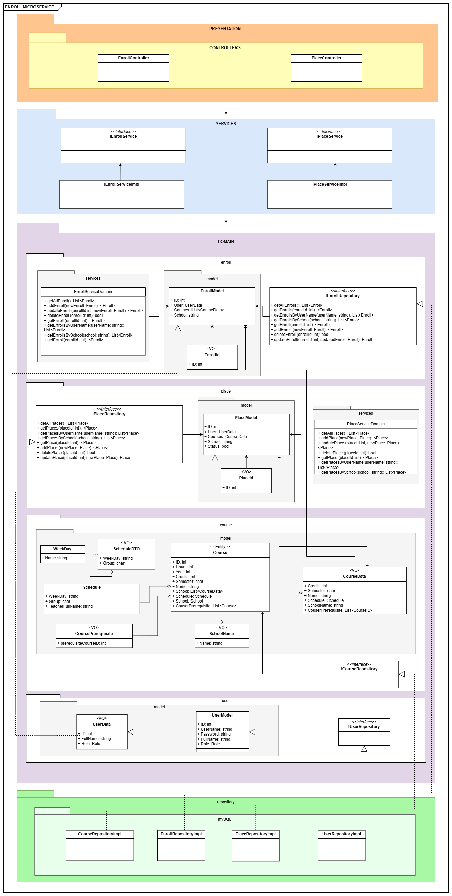

# Arquitectura DDD y Pruebas del Microservicio de Matrículas

## 1. Descripción

El microservicio de matrículas se encarga de gestionar todos los aspectos relacionados con las matrículas de los estudiantes, incluyendo la creación, actualización, consulta y eliminación de matrículas.

- **Contexto Delimitado:** Gestión de Matrículas

## 2. Arquitectura DDD

### 2.1. Capas de la Arquitectura

<details open>
  <summary><b><i>2.1.1. Capa de Presentación</b></i></summary>
  <ul>
    <li>Controladores</li>
    <ul>
      <li><b>EnrollmentsController</b>: Gestiona las solicitudes HTTP relacionadas con las matrículas. Incluye métodos para crear, actualizar, obtener y eliminar matrículas, delegando la lógica a los servicios de aplicación.</li>
    </ul>
  </ul>
</details>
<details open>
  <summary><b><i>2.1.2. Capa de Aplicación</b></i></summary>
  <ul>
    <li>Servicios de aplicación</li>
    <ul>
      <li><b>EnrollServiceImpl</b>: Contiene la lógica de negocio específica de la aplicación para las matrículas. Coordina las operaciones entre el controlador y el dominio, incluyendo la validación y transformación de datos.</li>
    </ul>
    <li>DTOs</li>
    <ul>
      <li><b>EnrollmentDto</b>: Objeto de transferencia de datos utilizado para encapsular los datos de una matrícula en una estructura simple que puede ser utilizada en la capa de presentación.</li>
    </ul>
    <li>Mapping</li>
    <ul>
      <li><b>EnrollMapping</b>: Clase responsable de mapear entre entidades de dominio y DTOs, asegurando que los datos se transfieran correctamente entre capas.</li>
    </ul>
  </ul>
</details>
<details open>
  <summary><b><i>2.1.3. Capa de Dominio</b></i></summary>
  <ul>
    <li>Entidades</li>
    <ul>
      <li><b>EnrollModel</b>: Representa la entidad principal del sistema de matrículas, incluyendo propiedades como <code>EnrollId</code>, <code>StudentId</code>, <code>CoursesId</code>, entre otras.</li>
    </ul>
    <li>Value Objects</li>
    <ul>
      <li><b>StudentData</b>: Representa un objeto de valor que maneja los datos del estudiante.</li>
      <li><b>SchoolData</b>: Representa un objeto de valor que maneja los datos de la escuela.</li>
    </ul>
    <li>Servicios de dominio</li>
    <ul>
      <li><b>EnrollServiceDomainImpl</b>: Contiene lógica de negocio compleja que involucra múltiples entidades. Por ejemplo, validaciones específicas de dominio para matrículas.</li>
    </ul>
    <li>Interfaces de repositorio</li>
    <ul>
      <li><b>IEnrollRepository</b>: Define los métodos que deben ser implementados para la gestión de matrículas en el repositorio. Incluye métodos como <code>AddEnroll</code>, <code>UpdateEnroll</code>, <code>GetEnrollById</code> y <code>DeleteEnroll</code>.</li>
    </ul>
  </ul>
</details>
<details open>
  <summary><b><i>2.1.4. Capa de Repositorio</b></i></summary>
  <ul>
    <li>Implementaciones de repositorios</li>
    <ul>
      <li><b>EnrollRepositoryImpl</b>: Implementación concreta de <code>IEnrollRepository</code>. Utiliza el contexto de la base de datos para realizar operaciones CRUD sobre las matrículas.</li>
    </ul>
    <li>Contexto de la base de datos</li>
    <ul>
      <li><b>MongoDbContext</b>: Clase que maneja la conexión a la base de datos y proporciona acceso a las entidades a través de DbSets. Configura mapeos y relaciones entre entidades.</li>
    </ul>
    <li>Integraciones externas</li>
    <ul>
      <li><b>CoursesExternalService</b>: Servicio que se integra con otro microservicio con datos de cursos.</li>
      <li><b>SchoolExternalService</b>: Servicio que se integra con otro microservicio con datos de escuela.</li>
      <li><b>UserExternalService</b>: Servicio que se integra con otro microservicio con datos de usuario.</li>
    </ul>
  </ul>
</details>

### 2.2. Diagrama de la Arquitectura



## 3. Pruebas

### 3.1. Pruebas de API

#### 3.1.1. Herramientas y Tecnologías

Para llevar a cabo las pruebas de nuestra API, hemos utilizado una serie de herramientas y tecnologías clave que facilitan la evaluación exhaustiva y efectiva de las funcionalidades expuestas por la API. A continuación se describen las herramientas principales empleadas:

- **Postman:** Esta herramienta es ampliamente utilizada para el diseño, prueba y documentación de APIs. Permite realizar solicitudes HTTP a los endpoints de la API, definir y gestionar colecciones de pruebas, y verificar respuestas con gran detalle. Postman también proporciona funcionalidades avanzadas como la ejecución de scripts pre y post solicitud, así como la integración con sistemas de CI/CD para automatizar las pruebas.

- **Swagger:** Swagger, ahora conocido como OpenAPI, es una herramienta poderosa para documentar y probar APIs. Permite generar documentación interactiva que facilita la comprensión y el uso de los endpoints de la API. Con Swagger, es posible visualizar y probar los endpoints directamente desde la documentación, lo que ayuda a identificar problemas y validar el comportamiento de la API de manera eficiente.

Estas herramientas y tecnologías no solo facilitan la creación de pruebas detalladas y la generación de documentación precisa, sino que también aseguran una integración continua y una experiencia de usuario consistente durante el ciclo de vida de desarrollo de la API.

#### 3.1.2. Escenarios de Prueba de API

En esta sección se detallan los escenarios de prueba para el servicio de matrículas, los cuales han sido diseñados para validar el correcto funcionamiento de las diferentes operaciones del API. Los detalles de los escenarios de prueba están disponibles en el archivo `enrollments-microservice.postman_collection.json`, el cual contiene las solicitudes y configuraciones para ejecutar los tests en Postman.

Además, los resultados de la ejecución de estos tests se encuentran en el archivo `enrollments-microservice.postman_test_run.json`. Este archivo proporciona un resumen de las pruebas realizadas y los resultados obtenidos, facilitando la verificación del comportamiento esperado del API según los casos de prueba definidos.

<details open>
  <summary><b><i>Crear matrícula</i></b></summary>

```gherkin
Background:
    Given que el endpoint "/api/v1/Enrollments/enroll/{userId}/{schoolId}" está accesible
```

  <details open>
    <summary><b><i>Escenario 1:</i></b> Crear matrícula con éxito</summary>

```gherkin
    Given que el sistema contiene un usuario con ID "1" y créditos suficientes
    And el sistema contiene una escuela con ID "1" con el cuerpo:
    {
        "courses": [
        {"id": "course1", "group": "A"}
        ]
    }
    When envíe una solicitud POST a "/api/v1/Enrollments/enroll/1/1"
    Then el código de estado de la respuesta debe ser 201
    And el cuerpo de la respuesta debe contener "Enrollment created successfully"
```

  </details>

  <details open>
    <summary><b><i>Escenario 2:</i></b> Crear matrícula cuando el usuario no existe</summary>

```gherkin
  Given el sistema no contiene un usuario con ID "999" con el cuerpo:
    {
      "courses": [
        {"id": "1", "group": "A"},
        {"id": "3", "group": "B"}
      ]
    }
  When se envía una solicitud POST a "/api/v1/Enrollments/enroll/999/1"
  Then el código de estado de la respuesta debe ser 404
  And el cuerpo de la respuesta debe contener "User not found"
```

  </details>

  <details open>
    <summary><b><i>Escenario 3:</i></b> Crear matrícula cuando el usuario tiene créditos insuficientes</summary>

```gherkin
    Given que el sistema contiene un usuario con ID "1" pero con créditos insuficientes
    And el sistema contiene una escuela con ID "1" con el cuerpo:
    {
        "courses": [
        {"id": "1", "group": "A"},
        {"id": "3", "group": "B"}
        ]
    }
    When envíe una solicitud POST a "/api/v1/Enrollments/enroll/1/1"
    Then el código de estado de la respuesta debe ser 400
    And el cuerpo de la respuesta debe contener "Insufficient credits"
```

  </details>

  <details open>
    <summary><b><i>Escenario 4:</i></b> Crear matrícula cuando la escuela no existe</summary>

```gherkin
    Given que el sistema contiene un usuario con ID "1" y créditos suficientes
    And el sistema no contiene una escuela con ID "999" con el cuerpo:
    {
        "courses": [
        {"id": "1", "group": "A"},
        {"id": "3", "group": "B"}
        ]
    }
    When envíe una solicitud POST a "/api/v1/Enrollments/enroll/1/999"
    Then el código de estado de la respuesta debe ser 404
    And el cuerpo de la respuesta debe contener "School not found"
```

  </details>

  <details open>
    <summary><b><i>Escenario 5:</i></b> Crear matrícula cuando los cursos están vacíos</summary>

```gherkin
    Given que el sistema contiene un usuario con ID "1" y créditos suficientes
    And el sistema no contiene una escuela con ID "1" con el cuerpo:
    {
        "courses": []
    }
    When envíe una solicitud POST a "/api/v1/Enrollments/enroll/1/1"
    Then el código de estado de la respuesta debe ser 400
    And el cuerpo de la respuesta debe contener "No courses to enroll"
```

  </details>

  <details open>
    <summary><b><i>Escenario 6:</i></b> Crear matrícula cuando el ID del curso no existe</summary>

```gherkin
    Given que el sistema contiene un usuario con ID "1" y créditos suficientes
    And el sistema contiene una escuela con ID "1" con el cuerpo:
    {
        "courses": [
        {"id": "course999", "group": "A"},
        {"id": "course3", "group": "B"}
        ]
    }
    When envíe una solicitud POST a "/api/v1/Enrollments/enroll/1/1"
    Then el código de estado de la respuesta debe ser 404
    And el cuerpo de la respuesta debe contener "Course not found or credits missing"
```

  </details>

</details>

<details open>
<summary><b><i>Obtener detalles de la matrícula</i></b></summary>

```gherkin
Background:
    Given el endpoint "/api/v1/Enrollments/{id}" está accesible
```

  <details open>
    <summary><b><i>Escenario 1:</i></b> Obtener detalles de la matrícula con éxito</summary>

```gherkin
    Given el sistema contiene una matrícula con ID "1"
    When se envía una solicitud GET a "/api/v1/Enrollments/1"
    Then el código de estado de la respuesta debe ser 200
    And el cuerpo de la respuesta debe contener los detalles de la matrícula con ID "1"
```

  </details>

  <details open>
    <summary><b><i>Escenario 2:</i></b> Obtener detalles de la matrícula cuando no existe</summary>

```gherkin
        Given el sistema no contiene una matrícula con ID "999"
    When se envía una solicitud GET a "/api/v1/Enrollments/999"
    Then el código de estado de la respuesta debe ser 404
    And el cuerpo de la respuesta debe contener un mensaje de error "Not Found"
```

  </details>

</details>

<details open>
    <summary><b><i>Actualizar matrícula</i></b></summary>

```gherkin
Background:
    Given el endpoint "/api/v1/Enrollments/enroll/{enrollId}" está accesible
```

  <details open>
    <summary><b><i>Escenario 1:</i></b> Actualizar matrícula con éxito</summary>

```gherkin
    Given el sistema contiene una matrícula con ID "0" con el cuerpo:
    {
        "studentId": "1",
        "schoolId": "1",
        "fullName": "Shinji Ikari",
        "academicPerformance": 0,
        "credits": 28,
        "courses": [
            {"id": "1", "group": "A"},
            {"id": "3", "group": "C"}
        ],
        "schoolName": "Evangelion"
    }
    When se envía una solicitud PUT a "/api/v1/Enrollments/enroll/0"
    Then el código de estado de la respuesta debe ser 200
    And el cuerpo de la respuesta debe contener "Enroll updated successfully"
```

  </details>

  <details open>
    <summary><b><i>Escenario 2:</i></b> Actualizar matrícula cuando no existe</summary>

```gherkin
    Given el sistema no contiene una matrícula con ID "999" con el cuerpo:
    {
        "studentId": "1",
        "schoolId": "1",
        "fullName": "Shinji Ikari",
        "academicPerformance": 0,
        "credits": 28,
        "courses": [
            {"id": "1", "group": "A"},
            {"id": "3", "group": "C"}
        ],
        "schoolName": "Evangelion"
    }
    When se envía una solicitud PUT a "/api/v1/Enrollments/enroll/999"
    Then el código de estado de la respuesta debe ser 404
    And el cuerpo de la respuesta debe contener "Enroll not found"
```

  </details>

</details>

<details open>
    <summary><b><i>Eliminar matrícula</i></b></summary>

```gherkin
Background:
    Given el endpoint "/api/v1/Enrollments/enroll/{enrollId}" está accesible
```

  <details open>
    <summary><b><i>Escenario 1:</i></b> Eliminar matrícula con éxito</summary>

```gherkin
    Given el sistema contiene una matrícula con ID "1"
    When se envía una solicitud DELETE a "/api/v1/Enrollments/enroll/1"
    Then el código de estado de la respuesta debe ser 200
    And el cuerpo de la respuesta debe contener "Enrollment deleted successfully"
```

  </details>

  <details open>
    <summary><b><i>Escenario 2:</i></b> Eliminar matrícula cuando no existe</summary>

```gherkin
    Given el sistema no contiene una matrícula con ID "999"
    When se envía una solicitud DELETE a "/api/v1/Enrollments/enroll/999"
    Then el código de estado de la respuesta debe ser 400
    And el cuerpo de la respuesta debe contener "Enrollment not found"
```

  </details>

</details>

<details open>
    <summary><b><i>Obtener cursos disponibles</i></b></summary>

```gherkin
Background:
    Given el endpoint "/api/v1/Enrollments/available/{userId}/{schoolId}" está accesible
```

  <details open>
    <summary><b><i>Escenario 1:</i></b> Obtener cursos disponibles con éxito</summary>

```gherkin
    Given el sistema contiene un usuario con ID "1" y una escuela con ID "1"
    And el usuario ha completado los cursos con IDs "1" y "2"
    And la escuela tiene una malla con cursos que requieren los IDs "1" y "2"
    And hay cursos disponibles con ID "3" que no han sido completados por el usuario
    When se envía una solicitud GET a "/api/v1/Enrollments/available/1/1"
    Then el código de estado de la respuesta debe ser 200
    And el cuerpo de la respuesta debe contener una lista de cursos disponibles con ID "3"
```

  </details>

  <details open>
    <summary><b><i>Escenario 2:</i></b> Obtener cursos disponibles cuando el usuario no existe</summary>

```gherkin
    Given el sistema no contiene un usuario con ID "999"
    When se envía una solicitud GET a "/api/v1/Enrollments/available/999/1"
    Then el código de estado de la respuesta debe ser 404
    And el cuerpo de la respuesta debe contener "User not found"
```

  </details>

  <details open>
    <summary><b><i>Escenario 3:</i></b> Obtener cursos disponibles cuando la escuela no existe</summary>

```gherkin
    Given el sistema contiene un usuario con ID "1"
    And el sistema no contiene una escuela con ID "999"
    When se envía una solicitud GET a "/api/v1/Enrollments/available/1/999"
    Then el código de estado de la respuesta debe ser 404
    And el cuerpo de la respuesta debe contener "School not found"
```

  </details>

  <details open>
    <summary><b><i>Escenario 4:</i></b> Obtener cursos disponibles cuando no hay cursos disponibles</summary>

```gherkin
    Given el sistema contiene un usuario con ID "1"
    And la escuela tiene una malla con cursos que han sido completados por el usuario
    When se envía una solicitud GET a "/api/v1/Enrollments/available/1/1"
    Then el código de estado de la respuesta debe ser 404
    And el cuerpo de la respuesta debe contener "No courses available"
```

  </details>

  <details open>
    <summary><b><i>Escenario 5:</i></b> Obtener cursos disponibles cuando los cursos no existen</summary>

```gherkin
    Given el sistema contiene un usuario con ID "1"
    And la escuela tiene una malla con cursos que requieren los IDs "1" y "2"
    And el curso de ID “4” no tiene horarios registrados
    When se envía una solicitud GET a "/api/v1/Enrollments/available/1/1"
    Then el código de estado de la respuesta debe ser 404
    And el cuerpo de la respuesta debe contener "Course not found"
```

  </details>

</details>

<details open>
    <summary><b><i>Obtener matrículas por ID de usuario</i></b></summary>

```gherkin
Background:
    Given el endpoint "/api/v1/Enrollments/user/{userId}" está accesible
```

  <details open>
    <summary><b><i>Escenario 1:</i></b> Obtener matrículas por ID de usuario con éxito</summary>

```gherkin
    Given el sistema contiene matrículas asociadas al usuario con ID "1"
    When se envía una solicitud GET a "/api/v1/Enrollments/user/1"
    Then el código de estado de la respuesta debe ser 200
    And el cuerpo de la respuesta debe contener una lista de matrículas para el usuario con ID "1"
```

  </details>

  <details open>
    <summary><b><i>Escenario 2:</i></b> Obtener matrículas por ID de usuario cuando el usuario no existe</summary>

```gherkin
    Given el sistema no contiene matrículas asociadas al usuario con ID "999"
    When se envía una solicitud GET a "/api/v1/Enrollments/user/999"
    Then el código de estado de la respuesta debe ser 404
    And el cuerpo de la respuesta debe contener "User not found"
```

  </details>

</details>

<details open>
    <summary><b><i>Obtener matrículas por ID de escuela</i></b></summary>

```gherkin
Background:
    Given el endpoint "/api/v1/Enrollments/school/{schoolId}" está accesible
```

  <details open>
    <summary><b><i>Escenario 1:</i></b> Obtener matrículas por ID de escuela con éxito</summary>

```gherkin
    Given el sistema contiene matrículas asociadas a la escuela con ID "1"
    When se envía una solicitud GET a "/api/v1/Enrollments/school/1"
    Then el código de estado de la respuesta debe ser 200
    And el cuerpo de la respuesta debe contener una lista de matrículas para la escuela con ID "1"
```

  </details>

  <details open>
    <summary><b><i>Escenario 2:</i></b> Obtener matrículas por ID de escuela cuando la escuela no existe</summary>

```gherkin
    Given el sistema no contiene matrículas asociadas a la escuela con ID "999"
    When se envía una solicitud GET a "/api/v1/Enrollments/school/999"
    Then el código de estado de la respuesta debe ser 404
    And el cuerpo de la respuesta debe contener "School not found"
```

  </details>

</details>

<details open>
    <summary><b><i>Obtener matrículas por ID de usuario y ID de escuela</i></b></summary>

```gherkin
Background:
    Given el endpoint "/api/v1/Enrollments/certificate/{userId}/{schoolId}" está accesible
```

  <details open>
    <summary><b><i>Escenario 1:</i></b> Obtener matrículas por ID de usuario y ID de escuela con éxito</summary>

```gherkin
    Given el sistema contiene las matrículas para el usuario con ID "1" en la escuela con ID "1"
    When se envía una solicitud GET a "/api/v1/Enrollments/certificate/1/1"
    Then el código de estado de la respuesta debe ser 200
    And el cuerpo de la respuesta debe contener una lista de matrículas para el usuario con ID "1" en la escuela con ID "1"
```

  </details>

  <details open>
    <summary><b><i>Escenario 2:</i></b> Obtener matrícula por ID de usuario y ID de escuela cuando la escuela no existe</summary>

```gherkin
    Given el sistema no contiene una inscripción para el usuario con ID "1" en la escuela con ID "999"
    When se envía una solicitud GET a "/api/v1/Enrollments/certificate/1/999"
    Then el código de estado de la respuesta debe ser 404
    And el cuerpo de la respuesta debe contener "School not found"
```

  </details>

  <details open>
    <summary><b><i>Escenario 3:</i></b> Obtener matrícula por ID de usuario y ID de escuela cuando el usuario no existe</summary>

```gherkin
    Given el sistema no contiene una inscripción para el usuario con ID "999" en la escuela con ID "1"
    When se envía una solicitud GET a "/api/v1/Enrollments/certificate/999/1"
    Then el código de estado de la respuesta debe ser 404
    And el cuerpo de la respuesta debe contener "User not found"
```

  </details>

</details>

---

### 3.2. Pruebas de Rendimiento

#### 3.2.1. Herramientas y Tecnologías

Descripción de las herramientas utilizadas para las pruebas de rendimiento (por ejemplo, Apache JMeter, k6, etc.).

#### 3.2.2. Escenarios de Prueba de Rendimiento

<details open>
  <summary><b><i>Escenario 1:</i></b> Prueba de carga bajo 100 solicitudes simultáneas GET.</summary>
  
  ```gherkin
  Given el endpoint "api/payments/" está disponible
    When se envían 100 solicitudes GET simultáneas al endpoint
    Then todas las respuestas deben ser 200 OK
    And el tiempo de respuesta promedio debe ser menor a 2 segundos
    And no debe haber errores o caídas del servicio
  ```
</details>

<details open>
  <summary><b><i>Escenario 2:</i></b> Prueba de estrés con picos de tráfico.</summary>
  <span>gherkin aqui</span>
</details>

<details open>
  <summary><b><i>Escenario 3:</i></b> Prueba de escalabilidad.</summary>
  <span>gherkin aqui</span>
</details>

### 3.3. Pruebas de Seguridad

#### 3.3.1. Herramientas y Tecnologías

Descripción de las herramientas utilizadas para las pruebas de seguridad (por ejemplo, OWASP ZAP, Burp Suite, etc.).

#### 3.3.2. Escenarios de Prueba de Seguridad

<details open>
  <summary><b><i>Escenario 1:</i></b> Verificación de la autenticación y autorización.</summary>

```gherkin
Scenario: Verificación de la autenticación y autorización
  Given el endpoint "api/payments/" requiere autenticación
  When un usuario no autenticado intenta acceder al endpoint
  Then la respuesta debe ser 401 Unauthorized
```

</details>

<details open>
  <summary><b><i>Escenario 2:</i></b> Prueba de inyección SQL.</summary>

<span>gherkin aqui</span>

</details>

<details open>
  <summary><b><i>Escenario 3:</i></b> Prueba de XSS (Cross-Site Scripting).</summary>

<span>gherkin aqui</span>

</details>

<details open>
  <summary><b><i>Escenario 4:</i></b> Prueba de CSRF (Cross-Site Request Forgery).</summary>
  
  <span>gherkin aqui</span>
</details>

## 4. Referencias

[1] W. by Iamprovidence, **“Backend side architecture evolution (N-layered, DDD, Hexagon, Onion, Clean Architecture)”**, Medium, 27-jun-2023. [En línea]. Disponible en: [https://medium.com/@iamprovidence/backend-side-architecture-evolution-n-layered-ddd-hexagon-onion-clean-architecture-643d72444ce4](https://medium.com/@iamprovidence/backend-side-architecture-evolution-n-layered-ddd-hexagon-onion-clean-architecture-643d72444ce4).

[2] C. Ramalingam, **“Building domain driven microservices - Walmart global tech blog - medium”**, Walmart Global Tech Blog, 01-jul-2020. [En línea]. Disponible en: [https://medium.com/walmartglobaltech/building-domain-driven-microservices-af688aa1b1b8](https://medium.com/walmartglobaltech/building-domain-driven-microservices-af688aa1b1b8).

[3] J. Loscalzo, **“Domain Driven Design: principios, beneficios y elementos — Segunda Parte”**, Medium, 18-jun-2018. [En línea]. Disponible en: [https://medium.com/@jonathanloscalzo/domain-driven-design-principios-beneficios-y-elementos-segunda-parte-337d77dc8566](https://medium.com/@jonathanloscalzo/domain-driven-design-principios-beneficios-y-elementos-segunda-parte-337d77dc8566).

[4] P. Martinez, **“Domain-Driven Design: Everything you always wanted to know”**, SSENSE-TECH, 15-may-2020. [En línea]. Disponible en: [https://medium.com/ssense-tech/domain-driven-design-everything-you-always-wanted-to-know-about-it-but-were-afraid-to-ask-a85e7b74497a](https://medium.com/ssense-tech/domain-driven-design-everything-you-always-wanted-to-know-about-it-but-were-afraid-to-ask-a85e7b74497a).
