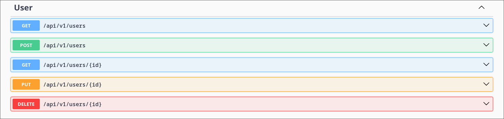

# Arquitectura DDD y Pruebas del Microservicio de Notificaciones

## 1. Descripción
El microservicio de notificaciones se encarga de gestionar todas las notificaciones enviadas a los usuarios, incluyendo la creación, actualización, obtención y eliminación de notificaciones.
- **Contexto Delimitado:** Gestión de Notificaciones

## 2. Arquitectura DDD

### 2.1. Capas de la Arquitectura

<details open>
  <summary><b><i>2.1.1. Capa de Presentación</b></i></summary>
  <ul>
    <li>Controladores</li>
    <ul>
      <li><b>NotificationController</b>: Gestiona las solicitudes HTTP relacionadas con las notificaciones. Incluye métodos para crear, actualizar, obtener y eliminar notificaciones, delegando la lógica a los servicios de aplicación.</li>
      <li><b>UserController</b>: Gestiona las solicitudes HTTP relacionadas con los usuarios. Incluye métodos para gestionar la información de los usuarios.</li>
    </ul>
  </ul>
</details>
<details open>
  <summary><b><i>2.1.2. Capa de Aplicación</b></i></summary>
  <ul>
    <li>Servicios de aplicación</li>
    <ul>
      <li><b>NotificationService</b>: Contiene la lógica de negocio específica de las notificaciones. Coordina las operaciones entre el controlador y el dominio, incluyendo la validación y transformación de datos.</li>
      <li><b>UserService</b>: Contiene la lógica de negocio específica de los usuarios. Coordina las operaciones entre el controlador y el dominio.</li>
    </ul>
    <li>DTOs</li>
    <ul>
      <li><b>NotificationDto</b>: Objeto de transferencia de datos utilizado para encapsular los datos de una notificación en una estructura simple que puede ser utilizada en la capa de presentación.</li>
      <li><b>UserDto</b>: Objeto de transferencia de datos utilizado para encapsular los datos de un usuario en una estructura simple que puede ser utilizada en la capa de presentación.</li>
    </ul>
  </ul>
</details>
<details open>
  <summary><b><i>2.1.3. Capa de Dominio</b></i></summary>
  <ul>
    <li>Entidades</li>
    <ul>
      <li><b>Notification</b>: Representa la entidad principal del sistema de notificaciones, incluyendo propiedades como <code>Id</code>, <code>Type</code>, <code>Message</code>, <code>Status</code>, <code>RecipientId</code>, entre otras.</li>
      <li><b>User</b>: Representa la entidad del usuario, incluyendo propiedades como <code>Id</code>, <code>Name</code>, <code>Preference</code>, <code>ContactInfo</code>, <code>IsActive</code>, entre otras.</li>
    </ul>
    <li>Value Objects</li>
    <ul>
      <li><b>Message</b>: Representa un objeto de valor para manejar los mensajes de las notificaciones.</li>
    </ul>
    <li>Agregados</li>
    <ul>
      <li><b>NotificationAggregate</b>: Agrupa entidades y objetos de valor relacionados a las notificaciones, asegurando la consistencia interna del agregado.</li>
    </ul>
    <li>Servicios de dominio</li>
    <ul>
      <li><b>NotificationDomainService</b>: Contiene lógica de negocio compleja que involucra múltiples entidades o agregados. Por ejemplo, la lógica para enviar notificaciones.</li>
      <li><b>UserDomainService</b>: Contiene lógica de negocio compleja relacionada con los usuarios.</li>
    </ul>
    <li>Interfaces de servicios</li>
    <ul>
      <li><b>INotificationService</b>: Define los métodos que deben ser implementados para la gestión de las notificaciones en el servicio de aplicación. Incluye métodos como <code>GetAllNotifications</code>, <code>GetByRecipientId</code> y <code>CreateNotification</code>.</li>
      <li><b>IUserService</b>: Define los métodos que deben ser implementados para la gestión de los usuarios en el servicio de aplicación. Incluye métodos como <code>GetAllUsers</code>, <code>GetUserById</code>, <code>CreateUser</code> y <code>UpdateUser</code>.</li>
    </ul>
  </ul>
</details>
  <summary><b><i>2.1.4. Capa de Repositorio</b></i></summary>
  <ul>
    <li>Implementaciones de repositorios</li>
    <ul>
      <li><b>NotificationRepository</b>: Implementación concreta de <code>INotificationRepository</code>. Utiliza el contexto de la base de datos para realizar operaciones CRUD sobre las notificaciones.</li>
      <li><b>UserRepository</b>: Implementación concreta de <code>IUserRepository</code>. Utiliza el contexto de la base de datos para realizar operaciones CRUD sobre los usuarios.</li>
    </ul>
    <li>Contexto de la base de datos</li>
    <ul>
      <li><b>MongoDbContext</b>: Clase que maneja la conexión a la base de datos y proporciona acceso a las entidades a través de DbSets. Configura mapeos y relaciones entre entidades.</li>
    </ul>
  </ul>
</details>

### 2.2. Diagrama de la Arquitectura


## 3. Pruebas

### 3.1. Pruebas de API

#### 3.1.1. Herramientas y Tecnologías
Descripción de las herramientas utilizadas para las pruebas de API (por ejemplo, Postman, Swagger, etc.).

#### 3.1.2. Escenarios de Prueba de API

<details open>
<summary><b><i>UsersController</i></b></summary>

<details open>
<summary><b><i>GET api/v1/users</i></b></summary>
<details open>
<summary><b><i>Escenario 1:</i></b> Verificación de la obtención de todos los usuarios.</summary>

```gherkin
    Escenario: Verificación de la obtención de todos los usuarios
       Given el endpoint "api/v1/users" está disponible
       When se envía una solicitud GET
       Then la respuesta debe ser 200 OK
       And la respuesta debe ser un array de usuarios
```
</details>

</details>

<details open>
<summary><b><i>POST api/v1/users</i></b></summary>

<details open>
<summary><b><i>Escenario 1:</i></b> Verificación de la creación de un usuario con datos válidos.</summary>

```gherkin
Escenario: Verificación de la creación de un usuario con datos válidos
  Given el endpoint "api/v1/users" está disponible
  And el cuerpo de la solicitud es:
"""
{
  "id": 501,
  "name": "Lyon",
  "preference": "Correo",
  "contactInfo": "lyonelmessi@gmail.com",
  "isActive": true
}
"""
  When se envía una solicitud POST con los datos del usuario
  Then la respuesta debe ser 201 Created
  And la respuesta debe contener el usuario creado
```
 </details>

<details open>
  <summary><b><i>Escenario 2:</i></b> Verificación de la creación de un usuario con ID duplicado.</summary>

```gherkin
Escenario: Verificación de la creación de un usuario con ID duplicado
  Given el endpoint "api/v1/users" está disponible
  And el cuerpo de la solicitud es:
  """
  {
    "id": 1,
    "name": "Lyon",
    "preference": "Correo",
    "contactInfo": "lyonelmessi@gmail.com",
    "isActive": true
  }
  """
  When se envía una solicitud POST con un ID de usuario que ya existe
  Then la respuesta debe ser 409 Conflict
  And la respuesta debe contener un mensaje de error
```
</details>

<details open>
  <summary><b><i>Escenario 3:</i></b> Verificación de la creación de un usuario con datos incompletos.</summary>

```gherkin
Escenario: Verificación de la creación de un usuario con datos incompletos
  Given el endpoint "api/v1/users" está disponible
  And el cuerpo de la solicitud es:
  """
  {
    "id": 502,
    "name": "Lyon",
    "preference": "Correo",
    "isActive": true
  }
  """
  When se envía una solicitud POST con datos incompletos del usuario
  Then la respuesta debe ser 400 Bad Request
  And la respuesta debe contener un mensaje de error
```
</details>

</details>

<details open>
  <summary><b><i>GET api/v1/users/{id}</i></b></summary>

  <details open>
    <summary><b><i>Escenario 1:</i></b> Verificación de la obtención de un usuario existente.</summary>

  ```gherkin
  Escenario: Verificación de la obtención de un usuario existente
    Given el endpoint "api/v1/users/{id}" está disponible
    When se envía una solicitud GET con un ID de usuario válido
    Then la respuesta debe ser 200 OK
    And la respuesta debe contener el usuario solicitado
  ```
  </details>

  <details open>
    <summary><b><i>Escenario 2:</i></b> Verificación de la obtención de un usuario inexistente.</summary>

  ```gherkin
  Escenario: Verificación de la obtención de un usuario inexistente
    Given el endpoint "api/v1/users/{id}" está disponible
    When se envía una solicitud GET con un ID de usuario no válido
    Then la respuesta debe ser 404 Not Found
    And la respuesta debe contener un mensaje de error
  ```
  </details>

</details>

<details open>
  <summary><b><i>PUT api/v1/users/{id}</i></b></summary>

  <details open>
    <summary><b><i>Escenario 1:</i></b> Verificación de la actualización de un usuario existente.</summary>

  ```gherkin
  Escenario: Verificación de la actualización de un usuario existente
    Given el endpoint "api/v1/users/{id}" está disponible
    And el cuerpo de la solicitud es:
    """
    {
      "id": 501,
      "name": "Lyon",
      "preference": "SMS",
      "contactInfo": "987654321",
      "isActive": true
    }
    """
    When se envía una solicitud PUT con datos válidos del usuario
    Then la respuesta debe ser 204 No Content
  ```
  </details>

  <details open>
    <summary><b><i>Escenario 2:</i></b> Verificación de la actualización de un usuario con datos inválidos.</summary>

  ```gherkin
  Escenario: Verificación de la actualización de un usuario con datos inválidos
    Given el endpoint "api/v1/users/{id}" está disponible
    And el cuerpo de la solicitud es:
    """
    {
      "id": 501,
      "name": "Lyon",
      "preference": "SMS",
      "contactInfo": "",
      "isActive": true
    }
    """
    When se envía una solicitud PUT con datos inválidos del usuario
    Then la respuesta debe ser 400 Bad Request
    And la respuesta debe contener un mensaje de error
  ```
  </details>

  <details open>
    <summary><b><i>Escenario 3:</i></b> Verificación de la actualización de un usuario inexistente.</summary>

  ```gherkin
  Escenario: Verificación de la actualización de un usuario inexistente
    Given el endpoint "api/v1/users/{id}" está disponible
    And el cuerpo de la solicitud es:
    """
    {
      "id": 987,
      "name": "Lyon",
      "preference": "SMS",
      "contactInfo": "987654321",
      "isActive": true
    }
    """
    When se envía una solicitud PUT con un ID de usuario no válido
    Then la respuesta debe ser 404 Not Found
    And la respuesta debe contener un mensaje de error
  ```
  </details>

</details>

<details open>
  <summary><b><i>DELETE api/v1/users/{id}</i></b></summary>

  <details open>
    <summary><b><i>Escenario 1:</i></b> Verificación de la eliminación de un usuario existente.</summary>

  ```gherkin
  Escenario: Verificación de la eliminación de un usuario existente
    Given el endpoint "api/v1/users/{id}" está disponible
    When se envía una solicitud DELETE con un ID de usuario válido
    Then la respuesta debe ser 204 No Content
  ```
  </details>

  <details open>
    <summary><b><i>Escenario 2:</i></b> Verificación de la eliminación de un usuario inexistente.</summary>

  ```gherkin
  Escenario: Verificación de la eliminación de un usuario inexistente
    Given el endpoint "api/v1/users/{id}" está disponible
    When se envía una solicitud DELETE con un ID de usuario no válido
    Then la respuesta debe ser 404 Not Found
    And la respuesta debe contener un mensaje de error
  ```
  </details>

</details>

</details>

<details open>
  <summary><b><i>NotificationsController</i></b></summary>

<details open>
  <summary><b><i>POST api/v1/notifications</i></b></summary>

  <details open>
    <summary><b><i>Escenario 1:</i></b> Verificación de la creación de una notificación con datos válidos.</summary>

  ```gherkin
  Escenario: Verificación de la creación de una notificación con datos válidos
    Given el endpoint "api/v1/notifications" está disponible
    And el cuerpo de la solicitud es:
    """
    {
      "type": "payment",
      "message": "Su pago se realizó con éxito",
      "recipientId": 501
    }
    """
    When se envía una solicitud POST con los datos de la notificación
    Then la respuesta debe ser 201 Created
    And la respuesta debe contener la notificación creada
  ```
  </details>

<details open>
    <summary><b><i>Escenario 2:</i></b> Verificación de la creación de una notificación con recipientId inválido.</summary>

  ```gherkin
  Escenario: Verificación de la creación de una notificación con recipientId inválido
    Given el endpoint "api/v1/notifications" está disponible
    And el cuerpo de la solicitud es:
    """
    {
      "type": "payment",
      "message": "Su pago se realizó con éxito",
      "recipientId": 987
    }
    """
    When se envía una solicitud POST con un recipientId no válido
    Then la respuesta debe ser 404 Not Found
    And la respuesta debe contener un mensaje de error
  ```
  </details>

  <details open>
    <summary><b><i>Escenario 3:</i></b> Verificación de la creación de una notificación con datos incompletos.</summary>

  ```gherkin
  Escenario: Verificación de la creación de una notificación con datos incompletos
    Given el endpoint "api/v1/notifications" está disponible
    And el cuerpo de la solicitud es:
    """
    {
      "type": "payment",
      "recipientId": 0
    }
    """
    When se envía una solicitud POST con datos incompletos de la notificación
    Then la respuesta debe ser 400 Bad Request
    And la respuesta debe contener un mensaje de error
  ```
  </details>

  <details open>
    <summary><b><i>Escenario 4:</i></b> Verificación de la creación de una notificación con datos inválidos.</summary>

  ```gherkin
  Escenario: Verificación de la creación de una notificación con datos inválidos
    Given el endpoint "api/v1/notifications" está disponible
    And el cuerpo de la solicitud es:
    """
    {
      "type": "payment",
      "message": "",
      "recipientId": 0
    }
    """
    When se envía una solicitud POST con datos inválidos de la notificación
    Then la respuesta debe ser 400 Bad Request
    And la respuesta debe contener un mensaje de error
  ```
  </details>

</details>

<details open>
  <summary><b><i>GET api/v1/notifications</i></b></summary>

  <details open>
    <summary><b><i>Escenario 1:</i></b> Verificación de la obtención de todas las notificaciones.</summary>

  ```gherkin
  Escenario: Verificación de la obtención de todas las notificaciones
    Given el endpoint "api/v1/notifications" está disponible
    When se envía una solicitud GET
    Then la respuesta debe ser 200 OK
    And la respuesta debe ser un array de notificaciones
  ```
  </details>

</details>

<details open>
  <summary><b><i>GET api/v1/notifications/recipient/{id}</i></b></summary>

  <details open>
    <summary><b><i>Escenario 1:</i></b> Verificación de la obtención de notificaciones por recipientId existente.</summary>

  ```gherkin
  Escenario: Verificación de la obtención de notificaciones por recipientId existente
    Given el endpoint "api/v1/notifications/recipient/{id}" está disponible
    When se envía una solicitud GET con un ID de recipient válido
    Then la respuesta debe ser 200 OK
    And la respuesta debe ser un array de notificaciones
  ```
  </details>

  <details open>
    <summary><b><i>Escenario 2:</i></b> Verificación de la obtención de notificaciones por recipientId inexistente.</summary>

```gherkin
  Escenario: Verificación de la obtención de notificaciones por recipientId inexistente
    Given el endpoint "api/v1/notifications/recipient/{id}" está disponible
    When se envía una solicitud GET con un ID de recipient no válido
    Then la respuesta debe ser 404 Not Found
    And la respuesta debe contener un mensaje de error
  ```
  </details>

</details>

<p align="center">
  
</p>
<p align="center">
  
</p>

</details>

### 3.2. Pruebas de Rendimiento

#### 3.2.1. Herramientas y Tecnologías

**Apache JMeter** es una herramienta de código abierto ampliamente utilizada para realizar pruebas de rendimiento y carga en aplicaciones. Diseñada para evaluar el rendimiento de servicios web y aplicaciones en una variedad de protocolos, JMeter permite simular múltiples usuarios concurrentes para medir el comportamiento del sistema bajo diferentes cargas. Con su interfaz gráfica intuitiva, JMeter facilita la creación de planes de prueba personalizados, la definición de escenarios de carga y la configuración de métricas detalladas. Esta herramienta también ofrece capacidades para generar reportes detallados y gráficos, proporcionando una visión integral del rendimiento del sistema y ayudando a identificar cuellos de botella y áreas de mejora. Su flexibilidad y extensibilidad la convierten en una opción ideal para evaluar la capacidad de respuesta y la estabilidad de aplicaciones en entornos de producción.

#### 3.2.2. Escenarios de Prueba de Rendimiento

<details open>
  <summary><b><i>Obtener detalles de Usuario</i></b></summary>

```gherkin
Background:
    Given el endpoint "/api/v1/Users/{userId}" está accesible
```

  <details open>
    <summary><b><i>Escenario 1:</i></b> Prueba de carga para obtener usuario por ID con 25 usuarios</summary>
    
```gherkin
    Given el endpoint "/api/v1/Users/1" está disponible
    When se envían 25 solicitudes GET simultáneas al endpoint
    Then todas las respuestas deben ser 200 OK
    And el tiempo de respuesta promedio debe ser menor a 1.5 segundos
    And no debe haber errores o caídas del servicio
```

  </details>
  
  <details open>
    <summary><b><i>Escenario 2:</i></b> Prueba de carga para obtener usuario por ID con 50 usuarios</summary>
    
```gherkin
    Given el endpoint "/api/v1/Users/1" está disponible
    When se envían 50 solicitudes GET simultáneas al endpoint
    Then todas las respuestas deben ser 200 OK
    And el tiempo de respuesta promedio debe ser menor a 1.5 segundos
    And no debe haber errores o caídas del servicio
```

  </details>
  
  <details open>
    <summary><b><i>Escenario 3:</i></b> Prueba de carga para obtener usuario por ID con 100 usuarios</summary>
    
```gherkin
    Given el endpoint "/api/v1/Users/1" está disponible
    When se envían 100 solicitudes GET simultáneas al endpoint
    Then todas las respuestas deben ser 200 OK
    And el tiempo de respuesta promedio debe ser menor a 1.5 segundos
    And no debe haber errores o caídas del servicio
```

  </details>
</details>

<details open>
  <summary><b><i>Obtener todos los usuarios</i></b></summary>
    
```gherkin
Background:
    Given el endpoint "/api/v1/Users" está accesible
```

  <details open>
    <summary><b><i>Escenario 1:</i></b> Prueba de carga para obtener todos los usuarios con 25 usuarios</summary>
    
```gherkin
    Given el endpoint "/api/v1/Users" está disponible
    When se envían 25 solicitudes GET simultáneas al endpoint
    Then todas las respuestas deben ser 200 OK
    And el tiempo de respuesta promedio debe ser menor a 1.5 segundos
    And no debe haber errores o caídas del servicio
```

  </details>

  <details open>
    <summary><b><i>Escenario 2:</i></b> Prueba de carga para obtener todos los usuarios con 50 usuarios</summary>
    
```gherkin
    Given el endpoint "/api/v1/Users" está disponible
    When se envían 50 solicitudes GET simultáneas al endpoint
    Then todas las respuestas deben ser 200 OK
    And el tiempo de respuesta promedio debe ser menor a 1.5 segundos
    And no debe haber errores o caídas del servicio
```

  </details>
  
  <details open>
    <summary><b><i>Escenario 3:</i></b> Prueba de carga para obtener todos los usuarios con 100 usuarios</summary>
    
```gherkin
    Given el endpoint "/api/v1/Users" está disponible
    When se envían 100 solicitudes GET simultáneas al endpoint
    Then todas las respuestas deben ser 200 OK
    And el tiempo de respuesta promedio debe ser menor a 1.5 segundos
    And no debe haber errores o caídas del servicio
```

  </details>
</details>


<details open>
  <summary><b><i>Obtener notificaciones por ID de destinatario</i></b></summary>
  
```gherkin
Background:
    Given el endpoint "/api/v1/Notifications/{recipientId}" está accesible
```

  <details open>
    <summary><b><i>Escenario 1:</i></b> Prueba de carga para obtener notificaciones por ID del destinatario con 25 usuarios</summary>
    
```gherkin
    Given el endpoint "/api/v1/Notifications/1" está disponible
    When se envían 25 solicitudes GET simultáneas al endpoint
    Then todas las respuestas deben ser 200 OK
    And el tiempo de respuesta promedio debe ser menor a 1.5 segundos
    And no debe haber errores o caídas del servicio
```

  </details>

  <details open>
    <summary><b><i>Escenario 2:</i></b> Prueba de carga para obtener notificaciones por ID del destinatario con 50 usuarios</summary>

```gherkin
    Given el endpoint "/api/v1/Notifications/1" está disponible
    When se envían 50 solicitudes GET simultáneas al endpoint
    Then todas las respuestas deben ser 200 OK
    And el tiempo de respuesta promedio debe ser menor a 1.5 segundos
    And no debe haber errores o caídas del servicio
```

  </details>

  <details open>
    <summary><b><i>Escenario 3:</i></b> Prueba de carga para obtener notificaciones por ID del destinatario con 100 usuarios</summary>
    
```gherkin
    Given el endpoint "/api/v1/Notifications/1" está disponible
    When se envían 100 solicitudes GET simultáneas al endpoint
    Then todas las respuestas deben ser 200 OK
    And el tiempo de respuesta promedio debe ser menor a 1.5 segundos
    And no debe haber errores o caídas del servicio
```

  </details>
</details>

<details open>
  <summary><b><i>Obtener todas las notificaciones</i></b></summary>

```gherkin
Background:
    Given el endpoint "/api/v1/Notifications" está accesible
```

  <details open>
    <summary><b><i>Escenario 1:</i></b> Prueba de carga para obtener todas las notificaciones con 25 usuarios</summary>
    
```gherkin
    Given el endpoint "/api/v1/Notifications" está disponible
    When se envían 25 solicitudes GET simultáneas al endpoint
    Then todas las respuestas deben ser 200 OK
    And el tiempo de respuesta promedio debe ser menor a 1.5 segundos
    And no debe haber errores o caídas del servicio
```

  </details>
  
  <details open>
    <summary><b><i>Escenario 2:</i></b> Prueba de carga para obtener todas las notificaciones con 50 usuarios</summary>
    
```gherkin
    Given el endpoint "/api/v1/Notifications" está disponible
    When se envían 50 solicitudes GET simultáneas al endpoint
    Then todas las respuestas deben ser 200 OK
    And el tiempo de respuesta promedio debe ser menor a 1.5 segundos
    And no debe haber errores o caídas del servicio
```

  </details>
  
  <details open>
    <summary><b><i>Escenario 3:</i></b> Prueba de carga para obtener todas las notificaciones con 100 usuarios</summary>
    
```gherkin
    Given el endpoint "/api/v1/Notifications" está disponible
    When se envían 100 solicitudes GET simultáneas al endpoint
    Then todas las respuestas deben ser 200 OK
    And el tiempo de respuesta promedio debe ser menor a 1.5 segundos
    And no debe haber errores o caídas del servicio
```

  </details>
</details>

El siguiente informe presenta los resultados de las pruebas de rendimiento ejecutadas utilizando Apache JMeter.

<p align="center">
  
</p>

| **Label**                                           | **#Samples** | **FAIL** | **Error%** | **Average (ms)** | **Min (ms)** | **Max (ms)** | **Median (ms)** | **90th pct (ms)** | **95th pct (ms)** | **99th pct (ms)** | **Transactions/s** | **Received (KB/sec)** | **Sent (KB/sec)** |
| --------------------------------------------------- | ------------ | -------- | ---------- | ---------------- | ------------ | ------------ | --------------- | ----------------- | ----------------- | ----------------- | ------------------ | --------------------- | ----------------- |
| **Total**                                           | 700          | 0        | 0.00%      | 462.43           | 169          | 1616         | 389.00          | 865.40            | 1051.65           | 1513.84           | 186.37             | 194.06                | 24.84             |
| **GetUserByIdWith100UsersTest**                     | 100          | 0        | 0.00%      | 489.72           | 178          | 1322         | 402.50          | 883.60            | 1154.70           | 1320.60           | 40.73              | 9.71                 | 5.21              |
| **GetUserByIdWith50UsersTest**                      | 50           | 0        | 0.00%      | 611.54           | 171          | 1616         | 455.50          | 1096.50           | 1442.30           | 1616.00           | 18.83              | 4.49                 | 2.41              |
| **GetUserByIdWith25UsersTest**                      | 25           | 0        | 0.00%      | 478.44           | 184          | 1584         | 461.00          | 895.00            | 1414.20           | 1584.00           | 10.36              | 2.47                 | 1.33              |
| **GetNotificationsByRecipientIdWith100UsersTest**   | 100          | 0        | 0.00%      | 448.01           | 169          | 1514         | 377.50          | 760.00            | 1022.35           | 1512.61           | 40.73              | 54.97                | 5.93              |
| **GetNotificationsByRecipientIdWith50UsersTest**    | 50           | 0        | 0.00%      | 471.94           | 172          | 1370         | 400.00          | 846.00            | 1117.00           | 1370.00           | 17.43              | 23.53                | 2.54              |
| **GetNotificationsByRecipientIdWith25UsersTest**    | 25           | 0        | 0.00%      | 447.36           | 181          | 867          | 413.00          | 746.80            | 852.90            | 867.00            | 8.00               | 10.80                | 1.16              |
| **GetAllUsersWith100UsersTest**                     | 100          | 0        | 0.00%      | 399.27           | 173          | 1547         | 275.00          | 821.60            | 974.95            | 1542.79           | 45.19              | 37.55                | 5.69              |
| **GetAllUsersWith50UsersTest**                      | 50           | 0        | 0.00%      | 372.46           | 170          | 1269         | 268.50          | 782.40            | 1047.55           | 1269.00           | 27.07              | 22.50                | 3.41              |
| **GetAllUsersWith25UsersTest**                      | 25           | 0        | 0.00%      | 369.56           | 178          | 1563         | 214.00          | 880.20            | 1386.60           | 1563.00           | 10.37              | 8.62                 | 1.31              |
| **GetAllNotificationsWith100UsersTest**             | 100          | 0        | 0.00%      | 510.04           | 171          | 1551         | 405.00          | 1057.90           | 1278.35           | 1550.47           | 40.44              | 70.61                | 5.41              |
| **GetAllNotificationsWith50UsersTest**              | 50           | 0        | 0.00%      | 452.44           | 193          | 912          | 410.50          | 824.90            | 891.40            | 912.00            | 18.85              | 32.91                | 2.52              |
| **GetAllNotificationsWith25UsersTest**              | 25           | 0        | 0.00%      | 447.72           | 193          | 974          | 390.00          | 793.00            | 966.50            | 974.00            | 7.87               | 13.74                | 1.05              |

---

### 3.3. Pruebas de Seguridad

#### 3.3.1. Herramientas y Tecnologías

**OWASP ZAP (Zed Attack Proxy)** es una herramienta de código abierto diseñada para realizar pruebas de seguridad en aplicaciones web. Desarrollada por el Open Web Application Security Project (OWASP), ZAP proporciona una amplia gama de funciones para identificar vulnerabilidades y evaluar la seguridad de aplicaciones durante el ciclo de desarrollo. Su interfaz intuitiva permite a los usuarios realizar escaneos automatizados, así como llevar a cabo pruebas manuales de seguridad, como la exploración de aplicaciones y la identificación de puntos débiles. ZAP es particularmente útil para detectar problemas de seguridad comunes, como inyecciones SQL, ataques de cross-site scripting (XSS) y configuraciones incorrectas. Además, ZAP ofrece soporte para integraciones con otras herramientas de desarrollo y pruebas, lo que facilita la inclusión de prácticas de seguridad en el proceso de desarrollo ágil. Su capacidad para generar reportes detallados ayuda a los equipos de desarrollo a abordar las vulnerabilidades de manera efectiva y mejorar la seguridad general de sus aplicaciones.

#### 3.3.2. Escenarios de Prueba de Seguridad

```gherkin
Background:
    Given que el endpoint "http://localhost:8006" está accesible
```

<details open>
  <summary><b><i>Escenario 1:</i></b> Verificación de encabezados de seguridad HTTP.</summary>

```gherkin
Scenario: Verificación de encabezados de seguridad HTTP
  Given el sitio web "http://localhost:8006" debe incluir varios encabezados de seguridad HTTP
  When se realiza un análisis de encabezados HTTP
  Then los encabezados esperados deben estar presentes, incluyendo "Strict-Transport-Security", "Content-Security-Policy", y "X-Content-Type-Options"
```

</details>

<details open>
  <summary><b><i>Escenario 2:</i></b> Verificación de vulnerabilidades en bibliotecas JavaScript.</summary>

```gherkin
Scenario: Verificación de vulnerabilidades en bibliotecas JavaScript
  Given el sitio web "http://localhost:8006" utiliza bibliotecas JavaScript de terceros
  When se realiza un análisis de bibliotecas JavaScript
  Then no se deben encontrar bibliotecas vulnerables, como aquellas indicadas por Retire.js
```

</details>

<details open>
  <summary><b><i>Escenario 3:</i></b> Verificación de la configuración de cookies.</summary>

```gherkin
Scenario: Verificación de la configuración de cookies
  Given el sitio web "http://localhost:8006" utiliza cookies para el manejo de sesiones
  When se realiza un análisis de cookies
  Then todas las cookies deben estar configuradas con las banderas adecuadas, incluyendo "HttpOnly" y "Secure"
```

</details>

<details open>
  <summary><b><i>Escenario 4:</i></b> Verificación de la protección contra ataques XSS.</summary>

```gherkin
Scenario: Verificación de la protección contra ataques XSS
  Given el sitio web "http://localhost:8006" permite la entrada de usuarios
  When se realiza un análisis de entrada para detectar vulnerabilidades XSS
  Then no se deben encontrar puntos de entrada vulnerables a ataques de cross-site scripting (XSS)
```

</details>

<details open>
  <summary><b><i>Escenario 5:</i></b> Verificación de la política de seguridad de contenido (CSP).</summary>

```gherkin
Scenario: Verificación de la política de seguridad de contenido (CSP)
  Given el sitio web "http://localhost:8006" debe tener una política de seguridad de contenido configurada
  When se realiza un análisis de la política de seguridad de contenido
  Then la política debe estar correctamente configurada y debe incluir directivas como "default-src" y "script-src"
```

</details>

<details open>
  <summary><b><i>Escenario 6:</i></b> Verificación de la protección contra el clickjacking.</summary>

```gherkin
Scenario: Verificación de la protección contra el clickjacking
  Given el sitio web "http://localhost:8006" debe protegerse contra ataques de clickjacking
  When se realiza un análisis de encabezados HTTP
  Then debe estar presente el encabezado "X-Frame-Options" con una configuración segura
```

</details>

<details open>
  <summary><b><i>Escenario 7:</i></b> Verificación de redirecciones abiertas.</summary>

```gherkin
Scenario: Verificación de redirecciones abiertas
  Given el sitio web "http://localhost:8006" debe manejar las redirecciones de forma segura
  When se realiza un análisis para detectar redirecciones abiertas
  Then no deben encontrarse vulnerabilidades de redirección abierta
```

</details>

<details open>
  <summary><b><i>Escenario 8:</i></b> Verificación de exposición de información sensible.</summary>

```gherkin
Scenario: Verificación de exposición de información sensible
  Given el sitio web "http://localhost:8006" debe proteger la información sensible
  When se realiza un análisis para detectar la exposición de información sensible
  Then no se debe encontrar información sensible expuesta en encabezados HTTP o mensajes de error
```

</details>

<details open>
  <summary><b><i>Escenario 9:</i></b> Verificación de configuraciones de seguridad en la administración de sesiones.</summary>

```gherkin
Scenario: Verificación de configuraciones de seguridad en la administración de sesiones
  Given el sitio web "http://localhost:8006" gestiona sesiones de usuario
  When se realiza un análisis de la gestión de sesiones
  Then la sesión debe estar protegida contra ataques como el secuestro de sesión y el manejo inseguro de IDs de sesión
```

</details>

<details open>
  <summary><b><i>Escenario 10:</i></b> Verificación de la protección contra ataques de CSRF.</summary>

```gherkin
Scenario: Verificación de la protección contra ataques de CSRF
  Given el sitio web "http://localhost:8006" debe protegerse contra ataques de falsificación de solicitudes entre sitios (CSRF)
  When se realiza un análisis para detectar la protección contra CSRF
  Then deben encontrarse y validarse tokens anti-CSRF en formularios y solicitudes
```

</details>

<details open>
  <summary><b><i>Escenario 11:</i></b> Verificación de vulnerabilidades de exposición de información.</summary>

```gherkin
Scenario: Verificación de vulnerabilidades de exposición de información
  Given el sitio web "http://localhost:8006" debe manejar la exposición de información con cuidado
  When se realiza un análisis para detectar la divulgación de información sensible
  Then no deben encontrarse vulnerabilidades de divulgación de información, como mensajes de error o encabezados de respuesta que revelen detalles internos
```

</details>

<p align="center">
  
</p>

## 4. Referencias

[1] W. by Iamprovidence, **“Backend side architecture evolution (N-layered, DDD, Hexagon, Onion, Clean Architecture)”**, Medium, 27-jun-2023. [En línea]. Disponible en: [https://medium.com/@iamprovidence/backend-side-architecture-evolution-n-layered-ddd-hexagon-onion-clean-architecture-643d72444ce4](https://medium.com/@iamprovidence/backend-side-architecture-evolution-n-layered-ddd-hexagon-onion-clean-architecture-643d72444ce4).

[2] C. Ramalingam, **“Building domain driven microservices - Walmart global tech blog - medium”**, Walmart Global Tech Blog, 01-jul-2020. [En línea]. Disponible en: [https://medium.com/walmartglobaltech/building-domain-driven-microservices-af688aa1b1b8](https://medium.com/walmartglobaltech/building-domain-driven-microservices-af688aa1b1b8).

[3] J. Loscalzo, **“Domain Driven Design: principios, beneficios y elementos — Segunda Parte”**, Medium, 18-jun-2018. [En línea]. Disponible en: [https://medium.com/@jonathanloscalzo/domain-driven-design-principios-beneficios-y-elementos-segunda-parte-337d77dc8566](https://medium.com/@jonathanloscalzo/domain-driven-design-principios-beneficios-y-elementos-segunda-parte-337d77dc8566).

[4] P. Martinez, **“Domain-Driven Design: Everything you always wanted to know”**, SSENSE-TECH, 15-may-2020. [En línea]. Disponible en: [https://medium.com/ssense-tech/domain-driven-design-everything-you-always-wanted-to-know-about-it-but-were-afraid-to-ask-a85e7b74497a](https://medium.com/ssense-tech/domain-driven-design-everything-you-always-wanted-to-know-about-it-but-were-afraid-to-ask-a85e7b74497a).
