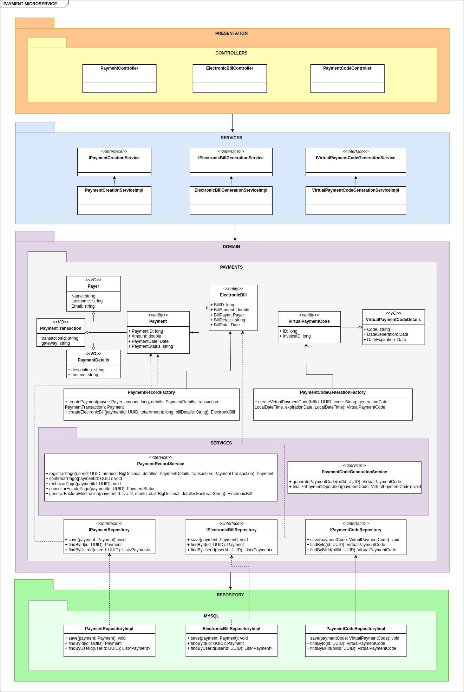

# Arquitectura DDD y Pruebas del Microservicio de Pagos

## 1. Descripcion
El microservicio de pagos se encarga de gestionar todas las transacciones financieras relacionadas con los pagos de los estudiantes, incluyendo la creación, actualización, obtención y eliminación de pagos.
- **Contexto Delimitado:** Gestión de Pagos

## 2. Arquitectura DDD

### 2.1. Capas de la Arquitectura

<details open>
  <summary><b><i>2.1.1. Capa de Presentación</b></i></summary>
  <ul>
    <li>Controladores</li>
    <ul>
      <li><b>PaymentController</b>: Gestiona las solicitudes HTTP relacionadas con los pagos. Incluye métodos para crear, actualizar, obtener y eliminar pagos, delegando la lógica a los servicios de aplicación.</li>
      <li><b>ElectronicBillController</b>: Gestiona las solicitudes HTTP relacionadas con las facturas electrónicas. Incluye métodos para obtener, crear y actualizar facturas electrónicas.</li>
      <li><b>PayerController</b>: Gestiona las solicitudes HTTP relacionadas con los pagadores, incluyendo operaciones como la obtención de información de un pagador.</li>
      <li><b>PaymentCodeCommandController</b>: Maneja las solicitudes HTTP para generar y guardar códigos de pago.</li>
      <li><b>PaymentCodeQueryController</b>: Gestiona las solicitudes HTTP para consultar códigos de pago.</li>
    </ul>
  </ul>
</details>

<details open>
  <summary><b><i>2.1.2. Capa de Aplicación</b></i></summary>
  <ul>
    <li>Servicios de aplicación</li>
    <ul>
      <li><b>PaymentService</b>: Contiene la lógica de negocio específica de la aplicación. Coordina las operaciones entre el controlador y el dominio, incluyendo la validación y transformación de datos.</li>
      <li><b>ElectronicBillService</b>: Gestiona la lógica de negocio relacionada con las facturas electrónicas, incluyendo la validación y la comunicación con los repositorios.</li>
      <li><b>PayerService</b>: Maneja la lógica de negocio para la gestión de pagadores, incluyendo validaciones y transformaciones de datos.</li>
      <li><b>PaymentCodeService</b>: Contiene la lógica para generar y gestionar códigos de pago, y coordina con los repositorios correspondientes.</li>
    </ul>
    <li>DTOs</li>
    <ul>
      <li><b>PaymentDto</b>: Objeto de transferencia de datos utilizado para encapsular los datos de un pago en una estructura simple que puede ser utilizada en la capa de presentación.</li>
      <li><b>ElectronicBillDto</b>: DTO utilizado para encapsular los datos de una factura electrónica.</li>
      <li><b>PaymentCodeDto</b>: DTO que encapsula los datos de un código de pago.</li>
      <li><b>PayerDto</b>: DTO utilizado para encapsular los datos de un pagador.</li>
    </ul>
    <li>Mapping</li>
    <ul>
      <li><b>PaymentMapper</b>: Clase responsable de mapear entre entidades de dominio y DTOs, asegurando que los datos se transfieran correctamente entre capas.</li>
      <li><b>ElectronicBillMapper</b>: Mapper para la conversión entre entidades de dominio y DTOs relacionados con facturas electrónicas.</li>
      <li><b>PaymentCodeMapper</b>: Mapper para la conversión entre entidades de dominio y DTOs relacionados con códigos de pago.</li>
    </ul>
  </ul>
</details>

<details open>
  <summary><b><i>2.1.3. Capa de Dominio</b></i></summary>
  <ul>
    <li>Entidades</li>
    <ul>
      <li><b>Payment</b>: Representa la entidad principal del sistema de pagos, incluyendo propiedades como <code>PaymentId</code>, <code>Amount</code>, <code>PaymentDate</code>, <code>StudentId</code>, entre otras.</li>
      <li><b>ElectronicBill</b>: Representa la entidad principal del sistema de facturación electrónica, incluyendo propiedades como <code>ElectronicBillId</code>, <code>Amount</code>, <code>IssueDate</code>, <code>Status</code>, etc.</li>
      <li><b>Payer</b>: Representa la entidad que realiza el pago, incluyendo propiedades como <code>PayerId</code>, <code>Name</code>, <code>Email</code>, etc.</li>
      <li><b>PaymentCode</b>: Representa un código de pago único utilizado para identificar y procesar pagos.</li>
    </ul>
    <li>Value Objects</li>
    <ul>
      <li><b>Money</b>: Representa un objeto de valor para manejar cantidades monetarias con propiedades como <code>Amount</code> y <code>Currency</code>.</li>
      <li><b>PaymentDetails</b>: Representa detalles adicionales del pago que no cambian la identidad del pago.</li>
      <li><b>ElectronicBillStatus</b>: Representa el estado de una factura electrónica, como <code>Pending</code>, <code>Paid</code>, <code>Cancelled</code>, etc.</li>
    </ul>
    <li>Agregados</li>
    <ul>
      <li><b>PaymentAggregate</b>: Agrupa entidades y objetos de valor relacionados al pago, asegurando la consistencia interna del agregado.</li>
      <li><b>ElectronicBillAggregate</b>: Agrupa entidades y objetos de valor relacionados con las facturas electrónicas, asegurando la consistencia interna del agregado.</li>
    </ul>
    <li>Servicios de dominio</li>
    <ul>
      <li><b>PaymentDomainService</b>: Contiene lógica de negocio compleja que involucra múltiples entidades o agregados. Por ejemplo, cálculos de comisiones o validaciones específicas de dominio.</li>
      <li><b>ElectronicBillDomainService</b>: Contiene lógica de negocio compleja para la gestión de facturas electrónicas.</li>
    </ul>
    <li>Interfaces de repositorio</li>
    <ul>
      <li><b>IPaymentRepository</b>: Define los métodos que deben ser implementados para la gestión de los pagos en el repositorio. Incluye métodos como <code>AddPayment</code>, <code>UpdatePayment</code>, <code>GetPaymentById</code> y <code>DeletePayment</code>.</li>
      <li><b>IElectronicBillRepository</b>: Define los métodos necesarios para gestionar las facturas electrónicas, incluyendo operaciones CRUD y consultas.</li>
    </ul>
    <!-- <li>Eventos de dominio</li>
    <ul>
      <li><b>PaymentCreatedEvent</b>: Evento que se dispara cuando se crea un nuevo pago.</li>
      <li><b>PaymentUpdatedEvent</b>: Evento que se dispara cuando se actualiza un pago.</li>
      <li><b>PaymentDeletedEvent</b>: Evento que se dispara cuando se elimina un pago.</li>
    </ul> -->
  </ul>
</details>

<details open>
  <summary><b><i>2.1.4. Capa de Repositorio</b></i></summary>
  <ul>
    <li>Implementaciones de repositorios</li>
    <ul>
      <li><b>PaymentRepository</b>: Implementación concreta de <code>IPaymentRepository</code>. Utiliza el contexto de la base de datos para realizar operaciones CRUD sobre los pagos.</li>
      <li><b>ElectronicBillRepository</b>: Implementación concreta de <code>IElectronicBillRepository</code>. Utiliza el contexto de la base de datos para realizar operaciones CRUD sobre las facturas electrónicas.</li>
      <li><b>PayerRepository</b>: Implementación concreta de <code>IPayerRepository</code>. Gestiona las operaciones CRUD relacionadas con los pagadores.</li>
      <li><b>PaymentCodeRepository</b>: Implementación concreta de <code>IPaymentCodeRepository</code>. Gestiona los códigos de pago en el sistema.</li>
    </ul>
    <li>Contexto de la base de datos</li>
    <ul>
      <li><b>MongoDbContext</b>: Clase que maneja la conexión a la base de datos MongoDB y proporciona acceso a las entidades a través de DbSets. Configura mapeos y relaciones entre entidades.</li>
    </ul>
    <li>Integraciones externas</li>
    <ul>
      <li><b>PaymentGatewayIntegration</b>: Servicio que se integra con proveedores de pagos externos para procesar transacciones.</li>
      <li><b>NotificationService</b>: Servicio que se encarga de enviar notificaciones a los usuarios sobre el estado de sus pagos.</li>
    </ul>
  </ul>
</details>


### 2.2. Diagrama de la Arquitectura



## 3. Pruebas

### 3.1. Pruebas de API

#### 3.1.1. Herramientas y Tecnologías
Descripción de las herramientas utilizadas para las pruebas de API (por ejemplo, Postman, Swagger, etc.).

#### 3.1.2. Escenarios de Prueba de API

```gherkin
Background: 
  Dado que el endpoint "api/v1/electronicbill/{electronicBillId}" está disponible
```

<details open>
  <summary><b><i>Escenario 1:</i></b> Obtener una factura electrónica por ID (caso de éxito).</summary>
  
  ```gherkin
  Scenario: Obtener una factura electrónica por ID
    Given que se proporciona un electronicBillId válido
    When se envía una solicitud GET al endpoint con el electronicBillId
    Then la respuesta debe ser 200 OK
    And la respuesta debe contener los detalles de la factura electrónica
  ```
</details>

<details open>
  <summary><b><i>Escenario 2:</i></b> Obtener una factura electrónica por ID (caso de fallo).</summary>
  
  ```gherkin
  Scenario: Obtener una factura electrónica por ID
    Given que se proporciona un electronicBillId inválido
    When se envía una solicitud GET al endpoint con el electronicBillId
    Then la respuesta debe ser 404 Not Found
    And la respuesta debe contener un mensaje de error adecuado
  ```
</details>

```gherkin
Background: 
  Dado que el endpoint "api/v1/electronicbill" está disponible
```

<details open>
  <summary><b><i>Escenario 3:</i></b> Crear una factura electrónica (caso de éxito).</summary>
  
  ```gherkin
  Scenario: Crear una factura electrónica
    Given que se proporciona un ElectronicBillDto válido
    When se envía una solicitud POST al endpoint con los datos de la factura electrónica
    Then la respuesta debe ser 201 Created
    And la respuesta debe contener los detalles de la factura electrónica creada
  ```
</details>

<details open>
  <summary><b><i>Escenario 4:</i></b> Crear una factura electrónica (caso de fallo).</summary>
  
  ```gherkin
  Scenario: Crear una factura electrónica
    Given que se proporciona un ElectronicBillDto inválido
    When se envía una solicitud POST al endpoint con los datos de la factura electrónica
    Then la respuesta debe ser 400 Bad Request
    And la respuesta debe contener un mensaje de error adecuado
  ```
</details>

```gherkin
Background: 
  Dado que el endpoint "api/v1/electronicbill" está disponible
```

<details open>
  <summary><b><i>Escenario 5:</i></b> Obtener la lista de facturas electrónicas (caso de éxito).</summary>
  
  ```gherkin
  Scenario: Obtener la lista de facturas electrónicas
    Given que existen facturas electrónicas en el sistema
    When se envía una solicitud GET al endpoint
    Then la respuesta debe ser 200 OK
    And la respuesta debe contener una lista de facturas electrónicas
  ```
</details>

<details open>
  <summary><b><i>Escenario 6:</i></b> Obtener la lista de facturas electrónicas (caso de fallo).</summary>
  
  ```gherkin
  Scenario: Obtener la lista de facturas electrónicas
    Given que no existen facturas electrónicas en el sistema
    When se envía una solicitud GET al endpoint
    Then la respuesta debe ser 404 Not Found
    And la respuesta debe contener un mensaje indicando que no se encontraron facturas electrónicas
  ```
</details>

```gherkin
Background: 
  Dado que el endpoint "api/v1/electronicbill/{electronicBillId}/status" está disponible
```

<details open>
  <summary><b><i>Escenario 7:</i></b> Actualizar el estado de una factura electrónica (caso de éxito).</summary>
  
  ```gherkin
  Scenario: Actualizar el estado de una factura electrónica
    Given que se proporciona un electronicBillId válido y un estado válido
    When se envía una solicitud PUT al endpoint con el electronicBillId y el nuevo estado
    Then la respuesta debe ser 200 OK
    And la respuesta debe contener un mensaje indicando que el estado de la factura electrónica fue actualizado
  ```
</details>

<details open>
  <summary><b><i>Escenario 8:</i></b> Actualizar el estado de una factura electrónica (caso de fallo).</summary>
  
  ```gherkin
  Scenario: Actualizar el estado de una factura electrónica
    Given que se proporciona un electronicBillId inválido o un estado inválido
    When se envía una solicitud PUT al endpoint con el electronicBillId y el nuevo estado
    Then la respuesta debe ser 404 Not Found
    And la respuesta debe contener un mensaje de error adecuado
  ```
</details>


```gherkin
Background: 
  Dado que el endpoint "api/v1/payer" está disponible
```

<details open>
  <summary><b><i>Escenario 9:</i></b> Obtener la lista de pagantes (caso de éxito).</summary>
  
  ```gherkin
  Scenario: Obtener la lista de pagantes
    Given que existen pagantes en el sistema
    When se envía una solicitud GET al endpoint
    Then la respuesta debe ser 200 OK
    And la respuesta debe contener una lista de pagantes
  ```
</details>

<details open>
  <summary><b><i>Escenario 10:</i></b> Obtener la lista de pagantes (caso de fallo).</summary>
  
  ```gherkin
  Scenario: Obtener la lista de pagantes
    Given que no existen pagantes en el sistema
    When se envía una solicitud GET al endpoint
    Then la respuesta debe ser 200 OK
    And la respuesta debe contener una lista vacía
  ```
</details>

```gherkin
Background: 
  Dado que el endpoint "api/v1/payer/{payerId}" está disponible
```

<details open>
  <summary><b><i>Escenario 11:</i></b> Obtener un pagante por ID (caso de éxito).</summary>
  
  ```gherkin
  Scenario: Obtener un pagante por ID
    Given que se proporciona un payerId válido
    When se envía una solicitud GET al endpoint con el payerId
    Then la respuesta debe ser 200 OK
    And la respuesta debe contener los detalles del pagante
  ```
</details>

<details open>
  <summary><b><i>Escenario 12:</i></b> Obtener un pagante por ID (caso de fallo).</summary>
  
  ```gherkin
  Scenario: Obtener un pagante por ID
    Given que se proporciona un payerId inválido
    When se envía una solicitud GET al endpoint con el payerId
    Then la respuesta debe ser 404 Not Found
    And la respuesta debe contener un mensaje de error adecuado
  ```
</details>

```gherkin
Background: 
  Dado que el endpoint "api/v1/payer" está disponible
```

<details open>
  <summary><b><i>Escenario 13:</i></b> Crear un pagante (caso de éxito).</summary>
  
  ```gherkin
  Scenario: Crear un pagante
    Given que se proporciona un Payer válido
    When se envía una solicitud POST al endpoint con los datos del pagante
    Then la respuesta debe ser 200 OK
    And la respuesta debe contener un mensaje indicando que el pagante fue guardado correctamente
  ```
</details>

<details open>
  <summary><b><i>Escenario 14:</i></b> Crear un pagante (caso de fallo).</summary>
  
  ```gherkin
  Scenario: Crear un pagante
    Given que se proporciona un Payer inválido
    When se envía una solicitud POST al endpoint con los datos del pagante
    Then la respuesta debe ser 400 Bad Request
    And la respuesta debe contener un mensaje de error adecuado
  ```
</details>


```gherkin
Background: 
  Dado que el endpoint "api/v1/paymentcodecommand" está disponible
```

<details open>
  <summary><b><i>Escenario 15:</i></b> Generar un código de pago (caso de éxito).</summary>
  
  ```gherkin
  Scenario: Generar un código de pago
    Given que se proporciona un PaymentCodeRequest válido
    When se envía una solicitud POST al endpoint con los datos del paymentCodeRequest
    Then la respuesta debe ser 200 OK
    And la respuesta debe contener el código de pago generado
  ```
</details>

<details open>
  <summary><b><i>Escenario 16:</i></b> Generar un código de pago (caso de fallo por datos inválidos).</summary>
  
  ```gherkin
  Scenario: Generar un código de pago
    Given que se proporciona un PaymentCodeRequest con studentId o electronicBillId inválido
    When se envía una solicitud POST al endpoint con los datos del paymentCodeRequest
    Then la respuesta debe ser 400 Bad Request
    And la respuesta debe contener un mensaje de error adecuado indicando la invalidez de los datos
  ```
</details>

<details open>
  <summary><b><i>Escenario 17:</i></b> Generar un código de pago (caso de fallo por error de almacenamiento).</summary>
  
  ```gherkin
  Scenario: Generar un código de pago
    Given que se proporciona un PaymentCodeRequest válido
    And el servicio de almacenamiento tiene un problema
    When se envía una solicitud POST al endpoint con los datos del paymentCodeRequest
    Then la respuesta debe ser 500 Internal Server Error
    And la respuesta debe contener un mensaje de error adecuado indicando el problema de almacenamiento
  ```
</details>


```gherkin
Background: 
  Dado que el endpoint "api/v1/payment" está disponible
```

<details open>
  <summary><b><i>Escenario 18:</i></b> Crear un pago (caso de éxito).</summary>
  
  ```gherkin
  Scenario: Crear un pago
    Given que se proporciona un PaymentDto válido
    When se envía una solicitud POST al endpoint con los datos del paymentDto
    Then la respuesta debe ser 201 Created
    And la respuesta debe contener los detalles del pago creado
  ```
</details>

<details open>
  <summary><b><i>Escenario 19:</i></b> Crear un pago (caso de fallo por datos inválidos).</summary>
  
  ```gherkin
  Scenario: Crear un pago
    Given que se proporciona un PaymentDto con datos inválidos
    When se envía una solicitud POST al endpoint con los datos del paymentDto
    Then la respuesta debe ser 400 Bad Request
    And la respuesta debe contener un mensaje de error adecuado indicando la invalidez de los datos
  ```
</details>

```gherkin
Background: 
  Dado que el endpoint "api/v1/payment/{paymentId}" está disponible
```

<details open>
  <summary><b><i>Escenario 20:</i></b> Obtener detalles de un pago (caso de éxito).</summary>
  
  ```gherkin
  Scenario: Obtener detalles de un pago
    Given que se proporciona un paymentId válido
    When se envía una solicitud GET al endpoint con el paymentId
    Then la respuesta debe ser 200 OK
    And la respuesta debe contener los detalles del pago correspondiente
  ```
</details>

<details open>
  <summary><b><i>Escenario 21:</i></b> Obtener detalles de un pago (caso de fallo por ID no encontrado).</summary>
  
  ```gherkin
  Scenario: Obtener detalles de un pago
    Given que se proporciona un paymentId inválido o no existente
    When se envía una solicitud GET al endpoint con el paymentId
    Then la respuesta debe ser 404 Not Found
    And la respuesta debe contener un mensaje de error adecuado indicando que el pago no se encontró
  ```
</details>

```gherkin
Background: 
  Dado que el endpoint "api/v1/payment/{paymentId}/status" está disponible
```

<details open>
  <summary><b><i>Escenario 22:</i></b> Actualizar el estado de un pago (caso de éxito).</summary>
  
  ```gherkin
  Scenario: Actualizar el estado de un pago
    Given que se proporciona un paymentId válido y un nuevo estado
    When se envía una solicitud PUT al endpoint con el paymentId y el estado
    Then la respuesta debe ser 200 OK
    And la respuesta debe contener un mensaje indicando que el estado del pago se actualizó correctamente
  ```
</details>

<details open>
  <summary><b><i>Escenario 23:</i></b> Actualizar el estado de un pago (caso de fallo por ID no encontrado).</summary>
  
  ```gherkin
  Scenario: Actualizar el estado de un pago
    Given que se proporciona un paymentId inválido o no existente
    When se envía una solicitud PUT al endpoint con el paymentId y el estado
    Then la respuesta debe ser 404 Not Found
    And la respuesta debe contener un mensaje de error adecuado indicando que no se puede actualizar el estado del pago
  ```
</details>


---

#### 3.1.2. Pruebas de API con Swagger

Swagger facilita la comprensión de los endpoints disponibles y cómo interactuar con ellos. Además, se incluye información sobre el archivo `requests/payments.http`, que contiene los comandos cURL necesarios para ejecutar las pruebas de la API de manera eficiente. Este archivo permite realizar las solicitudes directamente desde la línea de comandos, complementando el uso de Swagger para una experiencia de prueba completa.


### 3.2. Pruebas de Rendimiento

#### 3.2.1. Herramientas y Tecnologías

**Apache JMeter** es una herramienta de código abierto ampliamente utilizada para realizar pruebas de rendimiento y carga en aplicaciones. Diseñada para evaluar el rendimiento de servicios web y aplicaciones en una variedad de protocolos, JMeter permite simular múltiples usuarios concurrentes para medir el comportamiento del sistema bajo diferentes cargas. Con su interfaz gráfica intuitiva, JMeter facilita la creación de planes de prueba personalizados, la definición de escenarios de carga y la configuración de métricas detalladas. Esta herramienta también ofrece capacidades para generar reportes detallados y gráficos, proporcionando una visión integral del rendimiento del sistema y ayudando a identificar cuellos de botella y áreas de mejora. Su flexibilidad y extensibilidad la convierten en una opción ideal para evaluar la capacidad de respuesta y la estabilidad de aplicaciones en entornos de producción.


#### 3.2.2. Escenarios de Prueba de Rendimiento

```gherkin
Background: 
  Dado que el endpoint "api/v1/electronicbill/{electronicBillId}" está disponible
```

<details open>
  <summary><b><i>Escenario 1:</i></b> Obtener detalles de una factura electrónica con 10 peticiones simultáneas.</summary>
  
  ```gherkin
  Scenario: Obtener detalles de una factura electrónica con 10 peticiones simultáneas
    Given existe una factura electrónica con el ID "12345"
    When se envían 10 peticiones GET simultáneas al endpoint "api/v1/electronicbill/12345"
    Then todas las respuestas deben ser 200 OK
    And el tiempo de respuesta promedio debe ser menor a 300 ms
  ```
  
</details>

<details open>
  <summary><b><i>Escenario 2:</i></b> Obtener detalles de una factura electrónica con 25 peticiones simultáneas.</summary>
  
  ```gherkin
  Scenario: Obtener detalles de una factura electrónica con 25 peticiones simultáneas
    Given existe una factura electrónica con el ID "12345"
    When se envían 25 peticiones GET simultáneas al endpoint "api/v1/electronicbill/12345"
    Then todas las respuestas deben ser 200 OK
    And el tiempo de respuesta promedio debe ser menor a 600 ms
  ```
  
</details>

<details open>
  <summary><b><i>Escenario 3:</i></b> Obtener detalles de una factura electrónica con 50 peticiones simultáneas.</summary>
  
  ```gherkin
  Scenario: Obtener detalles de una factura electrónica con 50 peticiones simultáneas
    Given existe una factura electrónica con el ID "12345"
    When se envían 50 peticiones GET simultáneas al endpoint "api/v1/electronicbill/12345"
    Then todas las respuestas deben ser 200 OK
    And el tiempo de respuesta promedio debe ser menor a 1000 ms
  ```
  
</details>


```gherkin
Background: 
  Dado que el endpoint "api/v1/electronicbill" está disponible
```

<details open>
  <summary><b><i>Escenario 4:</i></b> Verificar la obtención de todas las facturas electrónicas con 10 peticiones simultáneas.</summary>
  
  ```gherkin
  Scenario: Verificar la obtención de todas las facturas electrónicas con 10 peticiones simultáneas
    Given existen varias facturas electrónicas en el sistema
    When se envían 10 peticiones GET simultáneas al endpoint "api/v1/electronicbill"
    Then todas las respuestas deben ser 200 OK
    And el tiempo de respuesta promedio debe ser menor a 300 ms
  ```
  
</details>

<details open>
  <summary><b><i>Escenario 5:</i></b> Verificar la obtención de todas las facturas electrónicas con 25 peticiones simultáneas.</summary>
  
  ```gherkin
  Scenario: Verificar la obtención de todas las facturas electrónicas con 25 peticiones simultáneas
    Given existen varias facturas electrónicas en el sistema
    When se envían 25 peticiones GET simultáneas al endpoint "api/v1/electronicbill"
    Then todas las respuestas deben ser 200 OK
    And el tiempo de respuesta promedio debe ser menor a 600 ms
  ```
  
</details>

<details open>
  <summary><b><i>Escenario 6:</i></b> Verificar la obtención de todas las facturas electrónicas con 50 peticiones simultáneas.</summary>
  
  ```gherkin
  Scenario: Verificar la obtención de todas las facturas electrónicas con 50 peticiones simultáneas
    Given existen varias facturas electrónicas en el sistema
    When se envían 50 peticiones GET simultáneas al endpoint "api/v1/electronicbill"
    Then todas las respuestas deben ser 200 OK
    And el tiempo de respuesta promedio debe ser menor a 1000 ms
  ```
  
</details>

```gherkin
Background: 
  Dado que el endpoint "api/v1/payer" está disponible
```

<details open>
  <summary><b><i>Escenario 7:</i></b> Verificación de la obtención de todos los pagantes con 10 peticiones simultáneas.</summary>
  
  ```gherkin
  Scenario: Verificación de la obtención de todos los pagantes con 10 peticiones simultáneas
    Given existen varios pagantes en el sistema
    When se envían 10 peticiones GET simultáneas al endpoint "api/v1/payer"
    Then todas las respuestas deben ser 200 OK
    And el tiempo de respuesta promedio debe ser menor a 200 ms
  ```
  
</details>

<details open>
  <summary><b><i>Escenario 8:</i></b> Verificación de la obtención de todos los pagantes con 25 peticiones simultáneas.</summary>
  
  ```gherkin
  Scenario: Verificación de la obtención de todos los pagantes con 25 peticiones simultáneas
    Given existen varios pagantes en el sistema
    When se envían 25 peticiones GET simultáneas al endpoint "api/v1/payer"
    Then todas las respuestas deben ser 200 OK
    And el tiempo de respuesta promedio debe ser menor a 200 ms
  ```
  
</details>

<details open>
  <summary><b><i>Escenario 9:</i></b> Verificación de la obtención de todos los pagantes con 50 peticiones simultáneas.</summary>
  
  ```gherkin
  Scenario: Verificación de la obtención de todos los pagantes con 50 peticiones simultáneas
    Given existen varios pagantes en el sistema
    When se envían 50 peticiones GET simultáneas al endpoint "api/v1/payer"
    Then todas las respuestas deben ser 200 OK
    And el tiempo de respuesta promedio debe ser menor a 200 ms
  ```
  
</details>

```gherkin
Background: 
  Dado que el endpoint "api/v1/payer/12345" está disponible
```

<details open>
  <summary><b><i>Escenario 10:</i></b> Verificación de la obtención de un pagante por ID con 10 peticiones simultáneas.</summary>
  
  ```gherkin
  Scenario: Verificación de la obtención de un pagante por ID con 10 peticiones simultáneas
    Given existe un pagante con el ID "12345"
    When se envían 10 peticiones GET simultáneas al endpoint "api/v1/payer/12345"
    Then todas las respuestas deben ser 200 OK
    And el tiempo de respuesta promedio debe ser menor a 200 ms
  ```
  
</details>

<details open>
  <summary><b><i>Escenario 11:</i></b> Verificación de la obtención de un pagante por ID con 25 peticiones simultáneas.</summary>
  
  ```gherkin
  Scenario: Verificación de la obtención de un pagante por ID con 25 peticiones simultáneas
    Given existe un pagante con el ID "12345"
    When se envían 25 peticiones GET simultáneas al endpoint "api/v1/payer/12345"
    Then todas las respuestas deben ser 200 OK
    And el tiempo de respuesta promedio debe ser menor a 200 ms
  ```
  
</details>

<details open>
  <summary><b><i>Escenario 12:</i></b> Verificación de la obtención de un pagante por ID con 50 peticiones simultáneas.</summary>
  
  ```gherkin
  Scenario: Verificación de la obtención de un pagante por ID con 50 peticiones simultáneas
    Given existe un pagante con el ID "12345"
    When se envían 50 peticiones GET simultáneas al endpoint "api/v1/payer/12345"
    Then todas las respuestas deben ser 200 OK
    And el tiempo de respuesta promedio debe ser menor a 200 ms
  ```
  
</details>


```gherkin
Background: 
  Dado que el endpoint "api/v1/payment" está disponible
```

<details open>
  <summary><b><i>Escenario 13:</i></b> Verificación de la obtención de un pago por ID con 10 peticiones simultáneas.</summary>
  
  ```gherkin
  Scenario: Verificación de la obtención de un pago por ID con 10 peticiones simultáneas
    Given existe un pago con el ID "12345"
    When se envían 10 peticiones GET simultáneas al endpoint "api/v1/payment/12345"
    Then todas las respuestas deben ser 200 OK
    And el tiempo de respuesta promedio debe ser menor a 200 ms
  ```
  
</details>

<details open>
  <summary><b><i>Escenario 14:</i></b> Verificación de la obtención de un pago por ID con 25 peticiones simultáneas.</summary>
  
  ```gherkin
  Scenario: Verificación de la obtención de un pago por ID con 25 peticiones simultáneas
    Given existe un pago con el ID "12345"
    When se envían 25 peticiones GET simultáneas al endpoint "api/v1/payment/12345"
    Then todas las respuestas deben ser 200 OK
    And el tiempo de respuesta promedio debe ser menor a 200 ms
  ```
  
</details>

<details open>
  <summary><b><i>Escenario 15:</i></b> Verificación de la obtención de un pago por ID con 50 peticiones simultáneas.</summary>
  
  ```gherkin
  Scenario: Verificación de la obtención de un pago por ID con 50 peticiones simultáneas
    Given existe un pago con el ID "12345"
    When se envían 50 peticiones GET simultáneas al endpoint "api/v1/payment/12345"
    Then todas las respuestas deben ser 200 OK
    And el tiempo de respuesta promedio debe ser menor a 200 ms
  ```

</details>


El siguiente informe presenta los resultados de las pruebas de rendimiento ejecutadas utilizando Apache JMeter.

<p align="center">
  
</p>

| **Label**                                           | **#Samples** | **FAIL** | **Error%** | **Average (ms)** | **Min (ms)** | **Max (ms)** | **Median (ms)** | **90th pct (ms)** | **95th pct (ms)** | **99th pct (ms)** | **Transactions/s** | **Received (KB/sec)** | **Sent (KB/sec)** |
| --------------------------------------------------- | ------------ | -------- | ---------- | ---------------- | ------------ | ------------ | --------------- | ----------------- | ----------------- | ----------------- | ------------------ | --------------------- | ----------------- |
| **Total**                                           | 925          | 0        | 0.00%      | 1408.74          | 97           | 5292         | 1730.00         | 2834.60           | 3655.50           | 4630.92           | 12.71              | 34.91                 | 1.78              |
| **GetPayersWith10RequestsTest**           | 110          | 0        | 0.00%      | 2094.74          | 1612         | 5292         | 1937.00         | 2506.00           | 3683.40           | 5281.77           | 1.61               | 1.36                  | 0.23              |
| **GetPayerByIdWith10RequestsTest**           | 25           | 0        | 0.00%      | 3752.28          | 2957         | 4625         | 3681.00         | 4476.80           | 4603.40           | 4625.00           | 4.59               | 3.88                  | 0.66              |
| **GetElectronicBillByIdWith10RequestsTest**           | 50           | 0        | 0.00%      | 3842.18          | 2839         | 5236         | 3666.00         | 4742.30           | 5172.60           | 5236.00           | 8.99               | 7.60                  | 1.30              |
| **GetPaymentById10RequestsTest** | 110          | 0        | 0.00%      | 1999.85          | 1707         | 2851         | 1934.50         | 2460.30           | 2708.90           | 2850.56           | 1.64               | 6.56                  | 0.24              |
| **GetPayerByIdWith25RequestsTest** | 25           | 0        | 0.00%      | 1925.16          | 1709         | 2446         | 1944.00         | 2145.20           | 2361.70           | 2446.00           | 5.79               | 23.14                 | 0.85              |
| **GetElectronicBillByIdWith25RequestsTest** | 50           | 0        | 0.00%      | 1982.74          | 1717         | 2840         | 1945.00         | 2313.80           | 2598.85           | 2840.00           | 10.78              | 43.08                 | 1.58              |
| **GetPaymentById25RequestsTest**        | 110          | 0        | 0.00%      | 98.19            | 97           | 109          | 98.00           | 100.00            | 100.45            | 108.23            | 1.70               | 7.72                  | 0.24              |
| **GetPayersWith50RequestsTest**        | 25           | 0        | 0.00%      | 99.08            | 97           | 103          | 98.00           | 102.00            | 102.70            | 103.00            | 10.89              | 49.57                 | 1.52              |
| **GetPayerByIdWith50RequestsTest**        | 50           | 0        | 0.00%      | 99.72            | 97           | 113          | 98.50           | 102.90            | 104.45            | 113.00            | 19.50              | 88.78                 | 2.72              |
| **GetElectronicBillByIdWith50RequestsTest**          | 110          | 0        | 0.00%      | 2032.60          | 1707         | 2619         | 2012.50         | 2410.30           | 2499.95           | 2618.89           | 1.64               | 6.54                  | 0.23              |
| **GetPaymentById50RequestsTest**          | 25           | 0        | 0.00%      | 2110.56          | 1715         | 2889         | 2031.00         | 2737.40           | 2848.20           | 2889.00           | 5.48               | 21.89                 | 0.75              |
| **GetEnrollmentsByUserWith50RequestsTest**          | 50           | 0        | 0.00%      | 2118.62          | 1704         | 2937         | 2135.50         | 2503.40           | 2648.55           | 2937.00           | 10.35              | 41.36                 | 1.43              |

---


### 3.3. Pruebas de Seguridad

#### 3.3.1. Herramientas y Tecnologías

**OWASP ZAP (Zed Attack Proxy)** es una herramienta de código abierto diseñada para realizar pruebas de seguridad en aplicaciones web. Desarrollada por el Open Web Application Security Project (OWASP), ZAP proporciona una amplia gama de funciones para identificar vulnerabilidades y evaluar la seguridad de aplicaciones durante el ciclo de desarrollo. Su interfaz intuitiva permite a los usuarios realizar escaneos automatizados, así como llevar a cabo pruebas manuales de seguridad, como la exploración de aplicaciones y la identificación de puntos débiles. ZAP es particularmente útil para detectar problemas de seguridad comunes, como inyecciones SQL, ataques de cross-site scripting (XSS) y configuraciones incorrectas. Además, ZAP ofrece soporte para integraciones con otras herramientas de desarrollo y pruebas, lo que facilita la inclusión de prácticas de seguridad en el proceso de desarrollo ágil. Su capacidad para generar reportes detallados ayuda a los equipos de desarrollo a abordar las vulnerabilidades de manera efectiva y mejorar la seguridad general de sus aplicaciones.

#### 3.3.2. Escenarios de Prueba de Seguridad

```gherkin
Background:
    Given que el endpoint "http://localhost:8007" está accesible
```

<details open>
  <summary><b><i>Escenario 1:</i></b> Verificación de encabezados de seguridad HTTP.</summary>

```gherkin
Scenario: Verificación de encabezados de seguridad HTTP
  Given el sitio web "http://localhost:8004" debe incluir varios encabezados de seguridad HTTP
  When se realiza un análisis de encabezados HTTP
  Then los encabezados esperados deben estar presentes, incluyendo "Strict-Transport-Security", "Content-Security-Policy", y "X-Content-Type-Options"
```

</details>

<details open>
  <summary><b><i>Escenario 2:</i></b> Verificación de vulnerabilidades en bibliotecas JavaScript.</summary>

```gherkin
Scenario: Verificación de vulnerabilidades en bibliotecas JavaScript
  Given el sitio web "http://localhost:8004" utiliza bibliotecas JavaScript de terceros
  When se realiza un análisis de bibliotecas JavaScript
  Then no se deben encontrar bibliotecas vulnerables, como aquellas indicadas por Retire.js
```

</details>

<details open>
  <summary><b><i>Escenario 3:</i></b> Verificación de la configuración de cookies.</summary>

```gherkin
Scenario: Verificación de la configuración de cookies
  Given el sitio web "http://localhost:8004" utiliza cookies para el manejo de sesiones
  When se realiza un análisis de cookies
  Then todas las cookies deben estar configuradas con las banderas adecuadas, incluyendo "HttpOnly" y "Secure"
```

</details>

<details open>
  <summary><b><i>Escenario 4:</i></b> Verificación de la protección contra ataques XSS.</summary>

```gherkin
Scenario: Verificación de la protección contra ataques XSS
  Given el sitio web "http://localhost:8004" permite la entrada de usuarios
  When se realiza un análisis de entrada para detectar vulnerabilidades XSS
  Then no se deben encontrar puntos de entrada vulnerables a ataques de cross-site scripting (XSS)
```

</details>

<details open>
  <summary><b><i>Escenario 5:</i></b> Verificación de la política de seguridad de contenido (CSP).</summary>

```gherkin
Scenario: Verificación de la política de seguridad de contenido (CSP)
  Given el sitio web "http://localhost:8004" debe tener una política de seguridad de contenido configurada
  When se realiza un análisis de la política de seguridad de contenido
  Then la política debe estar correctamente configurada y debe incluir directivas como "default-src" y "script-src"
```

</details>

<details open>
  <summary><b><i>Escenario 6:</i></b> Verificación de la protección contra el clickjacking.</summary>

```gherkin
Scenario: Verificación de la protección contra el clickjacking
  Given el sitio web "http://localhost:8004" debe protegerse contra ataques de clickjacking
  When se realiza un análisis de encabezados HTTP
  Then debe estar presente el encabezado "X-Frame-Options" con una configuración segura
```

</details>

<details open>
  <summary><b><i>Escenario 7:</i></b> Verificación de redirecciones abiertas.</summary>

```gherkin
Scenario: Verificación de redirecciones abiertas
  Given el sitio web "http://localhost:8004" debe manejar las redirecciones de forma segura
  When se realiza un análisis para detectar redirecciones abiertas
  Then no deben encontrarse vulnerabilidades de redirección abierta
```

</details>

<details open>
  <summary><b><i>Escenario 8:</i></b> Verificación de exposición de información sensible.</summary>

```gherkin
Scenario: Verificación de exposición de información sensible
  Given el sitio web "http://localhost:8004" debe proteger la información sensible
  When se realiza un análisis para detectar la exposición de información sensible
  Then no se debe encontrar información sensible expuesta en encabezados HTTP o mensajes de error
```

</details>

<details open>
  <summary><b><i>Escenario 9:</i></b> Verificación de configuraciones de seguridad en la administración de sesiones.</summary>

```gherkin
Scenario: Verificación de configuraciones de seguridad en la administración de sesiones
  Given el sitio web "http://localhost:8004" gestiona sesiones de usuario
  When se realiza un análisis de la gestión de sesiones
  Then la sesión debe estar protegida contra ataques como el secuestro de sesión y el manejo inseguro de IDs de sesión
```

</details>

<details open>
  <summary><b><i>Escenario 10:</i></b> Verificación de la protección contra ataques de CSRF.</summary>

```gherkin
Scenario: Verificación de la protección contra ataques de CSRF
  Given el sitio web "http://localhost:8004" debe protegerse contra ataques de falsificación de solicitudes entre sitios (CSRF)
  When se realiza un análisis para detectar la protección contra CSRF
  Then deben encontrarse y validarse tokens anti-CSRF en formularios y solicitudes
```

</details>

<details open>
  <summary><b><i>Escenario 11:</i></b> Verificación de vulnerabilidades de exposición de información.</summary>

```gherkin
Scenario: Verificación de vulnerabilidades de exposición de información
  Given el sitio web "http://localhost:8004" debe manejar la exposición de información con cuidado
  When se realiza un análisis para detectar la divulgación de información sensible
  Then no deben encontrarse vulnerabilidades de divulgación de información, como mensajes de error o encabezados de respuesta que revelen detalles internos
```

</details>

<p align="center">
  
</p>


## 4. Referencias

[1] W. by Iamprovidence, **“Backend side architecture evolution (N-layered, DDD, Hexagon, Onion, Clean Architecture)”**, Medium, 27-jun-2023. [En línea]. Disponible en: [https://medium.com/@iamprovidence/backend-side-architecture-evolution-n-layered-ddd-hexagon-onion-clean-architecture-643d72444ce4](https://medium.com/@iamprovidence/backend-side-architecture-evolution-n-layered-ddd-hexagon-onion-clean-architecture-643d72444ce4).

[2] C. Ramalingam, **“Building domain driven microservices - Walmart global tech blog - medium”**, Walmart Global Tech Blog, 01-jul-2020. [En línea]. Disponible en: [https://medium.com/walmartglobaltech/building-domain-driven-microservices-af688aa1b1b8](https://medium.com/walmartglobaltech/building-domain-driven-microservices-af688aa1b1b8).

[3] J. Loscalzo, **“Domain Driven Design: principios, beneficios y elementos — Segunda Parte”**, Medium, 18-jun-2018. [En línea]. Disponible en: [https://medium.com/@jonathanloscalzo/domain-driven-design-principios-beneficios-y-elementos-segunda-parte-337d77dc8566](https://medium.com/@jonathanloscalzo/domain-driven-design-principios-beneficios-y-elementos-segunda-parte-337d77dc8566).

[4] P. Martinez, **“Domain-Driven Design: Everything you always wanted to know”**, SSENSE-TECH, 15-may-2020. [En línea]. Disponible en: [https://medium.com/ssense-tech/domain-driven-design-everything-you-always-wanted-to-know-about-it-but-were-afraid-to-ask-a85e7b74497a](https://medium.com/ssense-tech/domain-driven-design-everything-you-always-wanted-to-know-about-it-but-were-afraid-to-ask-a85e7b74497a).