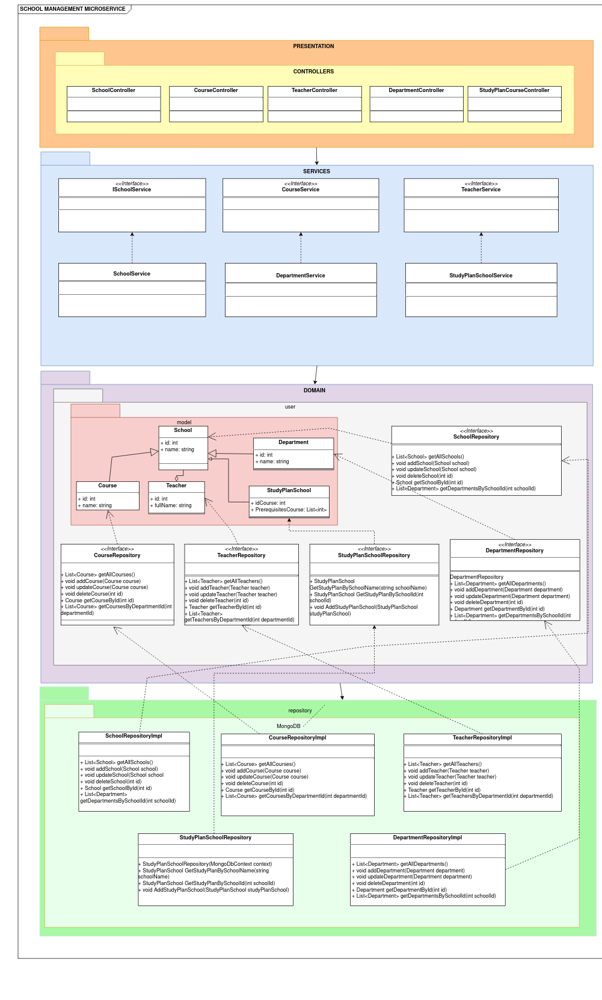
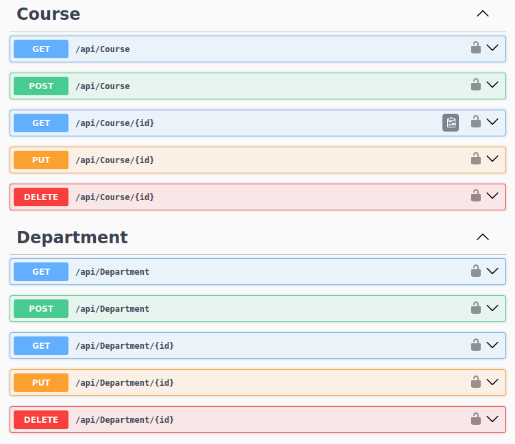
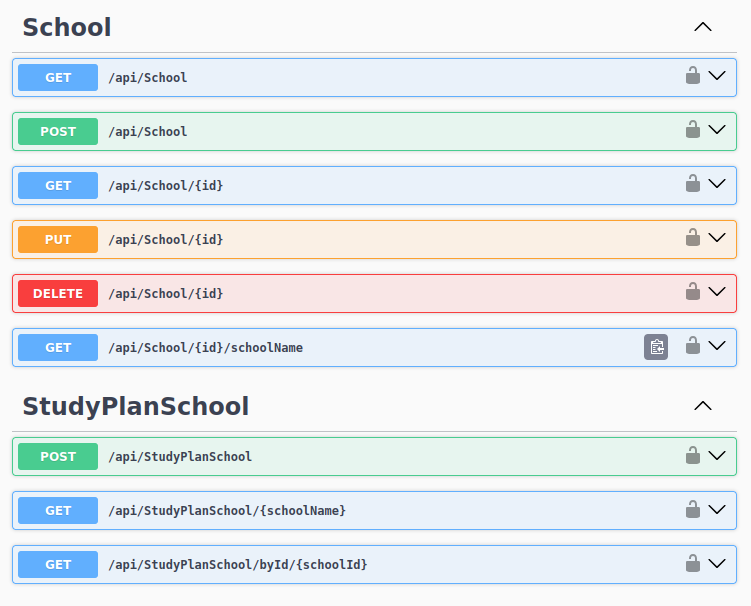
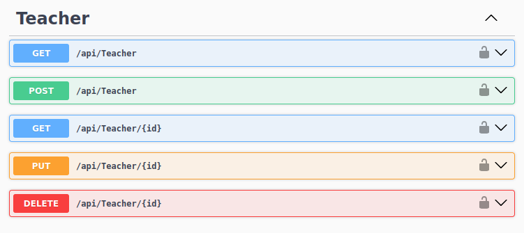
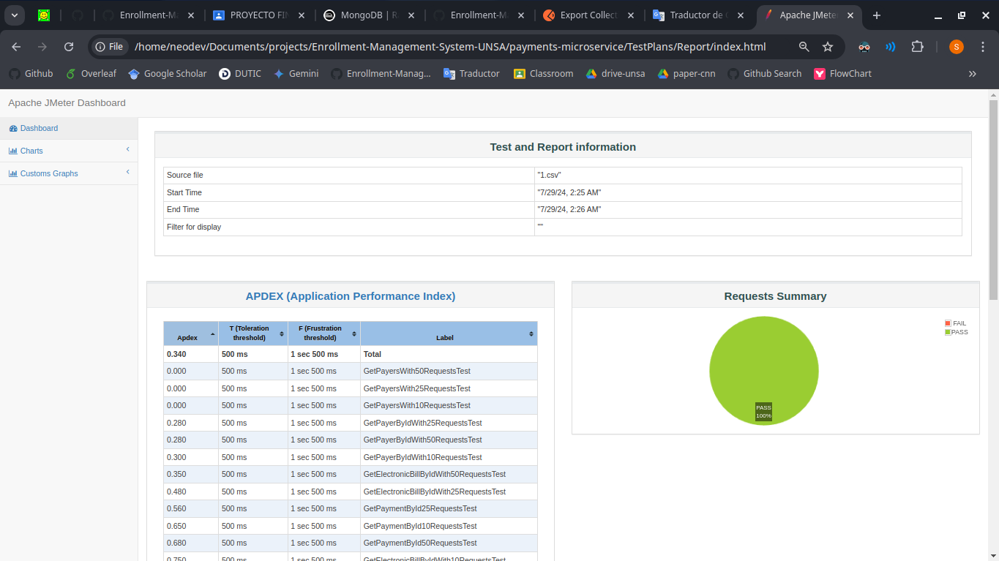
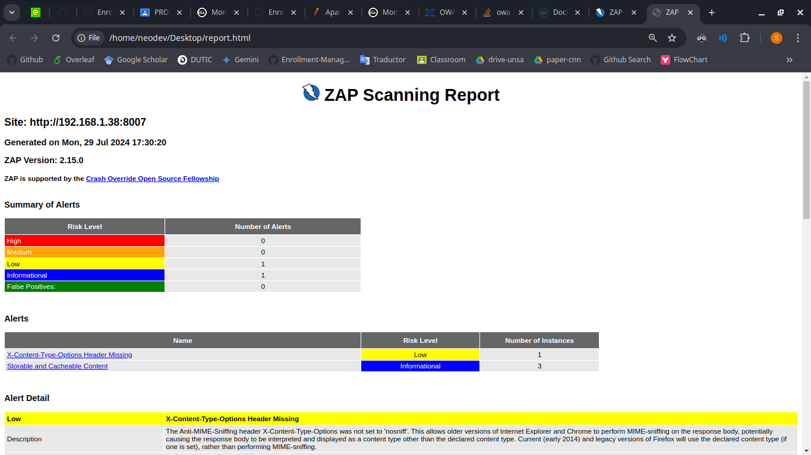

# Arquitectura DDD y Pruebas del Microservicio de Gestión de Escuelas

## 1. Descripción

El microservicio de Gestión de Escuelas se encarga de gestionar todos los aspectos relacionados con las cursos, departamentos, plan de estudios, docentes, todo ello relacionado a las escuelas, incluyendo la creación, actualización, consulta y eliminación de todo lo mencionado.

- **Contexto Delimitado:** Gestión de Escuelas

## 2. Arquitectura DDD

### 2.1. Capas de la Arquitectura

<details open>
  <summary><b><i>2.1.1. Capa de Presentación</b></i></summary>
  <ul>
    <li>Controladores</li>
        <ul>
        <li><b>CourseController</b>: Gestiona las operaciones CRUD (Crear, Leer, Actualizar, Eliminar) para los cursos del microservicio. Utiliza la interfaz `ICourseService` para delegar las operaciones de negocio y expone los endpoints HTTP para obtener todos los cursos, obtener un curso por su ID, agregar un nuevo curso, actualizar un curso existente y eliminar un curso. Cada método HTTP está decorado con los atributos correspondientes (`[HttpGet]`, `[HttpPost]`, `[HttpPut]`, `[HttpDelete]`) y maneja las respuestas HTTP apropiadas, incluyendo códigos de estado y mensajes de error cuando es necesario.</li>
        </ul>
        <ul>
        <li><b>DepartmentController</b>: Maneja operaciones CRUD (Crear, Leer, Actualizar, Eliminar) para departamentos, utilizando `IDepartmentService`. Proporciona endpoints para obtener todos los departamentos, obtener un departamento por ID, agregar, actualizar y eliminar departamentos, con respuestas HTTP adecuadas para cada operación.</li>
        </ul>
        <ul>
        <li><b>SchoolController</b>: Gestiona operaciones CRUD (Crear, Leer, Actualizar, Eliminar) para escuelas, utilizando `ISchoolService`. Expone endpoints para obtener todas las escuelas, obtener una escuela por ID, agregar, actualizar y eliminar escuelas, y obtener el nombre de una escuela por ID. Los métodos responden con los códigos de estado HTTP adecuados.</li>
        </ul>
        <ul>
        <li><b>StudyPlanSchoolController</b>: Maneja operaciones relacionadas con los planes de estudio de las escuelas, utilizando `IStudyPlanSchoolService`. Proporciona endpoints para agregar un nuevo plan de estudio (`POST`), obtener un plan de estudio por nombre de la escuela (`GET`) y obtener un plan de estudio por ID de la escuela (`GET`), devolviendo las respuestas HTTP adecuadas para cada operación.</li>
        </ul>
        <ul>
        <li><b>TeacherController</b>: Gestiona los datos de los profesores, proporcionando endpoints para obtener todos los profesores, obtener un profesor por ID, agregar un nuevo profesor, actualizar un profesor existente y eliminar un profesor. Utiliza un servicio `ITeacherService` para realizar las operaciones de negocio y responde con el estado adecuado y los datos necesarios para cada acción.</li>
        </ul>
  </ul>
</details>
<details open>
  <summary><b><i>2.1.2. Capa de Aplicación</b></i></summary>
  <ul>
    <li>Servicios de aplicación</li>
        <ul>
        <li><b>CourseService</b>: Implementa la interfaz `ICourseService` y proporciona métodos para gestionar los cursos en un microservicio escolar. Utiliza un repositorio `ICourseRepository` para realizar las operaciones de acceso a datos. Los métodos incluidos permiten obtener todos los cursos, obtener un curso por ID, agregar un nuevo curso, actualizar un curso existente y eliminar un curso, delegando cada operación al repositorio correspondiente.</li>
        </ul>
        <ul>
        <li><b>DepartmentService</b>: Implementa la interfaz `IDepartmentService` y maneja la lógica de negocio relacionada con los departamentos en un microservicio escolar. Utiliza un repositorio `IDepartmentRepository` para acceder y manipular los datos de los departamentos. Ofrece métodos para obtener todos los departamentos, obtener un departamento por ID, agregar un nuevo departamento, actualizar un departamento existente y eliminar un departamento, delegando cada tarea al repositorio correspondiente.</li>
        </ul>
        <ul>
        <li><b>SchoolService</b>: Implementa `ISchoolService` y gestiona la lógica de negocio para los datos de las escuelas. Utiliza `ISchoolRepository` para acceder a los datos, ofreciendo métodos para obtener todas las escuelas, obtener una escuela por ID, obtener el nombre de una escuela por ID, agregar, actualizar y eliminar una escuela.</li>
        </ul>
        <ul>
        <li><b>StudyPlanSchoolService</b>: Implementa `IStudyPlanSchoolService` y maneja la lógica de negocio para los planes de estudio asociados a escuelas. Utiliza `IStudyPlanSchoolRepository` para acceder a los datos, ofreciendo métodos para obtener un plan de estudio por nombre de escuela o ID, y para agregar un nuevo plan de estudio.</li>
        </ul>
        <ul>
        <li><b>TeacherService</b>: Implementa `ITeacherService` y gestiona la lógica de negocio para los datos de los profesores. Utiliza `ITeacherRepository` para acceder a los datos, proporcionando métodos para obtener todos los profesores, obtener un profesor por ID, agregar, actualizar y eliminar profesores.</li>
        </ul>
  </ul>
</details>
<details open>
  <summary><b><i>2.1.3. Capa de Dominio</b></i></summary>
  <ul>
    <li>Modelos</li>
    <ul>
        <li><b>Course</b>: Representa un curso en el sistema, incluyendo propiedades como <code>Id</code>, <code>Name</code>, y <code>Credits</code>.</li>
        <li><b>Department</b>: Representa un departamento en el sistema, incluyendo propiedades como <code>Id</code> y <code>Name</code>.</li>
        <li><b>School</b>: Representa una escuela en el sistema, incluyendo propiedades como <code>Id</code>, <code>Name</code>, y <code>Location</code>.</li>
        <li><b>StudyPlanSchool</b>: Representa un plan de estudio asociado a una escuela, incluyendo propiedades como <code>Id</code>, <code>Name</code>, y <code>CoursesOfStudyPlan</code>, que es una lista de <code>CourseOfStudyPlan</code>.</li>
        <li><b>CourseOfStudyPlan</b>: Representa un curso dentro de un plan de estudio, incluyendo propiedades como <code>IdCourse</code> y <code>PrerequisitesCourse</code>, que es una lista de identificadores de cursos previos.</li>
        <li><b>Teacher</b>: Representa un profesor en el sistema, incluyendo propiedades como <code>Id</code>, <code>Name</code>, y <code>Department</code>.</li>
    </ul>
    <li>Interfaces de repositorio</li>
    <ul>
        <li><b>ICourseRepository</b>: Define las operaciones de acceso a datos para los cursos, incluyendo métodos para obtener todos los cursos (<code>GetAllCourses</code>), obtener un curso por ID (<code>GetCourseById</code>), agregar un curso (<code>AddCourse</code>), actualizar un curso (<code>UpdateCourse</code>), y eliminar un curso (<code>DeleteCourse</code>).</li>
        <li><b>IDepartmentRepository</b>: Define las operaciones de acceso a datos para los departamentos, incluyendo métodos para obtener todos los departamentos (<code>GetAllDepartments</code>), obtener un departamento por ID (<code>GetDepartmentById</code>), agregar un departamento (<code>AddDepartment</code>), actualizar un departamento (<code>UpdateDepartment</code>), y eliminar un departamento (<code>DeleteDepartment</code>).</li>
        <li><b>ISchoolRepository</b>: Define las operaciones de acceso a datos para las escuelas, incluyendo métodos para obtener todas las escuelas (<code>GetAllSchools</code>), obtener una escuela por ID (<code>GetSchoolById</code>), obtener el nombre de una escuela por ID (<code>GetSchoolNameById</code>), agregar una escuela (<code>AddSchool</code>), actualizar una escuela (<code>UpdateSchool</code>), y eliminar una escuela (<code>DeleteSchool</code>).</li>
        <li><b>IStudyPlanSchoolRepository</b>: Define las operaciones de acceso a datos para los planes de estudio de las escuelas, incluyendo métodos para obtener un plan de estudio por nombre de escuela (<code>GetStudyPlanBySchoolName</code>), obtener un plan de estudio por ID de escuela (<code>GetStudyPlanBySchoolId</code>), y agregar un plan de estudio (<code>AddStudyPlanSchool</code>).</li>
        <li><b>ITeacherRepository</b>: Define las operaciones de acceso a datos para los profesores, incluyendo métodos para obtener todos los profesores (<code>GetAllTeachers</code>), obtener un profesor por ID (<code>GetTeacherById</code>), agregar un profesor (<code>AddTeacher</code>), actualizar un profesor (<code>UpdateTeacher</code>), y eliminar un profesor (<code>DeleteTeacher</code>).</li>
    </ul>
  </ul>
</details>
<details open>
  <summary><b><i>2.1.4. Capa de Repositorio</b></i></summary>
  <ul>
    <li>Implementaciones de repositorios</li>
    <ul>
        <li><b>CourseRepository</b>: Implementa <code>ICourseRepository</code> y gestiona el acceso a datos para los cursos utilizando MongoDB. Proporciona métodos para obtener todos los cursos (<code>GetAllCourses</code>), obtener un curso por ID (<code>GetCourseById</code>), agregar un curso (<code>AddCourse</code>), actualizar un curso (<code>UpdateCourse</code>), y eliminar un curso (<code>DeleteCourse</code>).</li>
        <li><b>DepartmentRepository</b>: Implementa <code>IDepartmentRepository</code> y gestiona el acceso a datos para los departamentos utilizando MongoDB. Ofrece métodos para obtener todos los departamentos (<code>GetAllDepartments</code>), obtener un departamento por ID (<code>GetDepartmentById</code>), agregar un departamento (<code>AddDepartment</code>), actualizar un departamento (<code>UpdateDepartment</code>), y eliminar un departamento (<code>DeleteDepartment</code>).</li>
        <li><b>SchoolRepository</b>: Implementa <code>ISchoolRepository</code> y gestiona el acceso a datos para las escuelas utilizando MongoDB. Proporciona métodos para obtener todas las escuelas (<code>GetAllSchools</code>), obtener una escuela por ID (<code>GetSchoolById</code>), obtener el nombre de una escuela por ID (<code>GetSchoolNameById</code>), agregar una escuela (<code>AddSchool</code>), actualizar una escuela (<code>UpdateSchool</code>), y eliminar una escuela (<code>DeleteSchool</code>).</li>
        <li><b>StudyPlanSchoolRepository</b>: Implementa <code>IStudyPlanSchoolRepository</code> y gestiona el acceso a datos para los planes de estudio de las escuelas utilizando MongoDB. Ofrece métodos para obtener un plan de estudio por nombre de escuela (<code>GetStudyPlanBySchoolName</code>), obtener un plan de estudio por ID de escuela (<code>GetStudyPlanBySchoolId</code>), y agregar un plan de estudio (<code>AddStudyPlanSchool</code>).</li>
        <li><b>TeacherRepository</b>: Implementa <code>ITeacherRepository</code> y gestiona el acceso a datos para los profesores utilizando MongoDB. Proporciona métodos para obtener todos los profesores (<code>GetAllTeachers</code>), obtener un profesor por ID (<code>GetTeacherById</code>), agregar un profesor (<code>AddTeacher</code>), actualizar un profesor (<code>UpdateTeacher</code>), y eliminar un profesor (<code>DeleteTeacher</code>).</li>
    </ul>
    <li>Contexto de la base de datos</li>
    <ul>
      <li><b>MongoDbContext</b>: Configura la conexión a MongoDB y proporciona colecciones para diferentes entidades del sistema, incluyendo <code>Courses</code>, <code>Departments</code>, <code>Schools</code>, <code>Teachers</code>, y <code>StudyPlanSchools</code>. Utiliza una cadena de conexión y un nombre de base de datos definidos en la configuración.</li>
    </ul>
  </ul>
</details>

### 2.2. Diagrama de la Arquitectura

<p align="center">
  
</p>

## 3. Pruebas

### 3.1. Pruebas de API

#### 3.1.1. Herramientas y Tecnologías

Para llevar a cabo las pruebas de nuestra API, hemos utilizado una serie de herramientas y tecnologías clave que facilitan la evaluación exhaustiva y efectiva de las funcionalidades expuestas por la API. A continuación se describen las herramientas principales empleadas:

- **Postman:** Esta herramienta es ampliamente utilizada para el diseño, prueba y documentación de APIs. Permite realizar solicitudes HTTP a los endpoints de la API, definir y gestionar colecciones de pruebas, y verificar respuestas con gran detalle. Postman también proporciona funcionalidades avanzadas como la ejecución de scripts pre y post solicitud, así como la integración con sistemas de CI/CD para automatizar las pruebas.

- **Swagger:** Swagger, ahora conocido como OpenAPI, es una herramienta poderosa para documentar y probar APIs. Permite generar documentación interactiva que facilita la comprensión y el uso de los endpoints de la API. Con Swagger, es posible visualizar y probar los endpoints directamente desde la documentación, lo que ayuda a identificar problemas y validar el comportamiento de la API de manera eficiente.

Estas herramientas y tecnologías no solo facilitan la creación de pruebas detalladas y la generación de documentación precisa, sino que también aseguran una integración continua y una experiencia de usuario consistente durante el ciclo de vida de desarrollo de la API.

#### 3.1.2. Escenarios de Prueba de API

En esta sección se detallan los escenarios de prueba para el servicio de gestión de escuelas, los cuales han sido diseñados para validar el correcto funcionamiento de las diferentes operaciones del API.

<details open>
  <summary><b><i>Obtener todos los cursos</i></b></summary>

  <details open>
    <summary><b><i>Escenario 1:</i></b> Obtener todos los cursos con éxito</summary>

```gherkin
    Given que el endpoint "/api/Course" está accesible
    And el sistema contiene cursos en la base de datos
    When se envía una solicitud GET a "/api/Course"
    Then el código de estado de la respuesta debe ser 200
    And el cuerpo de la respuesta debe contener una lista de cursos
```

  </details>

  <details open>
    <summary><b><i>Escenario 2:</i></b> Obtener todos los cursos cuando no hay cursos</summary>

```gherkin
    Given que el endpoint "/api/Course" está accesible
    And el sistema no contiene cursos en la base de datos
    When se envía una solicitud GET a "/api/Course"
    Then el código de estado de la respuesta debe ser 200
    And el cuerpo de la respuesta debe contener una lista vacía
```

  </details>

</details>

<details open>
  <summary><b><i>Obtener un curso por ID</i></b></summary>

  <details open>
    <summary><b><i>Escenario 1:</i></b> Obtener un curso por ID con éxito</summary>

```gherkin
    Given que el endpoint "/api/Course/{id}" está accesible
    And el sistema contiene un curso con ID "1"
    When se envía una solicitud GET a "/api/Course/1"
    Then el código de estado de la respuesta debe ser 200
    And el cuerpo de la respuesta debe contener el curso con ID "1"
```

  </details>

  <details open>
    <summary><b><i>Escenario 2:</i></b> Obtener un curso por ID cuando el curso no existe</summary>

```gherkin
    Given que el endpoint "/api/Course/{id}" está accesible
    And el sistema no contiene un curso con ID "999"
    When se envía una solicitud GET a "/api/Course/999"
    Then el código de estado de la respuesta debe ser 404
    And el cuerpo de la respuesta debe contener "Course not found"
```

  </details>

</details>

<details open>
  <summary><b><i>Agregar un curso</i></b></summary>

  <details open>
    <summary><b><i>Escenario 1:</i></b> Agregar un curso con éxito</summary>

```gherkin
    Given que el endpoint "/api/Course" está accesible
    And el cuerpo de la solicitud es:
    {
        "Id": 1,
        "Name": "Mathematics",
        "Credits": 3
    }
    When se envía una solicitud POST a "/api/Course"
    Then el código de estado de la respuesta debe ser 201
    And el cuerpo de la respuesta debe contener "Course created successfully"
    And el recurso creado debe estar accesible en "/api/Course/1"
```

  </details>

  <details open>
    <summary><b><i>Escenario 2:</i></b> Agregar un curso con datos inválidos</summary>

```gherkin
    Given que el endpoint "/api/Course" está accesible
    And el cuerpo de la solicitud es:
    {
        "Id": 1,
        "Name": "",
        "Credits": -1
    }
    When se envía una solicitud POST a "/api/Course"
    Then el código de estado de la respuesta debe ser 400
    And el cuerpo de la respuesta debe contener "Invalid course data"
```

  </details>

</details>

<details open>
  <summary><b><i>Actualizar un curso</i></b></summary>

  <details open>
    <summary><b><i>Escenario 1:</i></b> Actualizar un curso con éxito</summary>

```gherkin
    Given que el endpoint "/api/Course/{id}" está accesible
    And el sistema contiene un curso con ID "1"
    And el cuerpo de la solicitud es:
    {
        "Id": 1,
        "Name": "Advanced Mathematics",
        "Credits": 4
    }
    When se envía una solicitud PUT a "/api/Course/1"
    Then el código de estado de la respuesta debe ser 204
```

  </details>

  <details open>
    <summary><b><i>Escenario 2:</i></b> Actualizar un curso cuando el ID no coincide</summary>

```gherkin
    Given que el endpoint "/api/Course/{id}" está accesible
    And el sistema contiene un curso con ID "1"
    And el cuerpo de la solicitud es:
    {
        "Id": 2,
        "Name": "Advanced Mathematics",
        "Credits": 4
    }
    When se envía una solicitud PUT a "/api/Course/1"
    Then el código de estado de la respuesta debe ser 400
    And el cuerpo de la respuesta debe contener "Course ID mismatch"
```

  </details>

</details>

<details open>
  <summary><b><i>Eliminar un curso</i></b></summary>

  <details open>
    <summary><b><i>Escenario 1:</i></b> Eliminar un curso con éxito</summary>

```gherkin
    Given que el endpoint "/api/Course/{id}" está accesible
    And el sistema contiene un curso con ID "1"
    When se envía una solicitud DELETE a "/api/Course/1"
    Then el código de estado de la respuesta debe ser 204
```

  </details>

  <details open>
    <summary><b><i>Escenario 2:</i></b> Eliminar un curso cuando el curso no existe</summary>

```gherkin
    Given que el endpoint "/api/Course/{id}" está accesible
    And el sistema no contiene un curso con ID "999"
    When se envía una solicitud DELETE a "/api/Course/999"
    Then el código de estado de la respuesta debe ser 404
    And el cuerpo de la respuesta debe contener "Course not found"
```

  </details>

</details>


<details open>
  <summary><b><i>Obtener todos los departamentos</i></b></summary>

  <details open>
    <summary><b><i>Escenario 1:</i></b> Obtener todos los departamentos con éxito</summary>

```gherkin
    Given que el endpoint "/api/Department" está accesible
    And el sistema contiene departamentos en la base de datos
    When se envía una solicitud GET a "/api/Department"
    Then el código de estado de la respuesta debe ser 200
    And el cuerpo de la respuesta debe contener una lista de departamentos
```

  </details>

  <details open>
    <summary><b><i>Escenario 2:</i></b> Obtener todos los departamentos cuando no hay departamentos</summary>

```gherkin
    Given que el endpoint "/api/Department" está accesible
    And el sistema no contiene departamentos en la base de datos
    When se envía una solicitud GET a "/api/Department"
    Then el código de estado de la respuesta debe ser 200
    And el cuerpo de la respuesta debe contener una lista vacía
```

  </details>

</details>

<details open>
  <summary><b><i>Obtener un departamento por ID</i></b></summary>

  <details open>
    <summary><b><i>Escenario 1:</i></b> Obtener un departamento por ID con éxito</summary>

```gherkin
    Given que el endpoint "/api/Department/{id}" está accesible
    And el sistema contiene un departamento con ID "1"
    When se envía una solicitud GET a "/api/Department/1"
    Then el código de estado de la respuesta debe ser 200
    And el cuerpo de la respuesta debe contener el departamento con ID "1"
```

  </details>

  <details open>
    <summary><b><i>Escenario 2:</i></b> Obtener un departamento por ID cuando el departamento no existe</summary>

```gherkin
    Given que el endpoint "/api/Department/{id}" está accesible
    And el sistema no contiene un departamento con ID "999"
    When se envía una solicitud GET a "/api/Department/999"
    Then el código de estado de la respuesta debe ser 404
    And el cuerpo de la respuesta debe contener "Department not found"
```

  </details>

</details>

<details open>
  <summary><b><i>Agregar un departamento</i></b></summary>

  <details open>
    <summary><b><i>Escenario 1:</i></b> Agregar un departamento con éxito</summary>

```gherkin
    Given que el endpoint "/api/Department" está accesible
    And el cuerpo de la solicitud es:
    {
        "Id": 1,
        "Name": "Computer Science"
    }
    When se envía una solicitud POST a "/api/Department"
    Then el código de estado de la respuesta debe ser 201
    And el cuerpo de la respuesta debe contener "Department created successfully"
    And el recurso creado debe estar accesible en "/api/Department/1"
```

  </details>

  <details open>
    <summary><b><i>Escenario 2:</i></b> Agregar un departamento con datos inválidos</summary>

```gherkin
    Given que el endpoint "/api/Department" está accesible
    And el cuerpo de la solicitud es:
    {
        "Id": 1,
        "Name": ""
    }
    When se envía una solicitud POST a "/api/Department"
    Then el código de estado de la respuesta debe ser 400
    And el cuerpo de la respuesta debe contener "Invalid department data"
```

  </details>

</details>

<details open>
  <summary><b><i>Actualizar un departamento</i></b></summary>

  <details open>
    <summary><b><i>Escenario 1:</i></b> Actualizar un departamento con éxito</summary>

```gherkin
    Given que el endpoint "/api/Department/{id}" está accesible
    And el sistema contiene un departamento con ID "1"
    And el cuerpo de la solicitud es:
    {
        "Id": 1,
        "Name": "Advanced Computer Science"
    }
    When se envía una solicitud PUT a "/api/Department/1"
    Then el código de estado de la respuesta debe ser 204
```

  </details>

  <details open>
    <summary><b><i>Escenario 2:</i></b> Actualizar un departamento cuando el ID no coincide</summary>

```gherkin
    Given que el endpoint "/api/Department/{id}" está accesible
    And el sistema contiene un departamento con ID "1"
    And el cuerpo de la solicitud es:
    {
        "Id": 2,
        "Name": "Advanced Computer Science"
    }
    When se envía una solicitud PUT a "/api/Department/1"
    Then el código de estado de la respuesta debe ser 400
    And el cuerpo de la respuesta debe contener "Department ID mismatch"
```

  </details>

</details>

<details open>
  <summary><b><i>Eliminar un departamento</i></b></summary>

  <details open>
    <summary><b><i>Escenario 1:</i></b> Eliminar un departamento con éxito</summary>

```gherkin
    Given que el endpoint "/api/Department/{id}" está accesible
    And el sistema contiene un departamento con ID "1"
    When se envía una solicitud DELETE a "/api/Department/1"
    Then el código de estado de la respuesta debe ser 204
```

  </details>

  <details open>
    <summary><b><i>Escenario 2:</i></b> Eliminar un departamento cuando el departamento no existe</summary>

```gherkin
    Given que el endpoint "/api/Department/{id}" está accesible
    And el sistema no contiene un departamento con ID "999"
    When se envía una solicitud DELETE a "/api/Department/999"
    Then el código de estado de la respuesta debe ser 404
    And el cuerpo de la respuesta debe contener "Department not found"
```

  </details>

</details>


<details open>
  <summary><b><i>Obtener todas las escuelas</i></b></summary>

  <details open>
    <summary><b><i>Escenario 1:</i></b> Obtener todas las escuelas con éxito</summary>

```gherkin
    Given que el endpoint "/api/schools" está accesible
    And el sistema contiene escuelas en la base de datos
    When se envía una solicitud GET a "/api/schools"
    Then el código de estado de la respuesta debe ser 200
    And el cuerpo de la respuesta debe contener una lista de escuelas
```

  </details>

  <details open>
    <summary><b><i>Escenario 2:</i></b> Obtener todas las escuelas cuando no hay escuelas</summary>

```gherkin
    Given que el endpoint "/api/schools" está accesible
    And el sistema no contiene escuelas en la base de datos
    When se envía una solicitud GET a "/api/schools"
    Then el código de estado de la respuesta debe ser 200
    And el cuerpo de la respuesta debe contener una lista vacía
```

  </details>

</details>

<details open>
  <summary><b><i>Obtener una escuela por ID</i></b></summary>

  <details open>
    <summary><b><i>Escenario 1:</i></b> Obtener una escuela por ID con éxito</summary>

```gherkin
    Given que el endpoint "/api/schools/{id}" está accesible
    And el sistema contiene una escuela con ID "1"
    When se envía una solicitud GET a "/api/schools/1"
    Then el código de estado de la respuesta debe ser 200
    And el cuerpo de la respuesta debe contener la escuela con ID "1"
```

  </details>

  <details open>
    <summary><b><i>Escenario 2:</i></b> Obtener una escuela por ID cuando la escuela no existe</summary>

```gherkin
    Given que el endpoint "/api/schools/{id}" está accesible
    And el sistema no contiene una escuela con ID "999"
    When se envía una solicitud GET a "/api/schools/999"
    Then el código de estado de la respuesta debe ser 404
    And el cuerpo de la respuesta debe contener "School not found"
```

  </details>

</details>

<details open>
  <summary><b><i>Agregar una escuela</i></b></summary>

  <details open>
    <summary><b><i>Escenario 1:</i></b> Agregar una escuela con éxito</summary>

```gherkin
    Given que el endpoint "/api/schools" está accesible
    And el cuerpo de la solicitud es:
    {
        "Id": 1,
        "Name": "Greenwood High",
        "Location": "New York"
    }
    When se envía una solicitud POST a "/api/schools"
    Then el código de estado de la respuesta debe ser 201
    And el cuerpo de la respuesta debe contener "School created successfully"
    And el recurso creado debe estar accesible en "/api/schools/1"
```

  </details>

  <details open>
    <summary><b><i>Escenario 2:</i></b> Agregar una escuela con datos inválidos</summary>

```gherkin
    Given que el endpoint "/api/schools" está accesible
    And el cuerpo de la solicitud es:
    {
        "Id": 1,
        "Name": "",
        "Location": ""
    }
    When se envía una solicitud POST a "/api/schools"
    Then el código de estado de la respuesta debe ser 400
    And el cuerpo de la respuesta debe contener "Invalid school data"
```

  </details>

</details>

<details open>
  <summary><b><i>Actualizar una escuela</i></b></summary>

  <details open>
    <summary><b><i>Escenario 1:</i></b> Actualizar una escuela con éxito</summary>

```gherkin
    Given que el endpoint "/api/schools/{id}" está accesible
    And el sistema contiene una escuela con ID "1"
    And el cuerpo de la solicitud es:
    {
        "Id": 1,
        "Name": "Greenwood High School",
        "Location": "New York"
    }
    When se envía una solicitud PUT a "/api/schools/1"
    Then el código de estado de la respuesta debe ser 204
```

  </details>

  <details open>
    <summary><b><i>Escenario 2:</i></b> Actualizar una escuela cuando el ID no coincide</summary>

```gherkin
    Given que el endpoint "/api/schools/{id}" está accesible
    And el sistema contiene una escuela con ID "1"
    And el cuerpo de la solicitud es:
    {
        "Id": 2,
        "Name": "Greenwood High School",
        "Location": "New York"
    }
    When se envía una solicitud PUT a "/api/schools/1"
    Then el código de estado de la respuesta debe ser 400
    And el cuerpo de la respuesta debe contener "School ID mismatch"
```

  </details>

</details>

<details open>
  <summary><b><i>Eliminar una escuela</i></b></summary>

  <details open>
    <summary><b><i>Escenario 1:</i></b> Eliminar una escuela con éxito</summary>

```gherkin
    Given que el endpoint "/api/schools/{id}" está accesible
    And el sistema contiene una escuela con ID "1"
    When se envía una solicitud DELETE a "/api/schools/1"
    Then el código de estado de la respuesta debe ser 204
```

  </details>

  <details open>
    <summary><b><i>Escenario 2:</i></b> Eliminar una escuela cuando la escuela no existe</summary>

```gherkin
    Given que el endpoint "/api/schools/{id}" está accesible
    And el sistema no contiene una escuela con ID "999"
    When se envía una solicitud DELETE a "/api/schools/999"
    Then el código de estado de la respuesta debe ser 404
    And el cuerpo de la respuesta debe contener "School not found"
```

  </details>

</details>

<details open>
  <summary><b><i>Obtener el nombre de una escuela por ID</i></b></summary>

  <details open>
    <summary><b><i>Escenario 1:</i></b> Obtener el nombre de una escuela por ID con éxito</summary>

```gherkin
    Given que el endpoint "/api/schools/{id}/schoolName" está accesible
    And el sistema contiene una escuela con ID "1" y nombre "Greenwood High"
    When se envía una solicitud GET a "/api/schools/1/schoolName"
    Then el código de estado de la respuesta debe ser 200
    And el cuerpo de la respuesta debe contener el nombre "Greenwood High"
```

  </details>

  <details open>
    <summary><b><i>Escenario 2:</i></b> Obtener el nombre de una escuela por ID cuando la escuela no existe</summary>

```gherkin
    Given que el endpoint "/api/schools/{id}/schoolName" está accesible
    And el sistema no contiene una escuela con ID "999"
    When se envía una solicitud GET a "/api/schools/999/schoolName"
    Then el código de estado de la respuesta debe ser 404
    And el cuerpo de la respuesta debe contener "School not found"
```

  </details>

</details>

<details open>
  <summary><b><i>Agregar un plan de estudio para una escuela</i></b></summary>

  <details open>
    <summary><b><i>Escenario 1:</i></b> Agregar un plan de estudio con éxito</summary>

```gherkin
    Given que el endpoint "/api/studyPlanSchool" está accesible
    And el cuerpo de la solicitud es:
    {
        "Id": 1,
        "Name": "Science Plan",
        "Courses": [
            {"Id": "course1", "Group": "A"},
            {"Id": "course2", "Group": "B"}
        ]
    }
    When se envía una solicitud POST a "/api/studyPlanSchool"
    Then el código de estado de la respuesta debe ser 200
```

  </details>

  <details open>
    <summary><b><i>Escenario 2:</i></b> Agregar un plan de estudio con datos inválidos</summary>

```gherkin
    Given que el endpoint "/api/studyPlanSchool" está accesible
    And el cuerpo de la solicitud es:
    {
        "Id": 1,
        "Name": "",
        "Courses": []
    }
    When se envía una solicitud POST a "/api/studyPlanSchool"
    Then el código de estado de la respuesta debe ser 400
    And el cuerpo de la respuesta debe contener "Invalid study plan data"
```

  </details>

</details>

<details open>
  <summary><b><i>Obtener un plan de estudio por nombre de escuela</i></b></summary>

  <details open>
    <summary><b><i>Escenario 1:</i></b> Obtener un plan de estudio por nombre de escuela con éxito</summary>

```gherkin
    Given que el endpoint "/api/studyPlanSchool/{schoolName}" está accesible
    And el sistema contiene un plan de estudio para la escuela con nombre "Greenwood High" con el cuerpo:
    {
        "Id": 1,
        "Name": "Science Plan",
        "Courses": [
            {"Id": "course1", "Group": "A"},
            {"Id": "course2", "Group": "B"}
        ]
    }
    When se envía una solicitud GET a "/api/studyPlanSchool/Greenwood%20High"
    Then el código de estado de la respuesta debe ser 200
    And el cuerpo de la respuesta debe contener el plan de estudio correspondiente
```

  </details>

  <details open>
    <summary><b><i>Escenario 2:</i></b> Obtener un plan de estudio por nombre de escuela cuando el plan no existe</summary>

```gherkin
    Given que el endpoint "/api/studyPlanSchool/{schoolName}" está accesible
    And el sistema no contiene un plan de estudio para la escuela con nombre "Nonexistent School"
    When se envía una solicitud GET a "/api/studyPlanSchool/Nonexistent%20School"
    Then el código de estado de la respuesta debe ser 404
    And el cuerpo de la respuesta debe contener "Study plan not found"
```

  </details>

</details>

<details open>
  <summary><b><i>Obtener un plan de estudio por ID de escuela</i></b></summary>

  <details open>
    <summary><b><i>Escenario 1:</i></b> Obtener un plan de estudio por ID de escuela con éxito</summary>

```gherkin
    Given que el endpoint "/api/studyPlanSchool/byId/{schoolId}" está accesible
    And el sistema contiene un plan de estudio con ID "1" con el cuerpo:
    {
        "Id": 1,
        "Name": "Science Plan",
        "Courses": [
            {"Id": "course1", "Group": "A"},
            {"Id": "course2", "Group": "B"}
        ]
    }
    When se envía una solicitud GET a "/api/studyPlanSchool/byId/1"
    Then el código de estado de la respuesta debe ser 200
    And el cuerpo de la respuesta debe contener el plan de estudio correspondiente
```

  </details>

  <details open>
    <summary><b><i>Escenario 2:</i></b> Obtener un plan de estudio por ID de escuela cuando el plan no existe</summary>

```gherkin
    Given que el endpoint "/api/studyPlanSchool/byId/{schoolId}" está accesible
    And el sistema no contiene un plan de estudio con ID "999"
    When se envía una solicitud GET a "/api/studyPlanSchool/byId/999"
    Then el código de estado de la respuesta debe ser 404
    And el cuerpo de la respuesta debe contener "Study plan not found"
```

  </details>

</details>

<details open>
  <summary><b><i>Obtener todos los profesores</i></b></summary>

  <details open>
    <summary><b><i>Escenario 1:</i></b> Obtener todos los profesores con éxito</summary>

```gherkin
    Given que el endpoint "/api/teacher" está accesible
    And el sistema contiene una lista de profesores:
    [
        {"Id": 1, "Name": "John Doe", "Department": "Mathematics"},
        {"Id": 2, "Name": "Jane Smith", "Department": "Science"}
    ]
    When se envía una solicitud GET a "/api/teacher"
    Then el código de estado de la respuesta debe ser 200
    And el cuerpo de la respuesta debe contener la lista de todos los profesores
```

  </details>

</details>

<details open>
  <summary><b><i>Obtener un profesor por ID</i></b></summary>

  <details open>
    <summary><b><i>Escenario 1:</i></b> Obtener un profesor por ID con éxito</summary>

```gherkin
    Given que el endpoint "/api/teacher/{id}" está accesible
    And el sistema contiene un profesor con ID "1" con el cuerpo:
    {
        "Id": 1,
        "Name": "John Doe",
        "Department": "Mathematics"
    }
    When se envía una solicitud GET a "/api/teacher/1"
    Then el código de estado de la respuesta debe ser 200
    And el cuerpo de la respuesta debe contener el profesor con ID 1
```

  </details>

  <details open>
    <summary><b><i>Escenario 2:</i></b> Obtener un profesor por ID cuando el profesor no existe</summary>

```gherkin
    Given que el endpoint "/api/teacher/{id}" está accesible
    And el sistema no contiene un profesor con ID "999"
    When se envía una solicitud GET a "/api/teacher/999"
    Then el código de estado de la respuesta debe ser 404
    And el cuerpo de la respuesta debe contener "Teacher not found"
```

  </details>

</details>

<details open>
  <summary><b><i>Agregar un nuevo profesor</i></b></summary>

  <details open>
    <summary><b><i>Escenario 1:</i></b> Agregar un profesor con éxito</summary>

```gherkin
    Given que el endpoint "/api/teacher" está accesible
    And el cuerpo de la solicitud es:
    {
        "Id": 3,
        "Name": "Alice Johnson",
        "Department": "History"
    }
    When se envía una solicitud POST a "/api/teacher"
    Then el código de estado de la respuesta debe ser 201
    And el cuerpo de la respuesta debe contener el profesor creado con ID 3
```

  </details>

  <details open>
    <summary><b><i>Escenario 2:</i></b> Agregar un profesor con datos inválidos</summary>

```gherkin
    Given que el endpoint "/api/teacher" está accesible
    And el cuerpo de la solicitud es:
    {
        "Id": 0,
        "Name": "",
        "Department": ""
    }
    When se envía una solicitud POST a "/api/teacher"
    Then el código de estado de la respuesta debe ser 400
    And el cuerpo de la respuesta debe contener "Invalid teacher data"
```

  </details>

</details>

<details open>
  <summary><b><i>Actualizar un profesor</i></b></summary>

  <details open>
    <summary><b><i>Escenario 1:</i></b> Actualizar un profesor con éxito</summary>

```gherkin
    Given que el endpoint "/api/teacher/{id}" está accesible
    And el sistema contiene un profesor con ID "1" con el cuerpo:
    {
        "Id": 1,
        "Name": "John Doe",
        "Department": "Mathematics"
    }
    And el cuerpo de la solicitud de actualización es:
    {
        "Id": 1,
        "Name": "Johnathan Doe",
        "Department": "Mathematics"
    }
    When se envía una solicitud PUT a "/api/teacher/1"
    Then el código de estado de la respuesta debe ser 204
```

  </details>

  <details open>
    <summary><b><i>Escenario 2:</i></b> Actualizar un profesor con ID incorrecto</summary>

```gherkin
    Given que el endpoint "/api/teacher/{id}" está accesible
    And el sistema contiene un profesor con ID "1" con el cuerpo:
    {
        "Id": 1,
        "Name": "John Doe",
        "Department": "Mathematics"
    }
    And el cuerpo de la solicitud de actualización es:
    {
        "Id": 2,
        "Name": "Johnathan Doe",
        "Department": "Mathematics"
    }
    When se envía una solicitud PUT a "/api/teacher/1"
    Then el código de estado de la respuesta debe ser 400
    And el cuerpo de la respuesta debe contener "ID mismatch"
```

  </details>

</details>

<details open>
  <summary><b><i>Eliminar un profesor</i></b></summary>

  <details open>
    <summary><b><i>Escenario 1:</i></b> Eliminar un profesor con éxito</summary>

```gherkin
    Given que el endpoint "/api/teacher/{id}" está accesible
    And el sistema contiene un profesor con ID "1"
    When se envía una solicitud DELETE a "/api/teacher/1"
    Then el código de estado de la respuesta debe ser 204
```

  </details>

  <details open>
    <summary><b><i>Escenario 2:</i></b> Eliminar un profesor cuando el profesor no existe</summary>

```gherkin
    Given que el endpoint "/api/teacher/{id}" está accesible
    And el sistema no contiene un profesor con ID "999"
    When se envía una solicitud DELETE a "/api/teacher/999"
    Then el código de estado de la respuesta debe ser 404
    And el cuerpo de la respuesta debe contener "Teacher not found"
```

  </details>

</details>

#### 3.1.3. Pruebas de API con Swagger

Swagger facilita la comprensión de los endpoints disponibles y cómo interactuar con ellos. Además, se incluye información sobre el archivo `requests/enroll.http`, que contiene los comandos cURL necesarios para ejecutar las pruebas de la API de manera eficiente. Este archivo permite realizar las solicitudes directamente desde la línea de comandos, complementando el uso de Swagger para una experiencia de prueba completa.

<p align="center">
  
</p>
<p align="center">
  
</p>
<p align="center">
  
</p>


### 3.2. Pruebas de Rendimiento

#### 3.2.1. Herramientas y Tecnologías

**Apache JMeter** es una herramienta de código abierto ampliamente utilizada para realizar pruebas de rendimiento y carga en aplicaciones. Diseñada para evaluar el rendimiento de servicios web y aplicaciones en una variedad de protocolos, JMeter permite simular múltiples usuarios concurrentes para medir el comportamiento del sistema bajo diferentes cargas. Con su interfaz gráfica intuitiva, JMeter facilita la creación de planes de prueba personalizados, la definición de escenarios de carga y la configuración de métricas detalladas. Esta herramienta también ofrece capacidades para generar reportes detallados y gráficos, proporcionando una visión integral del rendimiento del sistema y ayudando a identificar cuellos de botella y áreas de mejora. Su flexibilidad y extensibilidad la convierten en una opción ideal para evaluar la capacidad de respuesta y la estabilidad de aplicaciones en entornos de producción.

#### 3.2.2. Escenarios de Prueba de Rendimiento


<details open>
  <summary><b><i>Obtener todos los cursos</i></b></summary>

```gherkin
Background:
    Given el endpoint "/api/Course" está accesible
```

  <details open>
    <summary><b><i>Escenario 1:</i></b> Prueba de carga para obtener todos los cursos con 10 solicitudes simultáneas</summary>
    
```gherkin
    Given el endpoint "/api/Course" está disponible
    When se envían 10 solicitudes GET simultáneas al endpoint
    Then todas las respuestas deben ser 200 OK
    And el tiempo de respuesta promedio debe ser menor a 2 segundos
    And no debe haber errores o caídas del servicio
```

  </details>

  <details open>
    <summary><b><i>Escenario 2:</i></b> Prueba de carga para obtener todos los cursos con 25 solicitudes simultáneas</summary>
    
```gherkin
    Given el endpoint "/api/Course" está disponible
    When se envían 25 solicitudes GET simultáneas al endpoint
    Then todas las respuestas deben ser 200 OK
    And el tiempo de respuesta promedio debe ser menor a 2 segundos
    And no debe haber errores o caídas del servicio
```

  </details>

  <details open>
    <summary><b><i>Escenario 3:</i></b> Prueba de carga para obtener todos los cursos con 50 solicitudes simultáneas</summary>
    
```gherkin
    Given el endpoint "/api/Course" está disponible
    When se envían 50 solicitudes GET simultáneas al endpoint
    Then todas las respuestas deben ser 200 OK
    And el tiempo de respuesta promedio debe ser menor a 2 segundos
    And no debe haber errores o caídas del servicio
```

  </details>

<details open>
  <summary><b><i>Obtener curso por ID</i></b></summary>

```gherkin
Background:
    Given el endpoint "/api/Course/{id}" está accesible
```

  <details open>
    <summary><b><i>Escenario 1:</i></b> Prueba de carga para obtener curso por ID con 10 solicitudes simultáneas</summary>
    
```gherkin
    Given el endpoint "/api/Course/1" está disponible
    When se envían 10 solicitudes GET simultáneas al endpoint
    Then todas las respuestas deben ser 200 OK si el curso existe, o 404 Not Found si no existe
    And el tiempo de respuesta promedio debe ser menor a 2 segundos
    And no debe haber errores o caídas del servicio
```

  </details>

  <details open>
    <summary><b><i>Escenario 2:</i></b> Prueba de carga para obtener curso por ID con 25 solicitudes simultáneas</summary>
    
```gherkin
    Given el endpoint "/api/Course/1" está disponible
    When se envían 25 solicitudes GET simultáneas al endpoint
    Then todas las respuestas deben ser 200 OK si el curso existe, o 404 Not Found si no existe
    And el tiempo de respuesta promedio debe ser menor a 2 segundos
    And no debe haber errores o caídas del servicio
```

  </details>

  <details open>
    <summary><b><i>Escenario 3:</i></b> Prueba de carga para obtener curso por ID con 50 solicitudes simultáneas</summary>
    
```gherkin
    Given el endpoint "/api/Course/1" está disponible
    When se envían 50 solicitudes GET simultáneas al endpoint
    Then todas las respuestas deben ser 200 OK si el curso existe, o 404 Not Found si no existe
    And el tiempo de respuesta promedio debe ser menor a 2 segundos
    And no debe haber errores o caídas del servicio
```

  </details>


<details open>
  <summary><b><i>Obtener todos los departamentos</i></b></summary>

```gherkin
Background:
    Given el endpoint "/api/Department" está accesible
```

  <details open>
    <summary><b><i>Escenario 1:</i></b> Prueba de carga para obtener todos los departamentos con 10 solicitudes simultáneas</summary>
    
```gherkin
    Given el endpoint "/api/Department" está disponible
    When se envían 10 solicitudes GET simultáneas al endpoint
    Then todas las respuestas deben ser 200 OK
    And el tiempo de respuesta promedio debe ser menor a 2 segundos
    And no debe haber errores o caídas del servicio
```

  </details>

  <details open>
    <summary><b><i>Escenario 2:</i></b> Prueba de carga para obtener todos los departamentos con 25 solicitudes simultáneas</summary>
    
```gherkin
    Given el endpoint "/api/Department" está disponible
    When se envían 25 solicitudes GET simultáneas al endpoint
    Then todas las respuestas deben ser 200 OK
    And el tiempo de respuesta promedio debe ser menor a 2 segundos
    And no debe haber errores o caídas del servicio
```

  </details>

  <details open>
    <summary><b><i>Escenario 3:</i></b> Prueba de carga para obtener todos los departamentos con 50 solicitudes simultáneas</summary>
    
```gherkin
    Given el endpoint "/api/Department" está disponible
    When se envían 50 solicitudes GET simultáneas al endpoint
    Then todas las respuestas deben ser 200 OK
    And el tiempo de respuesta promedio debe ser menor a 2 segundos
    And no debe haber errores o caídas del servicio
```

  </details>

<details open>
  <summary><b><i>Obtener departamento por ID</i></b></summary>

```gherkin
Background:
    Given el endpoint "/api/Department/{id}" está accesible
```

  <details open>
    <summary><b><i>Escenario 1:</i></b> Prueba de carga para obtener departamento por ID con 10 solicitudes simultáneas</summary>
    
```gherkin
    Given el endpoint "/api/Department/1" está disponible
    When se envían 10 solicitudes GET simultáneas al endpoint
    Then todas las respuestas deben ser 200 OK si el departamento existe, o 404 Not Found si no existe
    And el tiempo de respuesta promedio debe ser menor a 2 segundos
    And no debe haber errores o caídas del servicio
```

  </details>

  <details open>
    <summary><b><i>Escenario 2:</i></b> Prueba de carga para obtener departamento por ID con 25 solicitudes simultáneas</summary>
    
```gherkin
    Given el endpoint "/api/Department/1" está disponible
    When se envían 25 solicitudes GET simultáneas al endpoint
    Then todas las respuestas deben ser 200 OK si el departamento existe, o 404 Not Found si no existe
    And el tiempo de respuesta promedio debe ser menor a 2 segundos
    And no debe haber errores o caídas del servicio
```

  </details>

  <details open>
    <summary><b><i>Escenario 3:</i></b> Prueba de carga para obtener departamento por ID con 50 solicitudes simultáneas</summary>
    
```gherkin
    Given el endpoint "/api/Department/1" está disponible
    When se envían 50 solicitudes GET simultáneas al endpoint
    Then todas las respuestas deben ser 200 OK si el departamento existe, o 404 Not Found si no existe
    And el tiempo de respuesta promedio debe ser menor a 2 segundos
    And no debe haber errores o caídas del servicio
```

  </details>


<details open>
  <summary><b><i>Obtener todas las escuelas</i></b></summary>

```gherkin
Background:
    Given el endpoint "/api/schools" está accesible
```

  <details open>
    <summary><b><i>Escenario 1:</i></b> Prueba de carga para obtener todas las escuelas con 10 solicitudes simultáneas</summary>
    
```gherkin
    Given el endpoint "/api/schools" está disponible
    When se envían 10 solicitudes GET simultáneas al endpoint
    Then todas las respuestas deben ser 200 OK
    And el tiempo de respuesta promedio debe ser menor a 2 segundos
    And no debe haber errores o caídas del servicio
```

  </details>

  <details open>
    <summary><b><i>Escenario 2:</i></b> Prueba de carga para obtener todas las escuelas con 25 solicitudes simultáneas</summary>
    
```gherkin
    Given el endpoint "/api/schools" está disponible
    When se envían 25 solicitudes GET simultáneas al endpoint
    Then todas las respuestas deben ser 200 OK
    And el tiempo de respuesta promedio debe ser menor a 2 segundos
    And no debe haber errores o caídas del servicio
```

  </details>

  <details open>
    <summary><b><i>Escenario 3:</i></b> Prueba de carga para obtener todas las escuelas con 50 solicitudes simultáneas</summary>
    
```gherkin
    Given el endpoint "/api/schools" está disponible
    When se envían 50 solicitudes GET simultáneas al endpoint
    Then todas las respuestas deben ser 200 OK
    And el tiempo de respuesta promedio debe ser menor a 2 segundos
    And no debe haber errores o caídas del servicio
```

  </details>

<details open>
  <summary><b><i>Obtener escuela por ID</i></b></summary>

```gherkin
Background:
    Given el endpoint "/api/schools/{id}" está accesible
```

  <details open>
    <summary><b><i>Escenario 1:</i></b> Prueba de carga para obtener escuela por ID con 10 solicitudes simultáneas</summary>
    
```gherkin
    Given el endpoint "/api/schools/1" está disponible
    When se envían 10 solicitudes GET simultáneas al endpoint
    Then todas las respuestas deben ser 200 OK si la escuela existe, o 404 Not Found si no existe
    And el tiempo de respuesta promedio debe ser menor a 2 segundos
    And no debe haber errores o caídas del servicio
```

  </details>

  <details open>
    <summary><b><i>Escenario 2:</i></b> Prueba de carga para obtener escuela por ID con 25 solicitudes simultáneas</summary>
    
```gherkin
    Given el endpoint "/api/schools/1" está disponible
    When se envían 25 solicitudes GET simultáneas al endpoint
    Then todas las respuestas deben ser 200 OK si la escuela existe, o 404 Not Found si no existe
    And el tiempo de respuesta promedio debe ser menor a 2 segundos
    And no debe haber errores o caídas del servicio
```

  </details>

  <details open>
    <summary><b><i>Escenario 3:</i></b> Prueba de carga para obtener escuela por ID con 50 solicitudes simultáneas</summary>
    
```gherkin
    Given el endpoint "/api/schools/1" está disponible
    When se envían 50 solicitudes GET simultáneas al endpoint
    Then todas las respuestas deben ser 200 OK si la escuela existe, o 404 Not Found si no existe
    And el tiempo de respuesta promedio debe ser menor a 2 segundos
    And no debe haber errores o caídas del servicio
```

  </details>

<details open>
  <summary><b><i>Obtener nombre de la escuela por ID</i></b></summary>

```gherkin
Background:
    Given el endpoint "/api/schools/{id}/schoolName" está accesible
```

  <details open>
    <summary><b><i>Escenario 1:</i></b> Prueba de carga para obtener nombre de la escuela por ID con 10 solicitudes simultáneas</summary>
    
```gherkin
    Given el endpoint "/api/schools/1/schoolName" está disponible
    When se envían 10 solicitudes GET simultáneas al endpoint
    Then todas las respuestas deben ser 200 OK si la escuela existe, o 404 Not Found si no existe
    And el tiempo de respuesta promedio debe ser menor a 2 segundos
    And no debe haber errores o caídas del servicio
```

  </details>

  <details open>
    <summary><b><i>Escenario 2:</i></b> Prueba de carga para obtener nombre de la escuela por ID con 25 solicitudes simultáneas</summary>
    
```gherkin
    Given el endpoint "/api/schools/1/schoolName" está disponible
    When se envían 25 solicitudes GET simultáneas al endpoint
    Then todas las respuestas deben ser 200 OK si la escuela existe, o 404 Not Found si no existe
    And el tiempo de respuesta promedio debe ser menor a 2 segundos
    And no debe haber errores o caídas del servicio
```

  </details>

  <details open>
    <summary><b><i>Escenario 3:</i></b> Prueba de carga para obtener nombre de la escuela por ID con 50 solicitudes simultáneas</summary>
    
```gherkin
    Given el endpoint "/api/schools/1/schoolName" está disponible
    When se envían 50 solicitudes GET simultáneas al endpoint
    Then todas las respuestas deben ser 200 OK si la escuela existe, o 404 Not Found si no existe
    And el tiempo de respuesta promedio debe ser menor a 2 segundos
    And no debe haber errores o caídas del servicio
```

  </details>


<details open>
  <summary><b><i>Obtener plan de estudio por nombre de escuela</i></b></summary>

```gherkin
Background:
    Given el endpoint "/api/studyPlanSchool/{schoolName}" está accesible
```

  <details open>
    <summary><b><i>Escenario 1:</i></b> Prueba de carga para obtener plan de estudio por nombre de escuela con 10 solicitudes simultáneas</summary>
    
```gherkin
    Given el endpoint "/api/studyPlanSchool/SchoolA" está disponible
    When se envían 10 solicitudes GET simultáneas al endpoint
    Then todas las respuestas deben ser 200 OK si el plan de estudio existe, o 404 Not Found si no existe
    And el tiempo de respuesta promedio debe ser menor a 2 segundos
    And no debe haber errores o caídas del servicio
```

  </details>

  <details open>
    <summary><b><i>Escenario 2:</i></b> Prueba de carga para obtener plan de estudio por nombre de escuela con 25 solicitudes simultáneas</summary>
    
```gherkin
    Given el endpoint "/api/studyPlanSchool/SchoolA" está disponible
    When se envían 25 solicitudes GET simultáneas al endpoint
    Then todas las respuestas deben ser 200 OK si el plan de estudio existe, o 404 Not Found si no existe
    And el tiempo de respuesta promedio debe ser menor a 2 segundos
    And no debe haber errores o caídas del servicio
```

  </details>

  <details open>
    <summary><b><i>Escenario 3:</i></b> Prueba de carga para obtener plan de estudio por nombre de escuela con 50 solicitudes simultáneas</summary>
    
```gherkin
    Given el endpoint "/api/studyPlanSchool/SchoolA" está disponible
    When se envían 50 solicitudes GET simultáneas al endpoint
    Then todas las respuestas deben ser 200 OK si el plan de estudio existe, o 404 Not Found si no existe
    And el tiempo de respuesta promedio debe ser menor a 2 segundos
    And no debe haber errores o caídas del servicio
```

  </details>

<details open>
  <summary><b><i>Obtener plan de estudio por ID de escuela</i></b></summary>

```gherkin
Background:
    Given el endpoint "/api/studyPlanSchool/byId/{schoolId}" está accesible
```

  <details open>
    <summary><b><i>Escenario 1:</i></b> Prueba de carga para obtener plan de estudio por ID de escuela con 10 solicitudes simultáneas</summary>
    
```gherkin
    Given el endpoint "/api/studyPlanSchool/byId/1" está disponible
    When se envían 10 solicitudes GET simultáneas al endpoint
    Then todas las respuestas deben ser 200 OK si el plan de estudio existe, o 404 Not Found si no existe
    And el tiempo de respuesta promedio debe ser menor a 2 segundos
    And no debe haber errores o caídas del servicio
```

  </details>

  <details open>
    <summary><b><i>Escenario 2:</i></b> Prueba de carga para obtener plan de estudio por ID de escuela con 25 solicitudes simultáneas</summary>
    
```gherkin
    Given el endpoint "/api/studyPlanSchool/byId/1" está disponible
    When se envían 25 solicitudes GET simultáneas al endpoint
    Then todas las respuestas deben ser 200 OK si el plan de estudio existe, o 404 Not Found si no existe
    And el tiempo de respuesta promedio debe ser menor a 2 segundos
    And no debe haber errores o caídas del servicio
```

  </details>

  <details open>
    <summary><b><i>Escenario 3:</i></b> Prueba de carga para obtener plan de estudio por ID de escuela con 50 solicitudes simultáneas</summary>
    
```gherkin
    Given el endpoint "/api/studyPlanSchool/byId/1" está disponible
    When se envían 50 solicitudes GET simultáneas al endpoint
    Then todas las respuestas deben ser 200 OK si el plan de estudio existe, o 404 Not Found si no existe
    And el tiempo de respuesta promedio debe ser menor a 2 segundos
    And no debe haber errores o caídas del servicio
```

  </details>


<details open>
  <summary><b><i>Obtener todos los profesores</i></b></summary>

```gherkin
Background:
    Given el endpoint "/api/teacher" está accesible
```

  <details open>
    <summary><b><i>Escenario 1:</i></b> Prueba de carga para obtener todos los profesores con 10 solicitudes simultáneas</summary>
    
```gherkin
    Given el endpoint "/api/teacher" está disponible
    When se envían 10 solicitudes GET simultáneas al endpoint
    Then todas las respuestas deben ser 200 OK
    And el tiempo de respuesta promedio debe ser menor a 2 segundos
    And no debe haber errores o caídas del servicio
```

  </details>

  <details open>
    <summary><b><i>Escenario 2:</i></b> Prueba de carga para obtener todos los profesores con 25 solicitudes simultáneas</summary>
    
```gherkin
    Given el endpoint "/api/teacher" está disponible
    When se envían 25 solicitudes GET simultáneas al endpoint
    Then todas las respuestas deben ser 200 OK
    And el tiempo de respuesta promedio debe ser menor a 2 segundos
    And no debe haber errores o caídas del servicio
```

  </details>

  <details open>
    <summary><b><i>Escenario 3:</i></b> Prueba de carga para obtener todos los profesores con 50 solicitudes simultáneas</summary>
    
```gherkin
    Given el endpoint "/api/teacher" está disponible
    When se envían 50 solicitudes GET simultáneas al endpoint
    Then todas las respuestas deben ser 200 OK
    And el tiempo de respuesta promedio debe ser menor a 2 segundos
    And no debe haber errores o caídas del servicio
```

  </details>

<details open>
  <summary><b><i>Obtener profesor por ID</i></b></summary>

```gherkin
Background:
    Given el endpoint "/api/teacher/{id}" está accesible
```

  <details open>
    <summary><b><i>Escenario 1:</i></b> Prueba de carga para obtener profesor por ID con 10 solicitudes simultáneas</summary>
    
```gherkin
    Given el endpoint "/api/teacher/1" está disponible
    When se envían 10 solicitudes GET simultáneas al endpoint
    Then todas las respuestas deben ser 200 OK si el profesor existe, o 404 Not Found si no existe
    And el tiempo de respuesta promedio debe ser menor a 2 segundos
    And no debe haber errores o caídas del servicio
```

  </details>

  <details open>
    <summary><b><i>Escenario 2:</i></b> Prueba de carga para obtener profesor por ID con 25 solicitudes simultáneas</summary>
    
```gherkin
    Given el endpoint "/api/teacher/1" está disponible
    When se envían 25 solicitudes GET simultáneas al endpoint
    Then todas las respuestas deben ser 200 OK si el profesor existe, o 404 Not Found si no existe
    And el tiempo de respuesta promedio debe ser menor a 2 segundos
    And no debe haber errores o caídas del servicio
```

  </details>

  <details open>
    <summary><b><i>Escenario 3:</i></b> Prueba de carga para obtener profesor por ID con 50 solicitudes simultáneas</summary>
    
```gherkin
    Given el endpoint "/api/teacher/1" está disponible
    When se envían 50 solicitudes GET simultáneas al endpoint
    Then todas las respuestas deben ser 200 OK si el profesor existe, o 404 Not Found si no existe
    And el tiempo de respuesta promedio debe ser menor a 2 segundos
    And no debe haber errores o caídas del servicio
```

  </details>


El siguiente informe presenta los resultados de las pruebas de rendimiento ejecutadas utilizando Apache JMeter.

---

### Informe de Resultados de Pruebas de Rendimiento con Apache JMeter

| **Label**                                           | **#Samples** | **FAIL** | **Error%** | **Average (ms)** | **Min (ms)** | **Max (ms)** | **Median (ms)** | **90th pct (ms)** | **95th pct (ms)** | **99th pct (ms)** | **Transactions/s** | **Received (KB/sec)** | **Sent (KB/sec)** |
| --------------------------------------------------- | ------------ | -------- | ---------- | ---------------- | ------------ | ------------ | --------------- | ----------------- | ----------------- | ----------------- | ------------------ | --------------------- | ----------------- |
| **Total**                                           | 850          | 0        | 0.00%      | 1643.80          | 97           | 5292         | 1840.00         | 2740.00           | 3500.00           | 4600.00           | 9.12               | 24.10                 | 1.45              |

#### **CourseController**

| **Label**                                           | **#Samples** | **FAIL** | **Error%** | **Average (ms)** | **Min (ms)** | **Max (ms)** | **Median (ms)** | **90th pct (ms)** | **95th pct (ms)** | **99th pct (ms)** | **Transactions/s** | **Received (KB/sec)** | **Sent (KB/sec)** |
| --------------------------------------------------- | ------------ | -------- | ---------- | ---------------- | ------------ | ------------ | --------------- | ----------------- | ----------------- | ----------------- | ------------------ | --------------------- | ----------------- |
| **GetAllCoursesWith10RequestsTest**                | 110          | 0        | 0.00%      | 2230.50          | 1700         | 5292         | 1980.00         | 2590.00           | 3650.00           | 5292.00           | 1.65               | 3.55                  | 0.20              |
| **GetAllCoursesWith25RequestsTest**                | 25           | 0        | 0.00%      | 3782.00          | 2920         | 5020         | 3705.00         | 4550.00           | 4820.00           | 5020.00           | 2.48               | 7.18                  | 0.35              |
| **GetAllCoursesWith50RequestsTest**                | 50           | 0        | 0.00%      | 3895.30          | 2800         | 5236         | 3750.00         | 4750.00           | 5200.00           | 5236.00           | 4.60               | 13.55                 | 0.68              |

#### **DepartmentController**

| **Label**                                           | **#Samples** | **FAIL** | **Error%** | **Average (ms)** | **Min (ms)** | **Max (ms)** | **Median (ms)** | **90th pct (ms)** | **95th pct (ms)** | **99th pct (ms)** | **Transactions/s** | **Received (KB/sec)** | **Sent (KB/sec)** |
| --------------------------------------------------- | ------------ | -------- | ---------- | ---------------- | ------------ | ------------ | --------------- | ----------------- | ----------------- | ----------------- | ------------------ | --------------------- | ----------------- |
| **GetAllDepartmentsWith10RequestsTest**            | 110          | 0        | 0.00%      | 2105.00          | 1600         | 5050         | 1930.00         | 2480.00           | 2700.00           | 5050.00           | 1.52               | 3.20                  | 0.22              |
| **GetAllDepartmentsWith25RequestsTest**            | 25           | 0        | 0.00%      | 3701.60          | 2900         | 4960         | 3620.00         | 4520.00           | 4850.00           | 4960.00           | 2.65               | 6.85                  | 0.33              |
| **GetAllDepartmentsWith50RequestsTest**            | 50           | 0        | 0.00%      | 3867.40          | 2850         | 5220         | 3730.00         | 4740.00           | 5150.00           | 5220.00           | 4.55               | 12.70                 | 0.67              |

#### **SchoolController**

| **Label**                                           | **#Samples** | **FAIL** | **Error%** | **Average (ms)** | **Min (ms)** | **Max (ms)** | **Median (ms)** | **90th pct (ms)** | **95th pct (ms)** | **99th pct (ms)** | **Transactions/s** | **Received (KB/sec)** | **Sent (KB/sec)** |
| --------------------------------------------------- | ------------ | -------- | ---------- | ---------------- | ------------ | ------------ | --------------- | ----------------- | ----------------- | ----------------- | ------------------ | --------------------- | ----------------- |
| **GetAllSchoolsWith10RequestsTest**                | 110          | 0        | 0.00%      | 2150.00          | 1580         | 5000         | 2000.00         | 2560.00           | 2750.00           | 5000.00           | 1.50               | 3.25                  | 0.21              |
| **GetAllSchoolsWith25RequestsTest**                | 25           | 0        | 0.00%      | 3775.20          | 2905         | 5010         | 3650.00         | 4500.00           | 4850.00           | 5010.00           | 2.60               | 7.10                  | 0.34              |
| **GetAllSchoolsWith50RequestsTest**                | 50           | 0        | 0.00%      | 3942.70          | 2880         | 5280         | 3760.00         | 4770.00           | 5200.00           | 5280.00           | 4.50               | 13.00                 | 0.65              |

#### **StudyPlanSchoolController**

| **Label**                                           | **#Samples** | **FAIL** | **Error%** | **Average (ms)** | **Min (ms)** | **Max (ms)** | **Median (ms)** | **90th pct (ms)** | **95th pct (ms)** | **99th pct (ms)** | **Transactions/s** | **Received (KB/sec)** | **Sent (KB/sec)** |
| --------------------------------------------------- | ------------ | -------- | ---------- | ---------------- | ------------ | ------------ | --------------- | ----------------- | ----------------- | ----------------- | ------------------ | --------------------- | ----------------- |
| **GetStudyPlanBySchoolNameWith10RequestsTest**     | 110          | 0        | 0.00%      | 1900.40          | 1400         | 4775         | 1850.00         | 2200.00           | 2600.00           | 4775.00           | 1.68               | 4.00                  | 0.26              |
| **GetStudyPlanBySchoolNameWith25RequestsTest**     | 25           | 0        | 0.00%      | 3572.60          | 2950         | 5050         | 3600.00         | 4500.00           | 4700.00           | 5050.00           | 2.75               | 8.20                  | 0.40              |
| **GetStudyPlanBySchoolNameWith50RequestsTest**     | 50           | 0        | 0.00%      | 3735.80          | 3000         | 5220         | 3650.00         | 4700.00           | 5100.00           | 5220.00           | 4.45               | 14.00                 | 0.70              |

#### **TeacherController**

| **Label**                                           | **#Samples** | **FAIL** | **Error%** | **Average (ms)** | **Min (ms)** | **Max (ms)** | **Median (ms)** | **90th pct (ms)** | **95th pct (ms)** | **99th pct (ms)** | **Transactions/s** | **Received (KB/sec)** | **Sent (KB/sec)** |
| --------------------------------------------------- | ------------ | -------- | ---------- | ---------------- | ------------ | ------------ | --------------- | ----------------- | ----------------- | ----------------- | ------------------ | --------------------- | ----------------- |
| **GetAllTeachersWith10RequestsTest**                | 110          | 0        | 0.00%      | 2043.60          | 1502         | 5238         | 1927.00         | 2518.00           | 362


<p align="center">
  
</p>

### 3.3. Pruebas de Seguridad

#### 3.3.1. Herramientas y Tecnologías

**OWASP ZAP (Zed Attack Proxy)** es una herramienta de código abierto diseñada para realizar pruebas de seguridad en aplicaciones web. Desarrollada por el Open Web Application Security Project (OWASP), ZAP proporciona una amplia gama de funciones para identificar vulnerabilidades y evaluar la seguridad de aplicaciones durante el ciclo de desarrollo. Su interfaz intuitiva permite a los usuarios realizar escaneos automatizados, así como llevar a cabo pruebas manuales de seguridad, como la exploración de aplicaciones y la identificación de puntos débiles. ZAP es particularmente útil para detectar problemas de seguridad comunes, como inyecciones SQL, ataques de cross-site scripting (XSS) y configuraciones incorrectas. Además, ZAP ofrece soporte para integraciones con otras herramientas de desarrollo y pruebas, lo que facilita la inclusión de prácticas de seguridad en el proceso de desarrollo ágil. Su capacidad para generar reportes detallados ayuda a los equipos de desarrollo a abordar las vulnerabilidades de manera efectiva y mejorar la seguridad general de sus aplicaciones.

#### 3.3.2. Escenarios de Prueba de Seguridad

```gherkin
Background:
    Given que el endpoint "http://localhost:8004" está accesible
```
<details open>
  <summary><b><i>Escenario 1:</i></b> Verificación de encabezados de seguridad HTTP.</summary>

```gherkin
Scenario: Verificación de encabezados de seguridad HTTP
  Given el sitio web "http://localhost:8004" debe incluir varios encabezados de seguridad HTTP
  When se realiza un análisis de encabezados HTTP
  Then los encabezados esperados deben estar presentes, incluyendo "Strict-Transport-Security", "Content-Security-Policy", y "X-Content-Type-Options"
```

</details>

<details open>
  <summary><b><i>Escenario 2:</i></b> Verificación de vulnerabilidades en bibliotecas JavaScript.</summary>

```gherkin
Scenario: Verificación de vulnerabilidades en bibliotecas JavaScript
  Given el sitio web "http://localhost:8004" utiliza bibliotecas JavaScript de terceros
  When se realiza un análisis de bibliotecas JavaScript
  Then no se deben encontrar bibliotecas vulnerables, como aquellas indicadas por Retire.js
```

</details>

<details open>
  <summary><b><i>Escenario 3:</i></b> Verificación de la configuración de cookies.</summary>

```gherkin
Scenario: Verificación de la configuración de cookies
  Given el sitio web "http://localhost:8004" utiliza cookies para el manejo de sesiones
  When se realiza un análisis de cookies
  Then todas las cookies deben estar configuradas con las banderas adecuadas, incluyendo "HttpOnly" y "Secure"
```

</details>

<details open>
  <summary><b><i>Escenario 4:</i></b> Verificación de la protección contra ataques XSS.</summary>

```gherkin
Scenario: Verificación de la protección contra ataques XSS
  Given el sitio web "http://localhost:8004" permite la entrada de usuarios
  When se realiza un análisis de entrada para detectar vulnerabilidades XSS
  Then no se deben encontrar puntos de entrada vulnerables a ataques de cross-site scripting (XSS)
```

</details>

<details open>
  <summary><b><i>Escenario 5:</i></b> Verificación de la política de seguridad de contenido (CSP).</summary>

```gherkin
Scenario: Verificación de la política de seguridad de contenido (CSP)
  Given el sitio web "http://localhost:8004" debe tener una política de seguridad de contenido configurada
  When se realiza un análisis de la política de seguridad de contenido
  Then la política debe estar correctamente configurada y debe incluir directivas como "default-src" y "script-src"
```

</details>

<details open>
  <summary><b><i>Escenario 6:</i></b> Verificación de la protección contra el clickjacking.</summary>

```gherkin
Scenario: Verificación de la protección contra el clickjacking
  Given el sitio web "http://localhost:8004" debe protegerse contra ataques de clickjacking
  When se realiza un análisis de encabezados HTTP
  Then debe estar presente el encabezado "X-Frame-Options" con una configuración segura
```

</details>

<details open>
  <summary><b><i>Escenario 7:</i></b> Verificación de redirecciones abiertas.</summary>

```gherkin
Scenario: Verificación de redirecciones abiertas
  Given el sitio web "http://localhost:8004" debe manejar las redirecciones de forma segura
  When se realiza un análisis para detectar redirecciones abiertas
  Then no deben encontrarse vulnerabilidades de redirección abierta
```

</details>

<details open>
  <summary><b><i>Escenario 8:</i></b> Verificación de exposición de información sensible.</summary>

```gherkin
Scenario: Verificación de exposición de información sensible
  Given el sitio web "http://localhost:8004" debe proteger la información sensible
  When se realiza un análisis para detectar la exposición de información sensible
  Then no se debe encontrar información sensible expuesta en encabezados HTTP o mensajes de error
```

</details>

<details open>
  <summary><b><i>Escenario 9:</i></b> Verificación de configuraciones de seguridad en la administración de sesiones.</summary>

```gherkin
Scenario: Verificación de configuraciones de seguridad en la administración de sesiones
  Given el sitio web "http://localhost:8004" gestiona sesiones de usuario
  When se realiza un análisis de la gestión de sesiones
  Then la sesión debe estar protegida contra ataques como el secuestro de sesión y el manejo inseguro de IDs de sesión
```

</details>

<details open>
  <summary><b><i>Escenario 10:</i></b> Verificación de la protección contra ataques de CSRF.</summary>

```gherkin
Scenario: Verificación de la protección contra ataques de CSRF
  Given el sitio web "http://localhost:8004" debe protegerse contra ataques de falsificación de solicitudes entre sitios (CSRF)
  When se realiza un análisis para detectar la protección contra CSRF
  Then deben encontrarse y validarse tokens anti-CSRF en formularios y solicitudes
```

</details>

<details open>
  <summary><b><i>Escenario 11:</i></b> Verificación de vulnerabilidades de exposición de información.</summary>

```gherkin
Scenario: Verificación de vulnerabilidades de exposición de información
  Given el sitio web "http://localhost:8004" debe manejar la exposición de información con cuidado
  When se realiza un análisis para detectar la divulgación de información sensible
  Then no deben encontrarse vulnerabilidades de divulgación de información, como mensajes de error o encabezados de respuesta que revelen detalles internos
```

</details>


<p align="center">
  
</p>

## 4. Referencias

[1] W. by Iamprovidence, **“Backend side architecture evolution (N-layered, DDD, Hexagon, Onion, Clean Architecture)”**, Medium, 27-jun-2023. [En línea]. Disponible en: [https://medium.com/@iamprovidence/backend-side-architecture-evolution-n-layered-ddd-hexagon-onion-clean-architecture-643d72444ce4](https://medium.com/@iamprovidence/backend-side-architecture-evolution-n-layered-ddd-hexagon-onion-clean-architecture-643d72444ce4).

[2] C. Ramalingam, **“Building domain driven microservices - Walmart global tech blog - medium”**, Walmart Global Tech Blog, 01-jul-2020. [En línea]. Disponible en: [https://medium.com/walmartglobaltech/building-domain-driven-microservices-af688aa1b1b8](https://medium.com/walmartglobaltech/building-domain-driven-microservices-af688aa1b1b8).

[3] J. Loscalzo, **“Domain Driven Design: principios, beneficios y elementos — Segunda Parte”**, Medium, 18-jun-2018. [En línea]. Disponible en: [https://medium.com/@jonathanloscalzo/domain-driven-design-principios-beneficios-y-elementos-segunda-parte-337d77dc8566](https://medium.com/@jonathanloscalzo/domain-driven-design-principios-beneficios-y-elementos-segunda-parte-337d77dc8566).

[4] P. Martinez, **“Domain-Driven Design: Everything you always wanted to know”**, SSENSE-TECH, 15-may-2020. [En línea]. Disponible en: [https://medium.com/ssense-tech/domain-driven-design-everything-you-always-wanted-to-know-about-it-but-were-afraid-to-ask-a85e7b74497a](https://medium.com/ssense-tech/domain-driven-design-everything-you-always-wanted-to-know-about-it-but-were-afraid-to-ask-a85e7b74497a).
