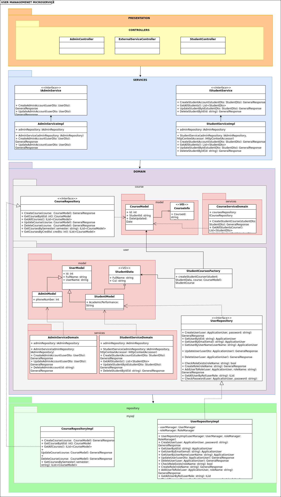
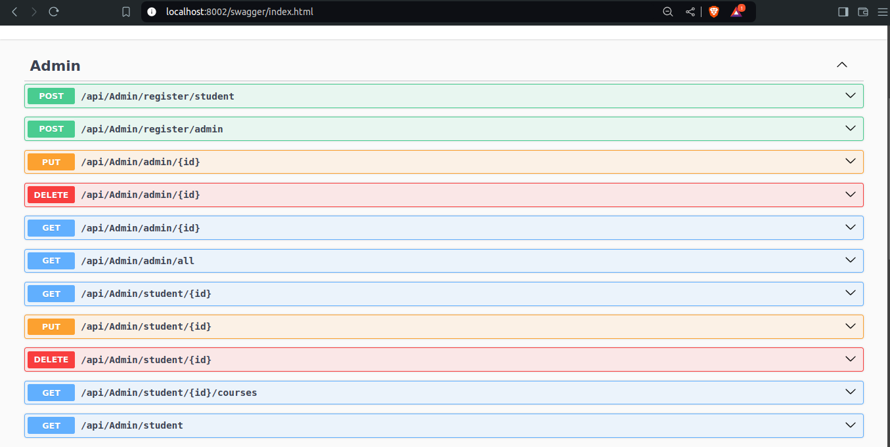
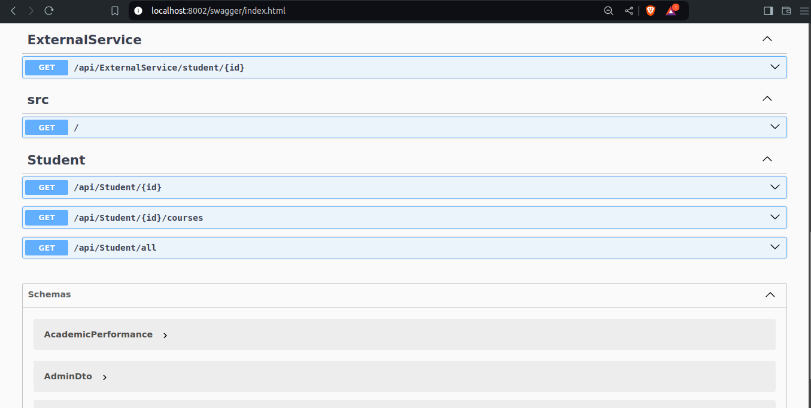
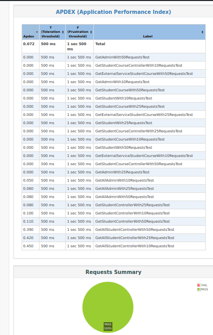
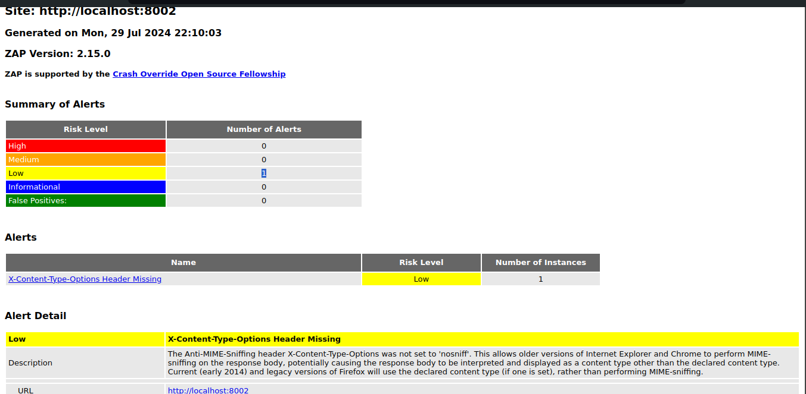

# Arquitectura DDD y Pruebas del Microservicio de Usuarios

## 1. Descripción
El microservicio de gestión de usuarios se encarga de manejar todas las operaciones relacionadas con la administración de usuarios en el sistema. Esto incluye la creación, actualización, consulta y eliminación de usuarios. 
- **Contexto Delimitado:**  Gestión de Usuarios

## 2. Arquitectura DDD

### 2.1. Capas de la Arquitectura

<details open>
  <summary><b><i>2.1.1. Capa de Presentación</b></i></summary>
  <ul>
    <li><b>Controladores</b></li>
    <ul>
      <li><b>AdminController</b>: Gestiona las solicitudes HTTP relacionadas con usuarios con el rol de <code>ADMIN</code>. Incluye métodos para crear, actualizar, obtener y eliminar usuarios, delegando la lógica correspondiente a los servicios de aplicación.</li>
      <li><b>StudentController</b>: Gestiona las solicitudes HTTP relacionadas con usuarios con el rol de <code>STUDENT</code>. Incluye únicamente métodos de lectura (<code>GET</code>), delegando la lógica a los servicios de aplicación.</li>
      <li><b>ExternalServiceController</b>: Gestiona las solicitudes HTTP relacionadas con otros microservicios. Incluye métodos para crear, actualizar, obtener y eliminar usuarios, delegando la lógica a los servicios de aplicación.</li>
    </ul>
  </ul>
</details>

<details open>
  <summary><b><i>2.1.2. Capa de Aplicación</b></i></summary>
  <ul>
    <li><b>Servicios de Aplicación</b></li>
    <ul>
      <li><b>AdminService</b>: Contiene la lógica de negocio específica para la gestión de usuarios con rol <code>ADMIN</code>.. Coordina las operaciones entre el controlador y el dominio, incluyendo la validación y transformación de datos.</li>
      <li><b>StudentService</b>: Contiene la lógica de negocio específica para la gestión de usuarios con rol <code>STUDENT</code>. Coordina las operaciones entre el controlador y el dominio, incluyendo la validación y transformación de datos.</li>
      <li><b>ExternalService</b>: Contiene la lógica de negocio específica para la integración con otros microservicios. Coordina las operaciones entre el controlador y el dominio, incluyendo la validación y transformación de datos.</li>
    </ul>
    <li><b>DTOs</b></li>
    <ul>
      <li><b>AdminDto</b>: Objeto de transferencia de datos utilizado para encapsular la información de un usuario administrador, facilitando su uso en la capa de presentación.</li>
      <li><b>CourseDto</b>: Objeto de transferencia de datos utilizado para encapsular la información relacionada con los cursos, facilitando su uso en la capa de presentación.</li>
      <li><b>ExternalServiceDto</b>: Objeto de transferencia de datos utilizado para encapsular la información necesaria para interactuar con otros microservicios, facilitando su uso en la capa de presentación.</li>
      <li><b>StudentDto</b>: Objeto de transferencia de datos utilizado para encapsular la información de un estudiante, facilitando su uso en la capa de presentación.</li>
      <li><b>UserDto</b>: Objeto de transferencia de datos utilizado para encapsular la información de un usuario, facilitando su uso en la capa de presentación.</li>
      <li><b>ServiceResponseDto</b>: Objeto de transferencia de datos utilizado para encapsular la información de respuesta de los servicios, facilitando su uso en la capa de presentación.</li>
    </ul>
    <li><b>Mapping</b></li>
    <ul>
      <li><b>AdminMapping</b>: Clase responsable de mapear entre las entidades de dominio y los DTOs, asegurando la transferencia correcta de datos entre capas.</li>
      <li><b>CourseMapping</b>: Clase responsable de mapear entre las entidades de dominio y los DTOs, asegurando la transferencia correcta de datos entre capas.</li>
      <li><b>StudentMapping</b>: Clase responsable de mapear entre las entidades de dominio y los DTOs, asegurando la transferencia correcta de datos entre capas.</li>
      <li><b>UserMapping</b>: Clase responsable de mapear entre las entidades de dominio y los DTOs, asegurando la transferencia correcta de datos entre capas.</li>
    </ul>
  </ul>
</details>

<details open>
  <summary><b><i>2.1.3. Capa de Dominio</b></i></summary>
  <ul>
    <li><b>Entidades</b></li>
    <ul>
      <li><b>AcademicPerformance</b>: Enum que define el rendimiento académico del estudiante, clasificándolo en el primer tercio (<code>1</code>), segundo tercio (<code>2</code>), o tercer tercio (<code>3</code>).</li>
      <li><b>UserModel</b>: Entidad principal del sistema de gestión de usuarios, que incluye propiedades como <code>Id</code>, <code>FullName</code>, y <code>Email</code>.</li>
      <li><b>AdminModel</b>: Entidad derivada de <code>UserModel</code>, que representa al usuario administrador y añade propiedades como <code>PhoneNumber</code>.</li>
      <li><b>StudentModel</b>: Entidad derivada de <code>UserModel</code>, que representa al usuario estudiante y contiene propiedades como <code>StudentData</code>, <code>Credit</code>, <code>AcademicPerformance</code>, y <code>StudentCourses</code>.</li>
      <li><b>CourseModel</b>: Entidad que almacena información sobre los cursos llevados por el estudiante, incluyendo propiedades como <code>Id</code>, <code>StudentId</code>, y <code>CourseInfo</code>.</li>
    </ul>
    <li><b>Value Objects</b></li>
    <ul>
      <li><b>CourseInfo</b>: Objeto de valor que gestiona los atributos relacionados con un curso, considerando que la información completa se almacena en otro microservicio. Incluye propiedades como <code>CourseId</code> y <code>Status</code>.</li>
      <li><b>StudentInfo</b>: Objeto de valor que proporciona detalles adicionales sobre un estudiante, incluyendo propiedades como <code>Cui</code> y <code>SchoolId</code>.</li>
    </ul>
    <li><b>Agregados</b></li>
    <ul>
      <li><b>StudentCourses</b>: Agrupa entidades y objetos de valor relacionados con los cursos de un estudiante, garantizando la consistencia interna del agregado.</li>
    </ul>
    <li><b>Servicios de Dominio</b></li>
    <ul>
      <li><b>AdminService</b>: Contiene la lógica de negocio compleja que involucra múltiples entidades o agregados, como cálculos de comisiones o validaciones específicas de dominio.</li>
      <li><b>StudentService</b>: Contiene la lógica de negocio compleja que involucra múltiples entidades o agregados, como cálculos de comisiones o validaciones específicas de dominio.</li>
    </ul>
    <li><b>Interfaces de Repositorio</b></li>
    <ul>
      <li><b>UserRepository</b>: Define los métodos necesarios para la gestión de usuarios en el repositorio, como <code>AddUser</code>, <code>UpdateUser</code>, <code>GetUserById</code>, y <code>DeleteUser</code>.</li>
      <li><b>CourseRepository</b>: Define los métodos necesarios para la gestión de cursos en el repositorio, como <code>AddCourse</code>, <code>UpdateCourse</code>, <code>GetCourseById</code>, y <code>DeleteCourse</code>.</li>
    </ul>
  </ul>
</details>

<details open>
  <summary><b><i>2.1.4. Capa de Repositorio</b></i></summary>
  <ul>
    <li><b>Implementaciones de Repositorios</b></li>
    <ul>
      <li><b>UserRepository</b>: Implementación concreta de <code>IUserRepository</code>, que utiliza el contexto de la base de datos para realizar operaciones CRUD sobre los usuarios.</li>
      <li><b>CourseRepository</b>: Implementación concreta de <code>ICourseRepository</code>, que utiliza el contexto de la base de datos para realizar operaciones CRUD sobre los cursos.</li>
    </ul>
    <li><b>Contexto de la Base de Datos</b></li>
    <ul>
      <li><b>UserManagementDbContext</b>: Clase que gestiona la conexión a la base de datos y proporciona acceso a las entidades a través de <code>DbSet</code>. Configura los mapeos y relaciones entre entidades.</li>
    </ul>
    <li><b>Integraciones Externas</b></li>
    <ul>
      <li><b>ExternalService</b>: Servicio encargado de enviar los datos necesarios para la creación de un usuario (<code>UserName</code>, <code>Password</code>, <code>Role</code>, entre otros) al microservicio de autenticación.</li>
    </ul>
  </ul>
</details>


### 2.2. Diagrama de la Arquitectura



## 3. Pruebas

### 3.1. Pruebas de API

#### 3.1.1. Herramientas y Tecnologías


Para llevar a cabo las pruebas de nuestra API, hemos utilizado una serie de herramientas y tecnologías clave que facilitan la evaluación exhaustiva y efectiva de las funcionalidades expuestas por la API. A continuación se describen las herramientas principales empleadas:

- **Postman:** Esta herramienta es ampliamente utilizada para el diseño, prueba y documentación de APIs. Permite realizar solicitudes HTTP a los endpoints de la API, definir y gestionar colecciones de pruebas, y verificar respuestas con gran detalle. Postman también proporciona funcionalidades avanzadas como la ejecución de scripts pre y post solicitud, así como la integración con sistemas de CI/CD para automatizar las pruebas.

- **Swagger:** Swagger, ahora conocido como OpenAPI, es una herramienta poderosa para documentar y probar APIs. Permite generar documentación interactiva que facilita la comprensión y el uso de los endpoints de la API. Con Swagger, es posible visualizar y probar los endpoints directamente desde la documentación, lo que ayuda a identificar problemas y validar el comportamiento de la API de manera eficiente.

Estas herramientas y tecnologías no solo facilitan la creación de pruebas detalladas y la generación de documentación precisa, sino que también aseguran una integración continua y una experiencia de usuario consistente durante el ciclo de vida de desarrollo de la API.

#### 3.1.2. Escenarios de Prueba de API

<details open>
  <summary><b><i>Background:</i></b> El endpoint "/api/Admin/register/admin" es accesible y está disponible</summary>

  <details open>
    <summary><b><i>Escenario 1:</i></b> Registrar exitosamente un usuario administrador.</summary>

```gherkin
    Escenario: Registrar exitosamente un usuario administrador
      Given se proporciona una payload válida de datos
        {
            "fullName": "Aldo Benito Martinez",
            "userData": {
                "userName": "bananon",
                "password": "Aldechi@123",
                "confirmPassword": "Aldechi@123",
                "role": "ADMIN"
            },
            "email": "aldechi001@example.com",
            "phoneNumber": "123456789"
        }

      When se envía una solicitud POST a "/api/Admin/register/admin"
      Then se recibe una respuesta válida con código 201
      And se recibe un mensaje de "Admin user created successfully"

```

    
  </details>

  <details open>
    <summary><b><i>Escenario 2:</i></b> Fallar al registrar debido a datos inválidos.</summary>
    
```gherkin
    Escenario: Fallar al registrar debido a datos inválidos
      Given se proporciona un payload inválido para registrar un administrador:
      {
        "fullName": "as",
        "userData": {
            "userName": "",
            "password": "123",
            "confirmPassword": "456",
            "role": "STUDENT"
        },
        "email": "aldechi001example.com",
        "cui": "",
        "courseIds": [],
        "academicPerformance": -1,
        "credit": 1,
        "schoolId": ""
      }

      When se envía una solicitud POST a "/api/Admin/register/admin"
      Then se recibe una respuesta con código 400
      And se recibe un respuesta formato JSON
      And se recibe un mensaje de "One or more validation errors occurred."
```
  </details>

 

</details>

<details open>
  <summary><b><i>Background:</i></b> El endpoint "/api/Admin/{id}" es accesible y está disponible</summary>

  <details open>
    <summary><b><i>Escenario 4:</i></b> Actualizar exitosamente datos de un administrador.</summary>
    
```gherkin
    Escenario: Actualizar exitosamente datos de un administrador
      Given el ID del administrador existe y se proporciona un payload para actualizar el administrador
        { "id": 1  }
      When se envía una solicitud PUT a "/api/Admin/{id}"
      Then se recibe una respuesta válida con código 200
      And el cuerpo de la respuesta debe contener  “User updated successfully”
```
  </details>

  <details open>
    <summary><b><i>Escenario 5:</i></b> Actualización fallida debido a ID inexistente.</summary>
    
```gherkin
    Escenario: Actualización fallida debido a ID inexistente
      Given el ID del administrador no existe y se proporciona un payload válido para actualizar el administrador
        { 
          "id": 10000000
        }
      When se envía una solicitud PUT a "/api/Admin/{id}" con una carga útil válida
      Then se recibe una respuesta válida con código 404
      And se recibe respuesta formato json
      And se recibe un mensjae de "Not found"
```
  </details>

  <details open>
    <summary><b><i>Escenario 6:</i></b> Eliminar exitosamente un administrador.</summary>
    

```gherkin
    Escenario: Eliminar exitosamente un administrador
      Given el ID del administrador existe
        {
          "id" : 3
        } 
      When se envía una solicitud DELETE a "/api/Admin/{id}"
      Then se recibe una respuesta válida con código 204
      And se comprueba por petición Get que el id no exista
      And se obtiene codigo 404
```
  </details>

  <details open>
    <summary><b><i>Escenario 7:</i></b> Eliminar un administrador inexistente</summary>
    

```gherkin
    Escenario:  Eliminar un administrador inexistente
      Given el ID del administrador no existe
       {
        "id" : 10000000000
       }
      When se envía una solicitud DELETE a "/api/Admin/{id}"
      Then se recibe una respuesta válida con código 
      And se recibe respuesta formato json
      And se recibe mensaje "Not Found"
```
  </details>

  <details open>
    <summary><b><i>Escenario 8:</i></b> Obtener administrador existente.</summary>
    

```gherkin
    Escenario: Obtener administrador existente
      Given el ID del administrador existe
        {
          "id" : 1
        }
      When se envía una solicitud GET a "/api/Admin/{id}"
      Then se recibe una respuesta válida con código 200
      And se recibe respuesta en formato JSON
```
  </details>

  <details open>
    <summary><b><i>Escenario 9:</i></b> Error por administrador inexistente.</summary>
    
    
```gherkin
    Escenario: Error por administrador inexistente
      Given el ID del administrador no existe
        {
          "id" : 100000000
        }
      When se envía una solicitud GET a "/api/Admin/{id}"
      Then se recibe una respuesta válida con código 404
      And se recibe respuesta formato json
      And se recibe mensajae "Not found"
```
  </details>

</details>

<details open>
  <summary><b><i>Background:</i></b> El endpoint "/api/Admin/all" es accesible y está disponible</summary>

  <details open>
    <summary><b><i>Escenario 10:</i></b> Obtener todos los administradores</summary>
    
```gherkin
    Escenario: Obtener todos los administradores
      Given existan datos en el servidor
      When se envía una solicitud GET a "/api/Admin/all"
      Then se recibe una respuesta válida con código 200
      And se recibe una respuesta en formato JSON
      And se recibe un array en formato JSON
```
  </details>

</details>

<details open>
  <summary><b><i>Background:</i></b> El endpoint "/api/Admin/register/student" es accesible y está disponible</summary>

  <details open>
    <summary><b><i>Escenario 11:</i></b> Registrar exitosamente un estudiante.</summary>
    
```gherkin
    Escenario: Registrar exitosamente un estudiante
      Given se proporciona un payload válido para registrar un estudiante
        {
          "id": "",
          "fullName": "John Doe2",
          "userData": {
              "userName": "bananon",
              "password": "Aldechi@123",
              "confirmPassword": "Aldechi@123",
              "role": "STUDENT"
          },
          "cui": "1234562",
          "email": "john.doe@example.com",
          "courseIds": [
              "08b34482-e007-4ab5-a66d-c2765f31aa94",
              "207f058b-b9e7-4a7b-b516-346320d3d512",
              "37302ffc-5432-4431-9eb2-d23d52b9a5bd"
          ],
          "academicPerformance": 1,
          "credit": 30,
          "schoolId": "school123"
      }
      When se envía una solicitud POST a "/api/Admin/register/student" con un payload válido
      Then se recibe una respuesta válida con código 201
      And se recibe una respuesta formato JSON
      And recibe un mensaje de "Student created successfully"
```
  </details>

  <details open>
    <summary><b><i>Escenario 12:</i></b> Fallar debido a datos inválidos.</summary>
    
```gherkin
    Escenario: Fallar debido a datos inválidos
      Given se proporciona un payload inválido para registrar un estudiante
        {
          "fullName": "as",
          "userData": {
            "userName": "",
            "password": "123",
            "confirmPassword": "456",
            "role": "STUDENT"
          },
          "email": "aldechi001example.com",
          "cui": "",
          "courseIds": [],
          "academicPerformance": -1,
          "credit": 1,
          "schoolId": ""
        }
      When se envía una solicitud POST a "/api/Admin/register/student" con un payload inválido
      Then se recibe una respuesta válida con código 400
      And se recibe un respuesta formato JSON
      And se recibe un mensaje de "One or more validation errors occurred."
```
  </details>
   <details open>
    <summary><b><i>Escenario 13:</i></b> Eliminar exitosamente un estudiante.</summary>
    

```gherkin
    Escenario: Eliminar exitosamente un estudiante
      Given el ID del administrador existe
        {
          "id" : 3
        } 
      When se envía una solicitud DELETE a "/api/Admin/student/{id}"
      Then se recibe una respuesta válida con código 204
      And se comprueba por petición Get que el id no exista
      And se obtiene codigo 404
```
  </details>

  <details open>
    <summary><b><i>Escenario 14:</i></b> Eliminar un estudiante inexistente</summary>
    

```gherkin
    Escenario:  Eliminar un administrador inexistente
      Given el ID del administrador no existe
       {
        "id" : 10000000000
       }
      When se envía una solicitud DELETE a "/api/Admin/student/{id}"
      Then se recibe una respuesta válida con código 
      And se recibe respuesta formato json
      And se recibe mensaje "Not Found"
```
  </details>


</details>

<details open>
  <summary><b><i>Background:</i></b> El endpoint "/api/Student/{id}" es accesible y está disponible</summary>

  <details open>
    <summary><b><i>Escenario 15:</i></b> Obtener estudiante existente.</summary>
    
```gherkin
    Escenario: Obtener estudiante existente
      Given el ID del estudiante existe
        {
          "id": 1
        }
      When se envía una solicitud GET a "/api/Student/{id}"
      Then se recibe una respuesta válida con código 200
      And la respuesta es en formato JSON
```
  </details>

  <details open>
    <summary><b><i>Escenario 16:</i></b> Obtener estudiante inexistente.</summary>
    
```gherkin
    Escenario: Obtener estudiante inexistente
      Given el ID del estudiante no existe
        {
          "id": 10000000
        }
      When se envía una solicitud GET a "/api/Student/{id}"
      Then se recibe una respuesta válida con código 404
      And se recibe un mensaje de "Not found"
```
  </details>

</details>

<details open>
  <summary><b><i>Background:</i></b> El endpoint "/api/Student/all" es accesible y está disponible</summary>

  <details open>
    <summary><b><i>Escenario 17:</i></b> Obtener todos los estudiantes.</summary>
    
```gherkin
    Escenario: Obtener todos los estudiantes
      Given existen estudiantes registrados en la base de datos
      When se envía una solicitud GET a "/api/Student/all"
      Then se recibe una respuesta válida con código 200
      And se espera recibir un array de estudiantes
```
  </details>

</details>

<details open>
  <summary><b><i>Background:</i></b> El endpoint "/api/Student/{id}/courses" es accesible y está disponible</summary>

  <details open>
    <summary><b><i>Escenario 18:</i></b> Obtener cursos de un estudiante existente.</summary>
    
```gherkin
    Escenario: Obtener cursos de un estudiante existente
      Given el ID del estudiante existe
        {
          "id" : 3
        }
      When se envía una solicitud GET a "/api/Student/{id}/courses"
      Then se recibe una respuesta válida con código 200
      And se espera recibir un array de cursos
      And se espera recibir una respuesta en formato json
      And se espera recibir un array de string de courseid
```
  </details>

  <details open>
    <summary><b><i>Escenario 19:</i></b> Obtener cursos de un estudiante inexistente.</summary>
    
```gherkin
    Escenario: Obtener cursos de un estudiante inexistente
      Given el ID del estudiante no existe
        {
          "id" : 100000 
        }
      When se envía una solicitud GET a "/api/Student/{id}/courses"
      Then se recibe una respuesta válida con código 404
      And se recibe un mensaje "Not found"
      And recibe una respuesta en formato json
```
  </details>

</details>

<details open>
  <summary><b><i>Background:</i></b> El endpoint "/api/ExternalService/student/{id}" es accesible y está disponible</summary>

  <details open>
    <summary><b><i>Escenario 20:</i></b> Obtener exitosamente datos de cursos del estudiante.</summary>
    
```gherkin
    Escenario: Obtener exitosamente datos de cursos del estudiante
      Given el ID del estudiante existe
        {
          "id": 3
        }
      When se envía una solicitud GET a "/api/ExternalService/student/{id}"
      Then se recibe una respuesta válida con código 200
      And se espera recibir una respuesta en formato JSON
      And se espera recibir un array de string de cursos
```
  </details>

  <details open>
    <summary><b><i>Escenario 21:</i></b> Solicitar con ID de estudiante no válido.</summary>
    
```gherkin
    Escenario: Solicitar con ID de estudiante no válido
      Given se proporciona un ID de estudiante no válido
        {
          "id": 100000
        }
      When se envía una solicitud GET a "/api/ExternalService/student/{id}"
      Then se recibe una respuesta válida con código 404
      And se recibe respuesta formato json
      And se recibe un mensaje "Not found"
```
  </details>

</details>


#### 3.1.3. Pruebas de API con Swagger

Swagger facilita la comprensión de los endpoints disponibles y cómo interactuar con ellos. Además, se incluye información sobre el archivo `requests/enroll.http`, que contiene los comandos cURL necesarios para ejecutar las pruebas de la API de manera eficiente. Este archivo permite realizar las solicitudes directamente desde la línea de comandos, complementando el uso de Swagger para una experiencia de prueba completa.




---

### 3.2. Pruebas de Rendimiento

#### 3.2.1. Herramientas y Tecnologías
Descripción de las herramientas utilizadas para las pruebas de rendimiento (por ejemplo, Apache JMeter, k6, etc.).

#### 3.2.2. Escenarios de Prueba de Rendimiento

<details open>
<summary><b><i>Background:</i></b> El endpoint "/api/Admin/{id}" es accesible y está disponible</summary>

<details open>
<summary><b><i>Escenario 1:</i></b> Prueba de carga para obtener detalles de matrícula con 10 solicitudes simultáneas.</summary>

```gherkin
Escenario: Obtener detalles de matrícula con 10 solicitudes simultáneas
  Given el endpoint "/api/Admin/{id}" está disponible
  When se envían 10 solicitudes GET simultáneas al endpoint
  Then todas las respuestas deben ser 200 OK
  And el tiempo de respuesta promedio debe ser menor a 2 segundos
  And no debe haber errores o caídas del servicio
```
</details>

<details open>
<summary><b><i>Escenario 2:</i></b> Prueba de carga para obtener detalles de matrícula con 25 solicitudes simultáneas.</summary>

```gherkin
Escenario: Obtener detalles de matrícula con 25 solicitudes simultáneas
  Given el endpoint "/api/Admin/{id}" está disponible
  When se envían 25 solicitudes GET simultáneas al endpoint
  Then todas las respuestas deben ser 200 OK
  And el tiempo de respuesta promedio debe ser menor a 2 segundos
  And no debe haber errores o caídas del servicio
```
</details>

<details open>
<summary><b><i>Escenario 3:</i></b> Prueba de carga para obtener detalles de matrícula con 50 solicitudes simultáneas.</summary>

```gherkin
Escenario: Obtener detalles de matrícula con 50 solicitudes simultáneas
  Given el endpoint "/api/Admin/{id}" está disponible
  When se envían 50 solicitudes GET simultáneas al endpoint
  Then todas las respuestas deben ser 200 OK
  And el tiempo de respuesta promedio debe ser menor a 2 segundos
  And no debe haber errores o caídas del servicio
```
</details>

</details>

<details open>
<summary><b><i>Background:</i></b> El endpoint "/api/Admin/all" es accesible y está disponible</summary>

<details open>
<summary><b><i>Escenario 4:</i></b> Obtener todos los administradores con 10 solicitudes simultáneas.</summary>

```gherkin
Escenario: Obtener todos los administradores con 10 solicitudes simultáneas
  Given el endpoint "/api/Admin/all" está disponible
  When se envían 10 solicitudes GET simultáneas al endpoint
  Then todas las respuestas deben ser 200 OK
  And el tiempo de respuesta promedio debe ser menor a 2 segundos
  And no debe haber errores o caídas del servicio
```
</details>

<details open>
<summary><b><i>Escenario 5:</i></b> Obtener todos los administradores con 25 solicitudes simultáneas.</summary>

```gherkin
Escenario: Obtener todos los administradores con 25 solicitudes simultáneas
  Given el endpoint "/api/Admin/all" está disponible
  When se envían 25 solicitudes GET simultáneas al endpoint
  Then todas las respuestas deben ser 200 OK
  And el tiempo de respuesta promedio debe ser menor a 2 segundos
  And no debe haber errores o caídas del servicio
```
</details>

<details open>
<summary><b><i>Escenario 6:</i></b> Obtener todos los administradores con 50 solicitudes simultáneas.</summary>

```gherkin
Escenario: Obtener todos los administradores con 50 solicitudes simultáneas
  Given el endpoint "/api/Admin/all" está disponible
  When se envían 50 solicitudes GET simultáneas al endpoint
  Then todas las respuestas deben ser 200 OK
  And el tiempo de respuesta promedio debe ser menor a 2 segundos
  And no debe haber errores o caídas del servicio
```
</details>

</details>

<details open>
<summary><b><i>Background:</i></b> El endpoint "/api/Student/{id}" es accesible y está disponible</summary>

<details open>
<summary><b><i>Escenario 7:</i></b> Obtener estudiante existente con 10 solicitudes simultáneas.</summary>

```gherkin
Escenario: Obtener estudiante existente con 10 solicitudes simultáneas
  Given el endpoint "/api/Student/{id}" está disponible
  And el ID del estudiante existe
  When se envían 10 solicitudes GET simultáneas al endpoint
  Then todas las respuestas deben ser 200 OK
  And el tiempo de respuesta promedio debe ser menor a 2 segundos
  And no debe haber errores o caídas del servicio
```
</details>

<details open>
<summary><b><i>Escenario 8:</i></b> Obtener estudiante existente con 25 solicitudes simultáneas.</summary>

```gherkin
Escenario: Obtener estudiante existente con 25 solicitudes simultáneas
  Given el endpoint "/api/Student/{id}" está disponible
  And el ID del estudiante existe
  When se envían 25 solicitudes GET simultáneas al endpoint
  Then todas las respuestas deben ser 200 OK
  And el tiempo de respuesta promedio debe ser menor a 2 segundos
  And no debe haber errores o caídas del servicio
```
</details>

<details open>
<summary><b><i>Escenario 9:</i></b> Obtener estudiante existente con 50 solicitudes simultáneas.</summary>

```gherkin
Escenario: Obtener estudiante existente con 50 solicitudes simultáneas
  Given el endpoint "/api/Student/{id}" está disponible
  And el ID del estudiante existe
  When se envían 50 solicitudes GET simultáneas al endpoint
  Then todas las respuestas deben ser 200 OK
  And el tiempo de respuesta promedio debe ser menor a 2 segundos
  And no debe haber errores o caídas del servicio
```
</details>

<details open>
<summary><b><i>Escenario 10:</i></b> Obtener estudiante inexistente con 10 solicitudes simultáneas.</summary>

```gherkin
Escenario: Obtener estudiante inexistente con 10 solicitudes simultáneas
  Given el endpoint "/api/Student/{id}" está disponible
  And el ID del estudiante no existe
  When se envían 10 solicitudes GET simultáneas al endpoint
  Then todas las respuestas deben ser 404 Not Found
  And el tiempo de respuesta promedio debe ser menor a 2 segundos
  And no debe haber errores o caídas del servicio
```
</details>

<details open>
<summary><b><i>Escenario 11:</i></b> Obtener estudiante inexistente con 25 solicitudes simultáneas.</summary>

```gherkin
Escenario: Obtener estudiante inexistente con 25 solicitudes simultáneas
  Given el endpoint "/api/Student/{id}" está disponible
  And el ID del estudiante no existe
  When se envían 25 solicitudes GET simultáneas al endpoint
  Then todas las respuestas deben ser 404 Not Found
  And el tiempo de respuesta promedio debe ser menor a 2 segundos
  And no debe haber errores o caídas del servicio
```
</details>

<details open>
<summary><b><i>Escenario 12:</i></b> Obtener estudiante inexistente con 50 solicitudes simultáneas.</summary>

```gherkin
Escenario: Obtener estudiante inexistente con 50 solicitudes simultáneas
  Given el endpoint "/api/Student/{id}" está disponible
  And el ID del estudiante no existe
  When se envían 50 solicitudes GET simultáneas al endpoint
  Then todas las respuestas deben ser 404 Not Found
  And el tiempo de respuesta promedio debe ser menor a 2 segundos
  And no debe haber errores o caídas del servicio
```
</details>

</details>

<details open>
<summary><b><i>Background:</i></b> El endpoint "/api/Student/all" es accesible y está disponible</summary>

<details open>
<summary><b><i>Escenario 13:</i></b> Obtener todos los estudiantes con 10 solicitudes simultáneas.</summary>

```gherkin
Escenario: Obtener todos los estudiantes con 10 solicitudes simultáneas
  Given el endpoint "/api/Student/all" está disponible
  When se envían 10 solicitudes GET simultáneas al endpoint
  Then todas las respuestas deben ser 200 OK
  And el tiempo de respuesta promedio debe ser menor a 2 segundos
  And no debe haber errores o caídas del servicio
```
</details>

<details open>
<summary><b><i>Escenario 14:</i></b> Obtener todos los estudiantes con 25 solicitudes simultáneas.</summary>

```gherkin
Escenario: Obtener todos los estudiantes con 25 solicitudes simultáneas
  Given el endpoint "/api/Student/all" está disponible
  When se envían 25 solicitudes GET simultáneas al endpoint
  Then todas las respuestas deben ser 200 OK
  And el tiempo de respuesta promedio debe ser menor a 2 segundos
  And no debe haber errores o caídas del servicio
```
</details>

<details open>
<summary><b><i>Escenario 15:</i></b> Obtener todos los estudiantes con 50 solicitudes simultáneas.</summary>

```gherkin
Escenario: Obtener todos los estudiantes con 50 solicitudes simultáneas
  Given el endpoint "/api/Student/all" está disponible
  When se envían 50 solicitudes GET simultáneas al endpoint
  Then todas las respuestas deben ser 200 OK
  And el tiempo de respuesta promedio debe ser menor a 2 segundos
  And no debe haber errores o caídas del servicio
```
</details>

</details>

<details open>
<summary><b><i>Background:</i></b> El endpoint "/api/Student/{id}/courses" es accesible y está disponible</summary>

<details open>
<summary><b><i>Escenario 16:</i></b> Obtener cursos de un estudiante existente con 10 solicitudes simultáneas.</summary>

```gherkin
Escenario: Obtener cursos de un estudiante existente con 10 solicitudes simultáneas
  Given el endpoint "/api/Student/{id}/courses" está disponible
  And el ID del estudiante existe
  When se envían 10 solicitudes GET simultáneas al endpoint
  Then todas las respuestas deben ser 200 OK
  And el tiempo de respuesta promedio debe ser menor a 2 segundos
  And no debe haber errores o caídas del servicio
```
</details>

<details open>
<summary><b><i>Escenario 17:</i></b> Obtener cursos de un estudiante existente con 25 solicitudes simultáneas.</summary>

```gherkin
Escenario: Obtener cursos de un estudiante existente con 25 solicitudes simultáneas
  Given el endpoint "/api/Student/{id}/courses" está disponible
  And el ID del estudiante existe
  When se envían 25 solicitudes GET simultáneas al endpoint
  Then todas las respuestas deben ser 200 OK
  And el tiempo de respuesta promedio debe ser menor a 2 segundos
  And no debe haber errores o caídas del servicio
```
</details>

<details open>
<summary><b><i>Escenario 18:</i></b> Obtener cursos de un estudiante existente con 50 solicitudes simultáneas.</summary>

```gherkin
Escenario: Obtener cursos de un estudiante existente con 50 solicitudes simultáneas
  Given el endpoint "/api/Student/{id}/courses" está disponible
  And el ID del estudiante existe
  When se envían 50 solicitudes GET simultáneas al endpoint
  Then todas las respuestas deben ser 200 OK
  And el tiempo de respuesta promedio debe ser menor a 2 segundos
  And no debe haber errores o caídas del servicio
```
</details>

<details open>
<summary><b><i>Escenario 19:</i></b> Obtener cursos de un estudiante inexistente con 10 solicitudes simultáneas.</summary>

```gherkin
Escenario: Obtener cursos de un estudiante inexistente con 10 solicitudes simultáneas
  Given el endpoint "/api/Student/{id}/courses" está disponible
  And el ID del estudiante no existe
  When se envían 10 solicitudes GET simultáneas al endpoint
  Then todas las respuestas deben ser 404 Not Found
  And el tiempo de respuesta promedio debe ser menor a 2 segundos
  And no debe haber errores o caídas del servicio
```
</details>

<details open>
<summary><b><i>Escenario 20:</i></b> Obtener cursos de un estudiante inexistente con 25 solicitudes simultáneas.</summary>

```gherkin
Escenario: Obtener cursos de un estudiante inexistente con 25 solicitudes simultáneas
  Given el endpoint "/api/Student/{id}/courses" está disponible
  And el ID del estudiante no existe
  When se envían 25 solicitudes GET simultáneas al endpoint
  Then todas las respuestas deben ser 404 Not Found
  And el tiempo de respuesta promedio debe ser menor a 2 segundos
  And no debe haber errores o caídas del servicio
```
</details>

<details open>
<summary><b><i>Escenario 21:</i></b> Obtener cursos de un estudiante inexistente con 50 solicitudes simultáneas.</summary>

```gherkin
Escenario: Obtener cursos de un estudiante inexistente con 50 solicitudes simultáneas
  Given el endpoint "/api/Student/{id}/courses" está disponible
  And el ID del estudiante no existe
  When se envían 50 solicitudes GET simultáneas al endpoint
  Then todas las respuestas deben ser 404 Not Found
  And el tiempo de respuesta promedio debe ser menor a 2 segundos
  And no debe haber errores o caídas del servicio
```
</details>

</details>

<details open>
<summary><b><i>Background:</i></b> El endpoint "/api/ExternalService/student/{id}" es accesible y está disponible</summary>

<details open>
<summary><b><i>Escenario 22:</i></b> Obtener exitosamente datos de cursos del estudiante con 10 solicitudes simultáneas.</summary>

```gherkin
Escenario: Obtener exitosamente datos de cursos del estudiante con 10 solicitudes simultáneas
  Given el endpoint "/api/ExternalService/student/{id}" está disponible
  And el ID del estudiante existe
  When se envían 10 solicitudes GET simultáneas al endpoint
  Then todas las respuestas deben ser 200 OK
  And el tiempo de respuesta promedio debe ser menor a 2 segundos
  And no debe haber errores o caídas del servicio
```
</details>

<details open>
<summary><b><i>Escenario 23:</i></b> Obtener exitosamente datos de cursos del estudiante con 25 solicitudes simultáneas.</summary>

```gherkin
Escenario: Obtener exitosamente datos de cursos del estudiante con 25 solicitudes simultáneas
  Given el endpoint "/api/ExternalService/student/{id}" está disponible
  And el ID del estudiante existe
  When se envían 25 solicitudes GET simultáneas al endpoint
  Then todas las respuestas deben ser 200 OK
  And el tiempo de respuesta promedio debe ser menor a 2 segundos
  And no debe haber errores o caídas del servicio
```
</details>

<details open>
<summary><b><i>Escenario 24:</i></b> Obtener exitosamente datos de cursos del estudiante con 50 solicitudes simultáneas.</summary>

```gherkin
Escenario: Obtener exitosamente datos de cursos del estudiante con 50 solicitudes simultáneas
  Given el endpoint "/api/ExternalService/student/{id}" está disponible
  And el ID del estudiante existe
  When se envían 50 solicitudes GET simultáneas al endpoint
  Then todas las respuestas deben ser 200 OK
  And el tiempo de respuesta promedio debe ser menor a 2 segundos
  And no debe haber errores o caídas del servicio
```
</details>

<details open>
<summary><b><i>Escenario 25:</i></b> Solicitar con ID de estudiante no válido con 10 solicitudes simultáneas.</summary>

```gherkin
Escenario: Solicitar con ID de estudiante no válido con 10 solicitudes simultáneas
  Given el endpoint "/api/ExternalService/student/{id}" está disponible
  And se proporciona un ID de estudiante no válido
  When se envían 10 solicitudes GET simultáneas al endpoint
  Then todas las respuestas deben ser 404 Not Found
  And el tiempo de respuesta promedio debe ser menor a 2 segundos
  And no debe haber errores o caídas del servicio
```
</details>

<details open>
<summary><b><i>Escenario 26:</i></b> Solicitar con ID de estudiante no válido con 25 solicitudes simultáneas.</summary>

```gherkin
Escenario: Solicitar con ID de estudiante no válido con 25 solicitudes simultáneas
  Given el endpoint "/api/ExternalService/student/{id}" está disponible
  And se proporciona un ID de estudiante no válido
  When se envían 25 solicitudes GET simultáneas al endpoint
  Then todas las respuestas deben ser 404 Not Found
  And el tiempo de respuesta promedio debe ser menor a 2 segundos
  And no debe haber errores o caídas del servicio
```
</details>

<details open>
<summary><b><i>Escenario 27:</i></b> Solicitar con ID de estudiante no válido con 50 solicitudes simultáneas.</summary>

```gherkin
Escenario: Solicitar con ID de estudiante no válido con 50 solicitudes simultáneas
  Given el endpoint "/api/ExternalService/student/{id}" está disponible
  And se proporciona un ID de estudiante no válido
  When se envían 50 solicitudes GET simultáneas al endpoint
  Then todas las respuestas deben ser 404 Not Found
  And el tiempo de respuesta promedio debe ser menor a 2 segundos
  And no debe haber errores o caídas del servicio
```
</details>

</details>

El siguiente informe presenta los resultados de las pruebas de rendimiento ejecutadas utilizando Apache JMeter.
<p align="center">
  
</p>


| **Label**                      | **#Samples** | **FAIL** | **Error%** | **Average (ms)** | **Min (ms)** | **Max (ms)** | **Median (ms)** | **90th pct (ms)** | **95th pct (ms)** | **99th pct (ms)** | **Transactions/s** | **Received (KB/sec)** | **Sent (KB/sec)** |
|--------------------------------|--------------|----------|------------|------------------|--------------|--------------|-----------------|-------------------|-------------------|-------------------|--------------------|-----------------------|-------------------|
| Total                          | 680          | 0        | 0.00%      | 2456.61          | 1306         | 5396         | 2177.00         | 3892.00           | 4198.30           | 5329.52           | 31.37              | 15.57                 | 4.20              |
| GetAdminWith10RequestsTest     | 10           | 0        | 0.00%      | 4305.60          | 3726         | 5341         | 4117.50         | 5331.40           | 5341.00           | 5341.00           | 1.73               | 0.47                  | 0.23              |
| GetAdminWith25RequestsTest     | 25           | 0        | 0.00%      | 4291.80          | 3718         | 5371         | 4072.00         | 5305.80           | 5358.10           | 5371.00           | 4.31               | 1.17                  | 0.56              |
| GetAdminWith50RequestsTest     | 50           | 0        | 0.00%      | 4347.14          | 3705         | 5396         | 4096.00         | 5315.70           | 5366.65           | 5396.00           | 8.64               | 2.34                  | 1.13              |
| GetAllAdminWith10RequestsTest  | 10           | 0        | 0.00%      | 1914.70          | 1425         | 2134         | 1981.50         | 2119.30           | 2134.00           | 2134.00           | 2.43               | 2.77                  | 0.32              |
| GetAllAdminWith25RequestsTest  | 25           | 0        | 0.00%      | 2062.16          | 1424         | 2709         | 1985.00         | 2418.20           | 2632.20           | 2709.00           | 5.64               | 6.41                  | 0.75              |
| GetAllAdminWith50RequestsTest  | 50           | 0        | 0.00%      | 2031.38          | 1421         | 2713         | 1983.00         | 2396.80           | 2710.35           | 2713.00           | 11.70              | 13.30                 | 1.55              |
| GetAllStudentControllerWith10RequestsTest | 10   | 0        | 0.00%      | 1407.90          | 1316         | 1995         | 1331.50         | 1942.10           | 1995.00           | 1995.00           | 2.87               | 2.82                  | 0.37              |
| GetAllStudentControllerWith25RequestsTest | 25   | 0        | 0.00%      | 1415.52          | 1316         | 1995         | 1332.00         | 1832.60           | 1947.00           | 1995.00           | 6.25               | 6.14                  | 0.81              |
| GetAllStudentControllerWith50RequestsTest | 50   | 0        | 0.00%      | 1435.92          | 1306         | 1996         | 1327.50         | 1829.00           | 1834.80           | 1996.00           | 11.58              | 11.38                 | 1.49              |
| GetExternalServiceStudentCourseWith10RequestsTest | 10 | 0        | 0.00%      | 2472.10          | 2116         | 3106         | 2312.00         | 3105.90           | 3106.00           | 3106.00           | 1.96               | 0.48                  | 0.28              |
| GetExternalServiceStudentCourseWith25RequestsTest | 25 | 0        | 0.00%      | 2527.12          | 2113         | 4103         | 2277.00         | 3106.40           | 3804.20           | 4103.00           | 4.59               | 1.13                  | 0.65              |
| GetExternalServiceStudentCourseWith50RequestsTest | 50 | 0        | 0.00%      | 2509.02          | 2115         | 4111         | 2283.50         | 3105.90           | 3561.20           | 4111.00           | 7.05               | 1.73                  | 1.00              |
| GetStudentControllerWith10RequestsTest | 10        | 0        | 0.00%      | 1995.60          | 1324         | 2813         | 2046.00         | 2747.10           | 2813.00           | 2813.00           | 2.44               | 0.78                  | 0.31              |
| GetStudentControllerWith25RequestsTest | 25        | 0        | 0.00%      | 1971.00          | 1323         | 2818         | 1985.00         | 2514.00           | 2816.80           | 2818.00           | 4.91               | 1.57                  | 0.62              |
| GetStudentControllerWith50RequestsTest | 50        | 0        | 0.00%      | 1957.60          | 1318         | 2819         | 1987.00         | 2806.80           | 2812.45           | 2819.00           | 9.20               | 2.94                  | 1.17              |
| GetStudentCourseControllerWith10RequestsTest | 10   | 0        | 0.00%      | 2292.70          | 2148         | 2770         | 2157.00         | 2768.30           | 2770.00           | 2770.00           | 2.03               | 0.69                  | 0.27              |
| GetStudentCourseControllerWith25RequestsTest | 25   | 0        | 0.00%      | 2240.32          | 1649         | 2985         | 2163.00         | 2754.40           | 2916.00           | 2985.00           | 4.61               | 1.56                  | 0.62              |
| GetStudentCourseControllerWith50RequestsTest | 50   | 0        | 0.00%      | 2296.48          | 1655         | 2981         | 2313.00         | 2753.90           | 2765.00           | 2981.00           | 8.67               | 2.93                  | 1.17              |
| GetStudentCourseWith10RequestsTest | 10         | 0        | 0.00%      | 2319.70          | 2162         | 3006         | 2173.00         | 2971.70           | 3006.00           | 3006.00           | 2.39               | 0.81                  | 0.34              |
| GetStudentCourseWith25RequestsTest | 25         | 0        | 0.00%      | 2352.40          | 2002         | 4010         | 2181.00         | 3003.80           | 3709.40           | 4010.00           | 4.82               | 1.63                  | 0.68              |
| GetStudentCourseWith50RequestsTest | 50         | 0        | 0.00%      | 2293.40          | 2006         | 3171         | 2175.00         | 2663.90           | 3005.45           | 3171.00           | 8.13               | 2.75                  | 1.14              |
| GetStudentWith10RequestsTest    | 10           | 0        | 0.00%      | 2776.50          | 2177         | 3128         | 3008.00         | 3127.90           | 3128.00           | 3128.00           | 2.32               | 0.79                  | 0.31              |
| GetStudentWith25RequestsTest    | 25           | 0        | 0.00%      | 2844.48          | 2180         | 3291         | 2890.00         | 3194.60           | 3290.70           | 3291.00           | 4.87               | 1.64                  | 0.65              |
| GetStudentWith50RequestsTest    | 50           | 0        | 0.00%      | 2789.56          | 2178         | 4009         | 2889.00         | 3128.00           | 3201.45           | 4009.00           | 7.92               | 2.68                  | 1.05              |
### 3.3. Pruebas de Seguridad

#### 3.3.1. Herramientas y Tecnologías

**OWASP ZAP (Zed Attack Proxy)** es una herramienta de código abierto diseñada para realizar pruebas de seguridad en aplicaciones web. Desarrollada por el Open Web Application Security Project (OWASP), ZAP proporciona una amplia gama de funciones para identificar vulnerabilidades y evaluar la seguridad de aplicaciones durante el ciclo de desarrollo. Su interfaz intuitiva permite a los usuarios realizar escaneos automatizados, así como llevar a cabo pruebas manuales de seguridad, como la exploración de aplicaciones y la identificación de puntos débiles. ZAP es particularmente útil para detectar problemas de seguridad comunes, como inyecciones SQL, ataques de cross-site scripting (XSS) y configuraciones incorrectas. Además, ZAP ofrece soporte para integraciones con otras herramientas de desarrollo y pruebas, lo que facilita la inclusión de prácticas de seguridad en el proceso de desarrollo ágil. Su capacidad para generar reportes detallados ayuda a los equipos de desarrollo a abordar las vulnerabilidades de manera efectiva y mejorar la seguridad general de sus aplicaciones.

#### 3.3.2. Escenarios de Prueba de Seguridad


### Background
```gherkin
Background:
    Given que el endpoint "http://localhost:8002" está accesible
```

<details open>
  <summary><b><i>Escenario 1:</i></b> Verificación de encabezados de seguridad HTTP.</summary>

```gherkin
Scenario: Verificación de encabezados de seguridad HTTP
  Given el sitio web "http://localhost:8002" debe incluir varios encabezados de seguridad HTTP
  When se realiza un análisis de encabezados HTTP
  Then los encabezados esperados deben estar presentes, incluyendo "Strict-Transport-Security", "Content-Security-Policy", y "X-Content-Type-Options"
```

</details>

<details open>
  <summary><b><i>Escenario 2:</i></b> Verificación de vulnerabilidades en bibliotecas JavaScript.</summary>

```gherkin
Scenario: Verificación de vulnerabilidades en bibliotecas JavaScript
  Given el sitio web "http://localhost:8002" utiliza bibliotecas JavaScript de terceros
  When se realiza un análisis de bibliotecas JavaScript
  Then no se deben encontrar bibliotecas vulnerables, como aquellas indicadas por Retire.js
```

</details>

<details open>
  <summary><b><i>Escenario 3:</i></b> Verificación de la configuración de cookies.</summary>

```gherkin
Scenario: Verificación de la configuración de cookies
  Given el sitio web "http://localhost:8002" utiliza cookies para el manejo de sesiones
  When se realiza un análisis de cookies
  Then todas las cookies deben estar configuradas con las banderas adecuadas, incluyendo "HttpOnly" y "Secure"
```

</details>

<details open>
  <summary><b><i>Escenario 4:</i></b> Verificación de la protección contra ataques XSS.</summary>

```gherkin
Scenario: Verificación de la protección contra ataques XSS
  Given el sitio web "http://localhost:8002" permite la entrada de usuarios
  When se realiza un análisis de entrada para detectar vulnerabilidades XSS
  Then no se deben encontrar puntos de entrada vulnerables a ataques de cross-site scripting (XSS)
```

</details>

<details open>
  <summary><b><i>Escenario 5:</i></b> Verificación de la política de seguridad de contenido (CSP).</summary>

```gherkin
Scenario: Verificación de la política de seguridad de contenido (CSP)
  Given el sitio web "http://localhost:8002" debe tener una política de seguridad de contenido configurada
  When se realiza un análisis de la política de seguridad de contenido
  Then la política debe estar correctamente configurada y debe incluir directivas como "default-src" y "script-src"
```

</details>

<details open>
  <summary><b><i>Escenario 6:</i></b> Verificación de la protección contra el clickjacking.</summary>

```gherkin
Scenario: Verificación de la protección contra el clickjacking
  Given el sitio web "http://localhost:8002" debe protegerse contra ataques de clickjacking
  When se realiza un análisis de encabezados HTTP
  Then debe estar presente el encabezado "X-Frame-Options" con una configuración segura
```

</details>

<details open>
  <summary><b><i>Escenario 7:</i></b> Verificación de redirecciones abiertas.</summary>

```gherkin
Scenario: Verificación de redirecciones abiertas
  Given el sitio web "http://localhost:8002" debe manejar las redirecciones de forma segura
  When se realiza un análisis para detectar redirecciones abiertas
  Then no deben encontrarse vulnerabilidades de redirección abierta
```

</details>

<details open>
  <summary><b><i>Escenario 8:</i></b> Verificación de exposición de información sensible.</summary>

```gherkin
Scenario: Verificación de exposición de información sensible
  Given el sitio web "http://localhost:8002" debe proteger la información sensible
  When se realiza un análisis para detectar la exposición de información sensible
  Then no se debe encontrar información sensible expuesta en encabezados HTTP o mensajes de error
```

</details>

<details open>
  <summary><b><i>Escenario 9:</i></b> Verificación de configuraciones de seguridad en la administración de sesiones.</summary>

```gherkin
Scenario: Verificación de configuraciones de seguridad en la administración de sesiones
  Given el sitio web "http://localhost:8002" gestiona sesiones de usuario
  When se realiza un análisis de la gestión de sesiones
  Then la sesión debe estar protegida contra ataques como el secuestro de sesión y el manejo inseguro de IDs de sesión
```

</details>

<details open>
  <summary><b><i>Escenario 10:</i></b> Verificación de la protección contra ataques de CSRF.</summary>

```gherkin
Scenario: Verificación de la protección contra ataques de CSRF
  Given el sitio web "http://localhost:8002" debe protegerse contra ataques de falsificación de solicitudes entre sitios (CSRF)
  When se realiza un análisis para detectar la protección contra CSRF
  Then deben encontrarse y validarse tokens anti-CSRF en formularios y solicitudes
```

</details>

<details open>
  <summary><b><i>Escenario 11:</i></b> Verificación de vulnerabilidades de exposición de información.</summary>

```gherkin
Scenario: Verificación de vulnerabilidades de exposición de información
  Given el sitio web "http://localhost:8002" debe manejar la exposición de información con cuidado
  When se realiza un análisis para detectar la divulgación de información sensible
  Then no deben encontrarse vulnerabilidades de divulgación de información, como mensajes de error o encabezados de respuesta que revelen detalles internos
```

</details>
</details>
<p align="center">
  
</p>


## 4. Referencias

[1] W. by Iamprovidence, **“Backend side architecture evolution (N-layered, DDD, Hexagon, Onion, Clean Architecture)”**, Medium, 27-jun-2023. [En línea]. Disponible en: [https://medium.com/@iamprovidence/backend-side-architecture-evolution-n-layered-ddd-hexagon-onion-clean-architecture-643d72444ce4](https://medium.com/@iamprovidence/backend-side-architecture-evolution-n-layered-ddd-hexagon-onion-clean-architecture-643d72444ce4).

[2] C. Ramalingam, **“Building domain driven microservices - Walmart global tech blog - medium”**, Walmart Global Tech Blog, 01-jul-2020. [En línea]. Disponible en: [https://medium.com/walmartglobaltech/building-domain-driven-microservices-af688aa1b1b8](https://medium.com/walmartglobaltech/building-domain-driven-microservices-af688aa1b1b8).

[3] J. Loscalzo, **“Domain Driven Design: principios, beneficios y elementos — Segunda Parte”**, Medium, 18-jun-2018. [En línea]. Disponible en: [https://medium.com/@jonathanloscalzo/domain-driven-design-principios-beneficios-y-elementos-segunda-parte-337d77dc8566](https://medium.com/@jonathanloscalzo/domain-driven-design-principios-beneficios-y-elementos-segunda-parte-337d77dc8566).

[4] P. Martinez, **“Domain-Driven Design: Everything you always wanted to know”**, SSENSE-TECH, 15-may-2020. [En línea]. Disponible en: [https://medium.com/ssense-tech/domain-driven-design-everything-you-always-wanted-to-know-about-it-but-were-afraid-to-ask-a85e7b74497a](https://medium.com/ssense-tech/domain-driven-design-everything-you-always-wanted-to-know-about-it-but-were-afraid-to-ask-a85e7b74497a).
